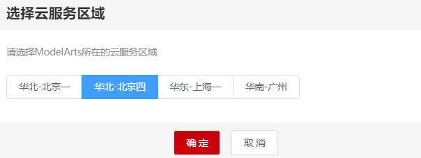
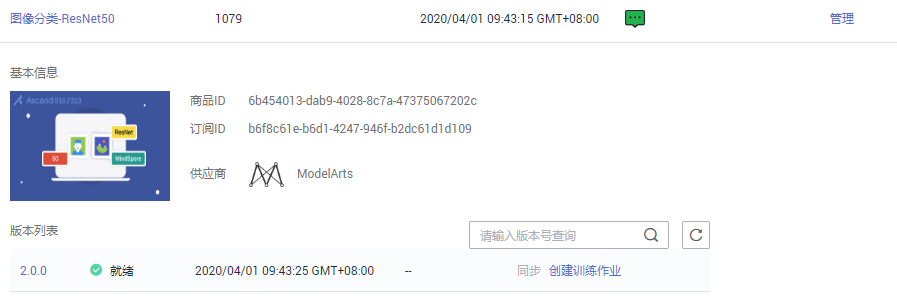
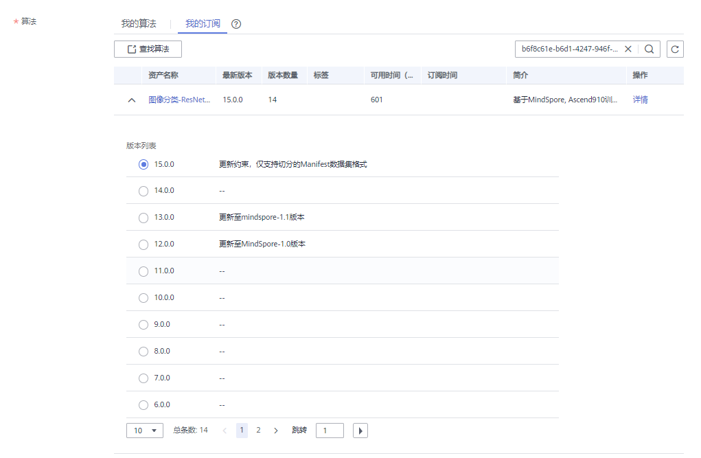
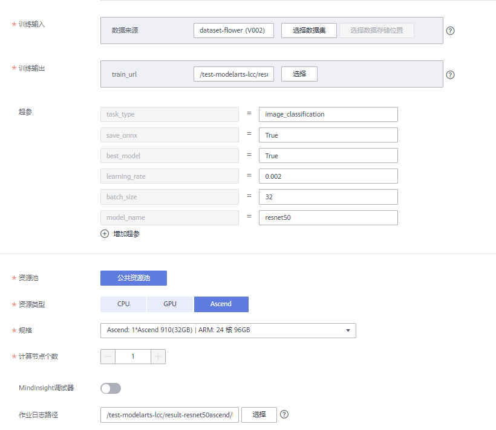
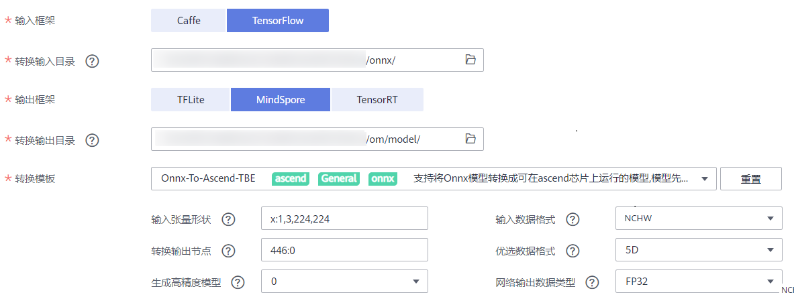
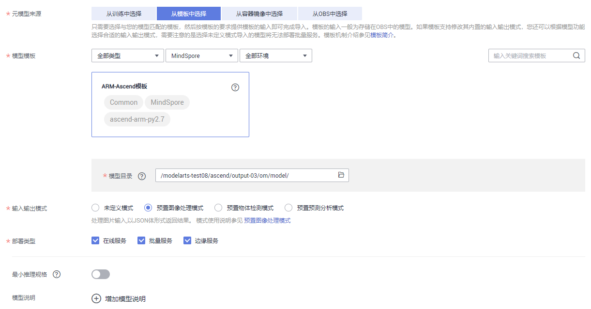
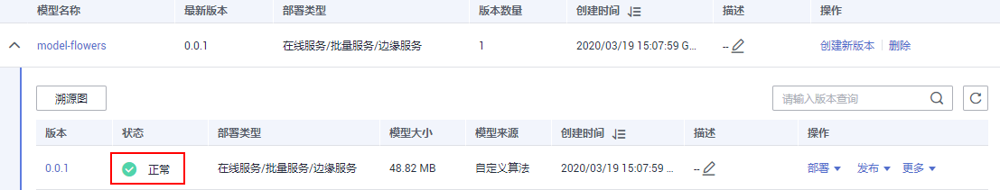
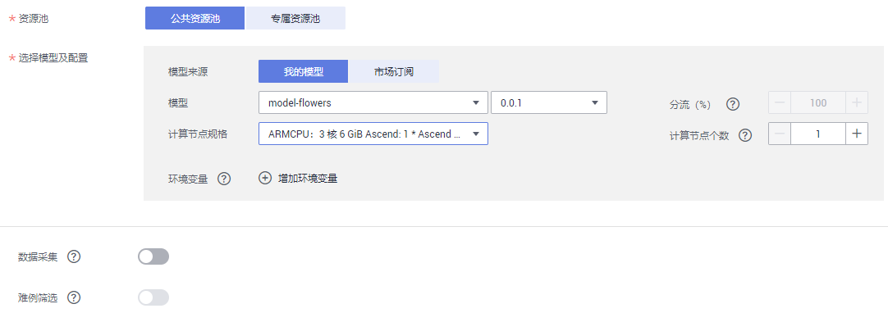
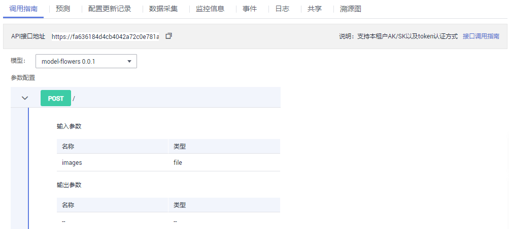
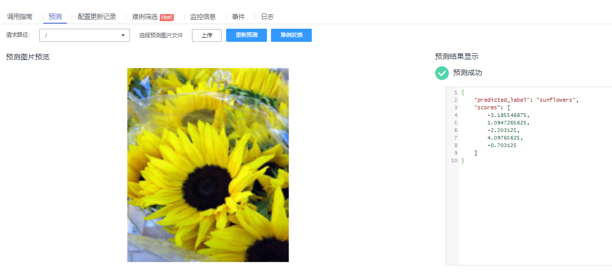

# Ascend910训练和Ascend310推理的样例

如下操作步骤，以MindSpore引擎的“ResNet50“为例，指导如何从AI Gallery订阅算法，然后使用算法创建训练模型，将所得的模型部署为在线服务（Ascend 910训练+Ascend 310推理）。针对支持Ascend 910训练和Ascend 310推理的算法，可参考此章节操作。

> **说明：** 
>-   Ascend芯片的应用，仅支持在“华北-北京四”区域试用。
>-   Ascend 910训练资源，只能用于一个正在运行中的作业。

1.  [数据准备](#zh-cn_topic_0235073536_section1584314150552)
2.  [订阅算法](#zh-cn_topic_0235073536_section87421022184315)
3.  [使用订阅算法创建训练作业（Ascend 910）](#zh-cn_topic_0235073536_section139551128135716)
4.  [模型转换](#zh-cn_topic_0235073536_section169361344121112)
5.  [导入模型](#zh-cn_topic_0235073536_section33213372557)
6.  [部署为在线服务（Ascend 310）](#zh-cn_topic_0235073536_section189854035517)

## 数据准备

1.  单击[样例数据集](https://marketplace.huaweicloud.com/markets/aihub/datasets/detail/?content_id=2d5cc65b-bbfc-4845-825a-1d7647e0307c)链接，跳转至“AI Gallery\>数据\>花卉识别“页面。
2.  单击“下载“跳转至下载页面详情页。

    

3.  在下载详情页，填写参数如[图1](#zh-cn_topic_0000001124469911_fig13613162519352)所示。
    -   下载方式：选择“ModelArts数据集“
    -   目标区域：选择“北京四“
    -   目标位置：请选择一个空的OBS目录，本示例为“/test-modelartsz/dataset-flower/“
    -   名称：填入该数据集的名称，本示例为“dataset-flower“

        **图 1**  下载至数据集  
        

4.  确认无误后，单击确定。页面自动跳转到“个人中心\>我的数据\>我的下载“页面，请耐心等待10分钟左右。
5.  下载完成后，您可以单击目标数据集dataset-flower跳转至数据集。

    **图 2**  目标数据集  
    

6.  在数据集详情页，单击右上角“发布“。

    **图 3**  发布数据集  
    

7.  在弹出的对话框中，填写版本名称，可使用默认值。打开“数据切分“按钮，“训练验证比例“建议设置为“0.8“。然后单击“确定“完成发布。

    验证集不参与训练。针对此示例，推荐使用0.8比例进行切分。

    **图 4**  发布数据集版本  
    

8.  在数据集列表页面，等待数据集发布完成。发布过程中的数据集，其名称前面有个运行标记。当数据集发布结束后，其操作列的发布按钮将呈现为蓝色可点击状态。

    请耐心等待，必须等数据集发布成功后，才可以执行下一步训练模型的操作。

## 订阅算法

目前“ResNet50“算法发布在AI Gallery中。您可以前往AI Gallery，订阅此模型，然后同步至ModelArts中。

1.  单击[算法链接](https://marketplace.huaweicloud.com/markets/aihub/modelhub/detail/?id=6b454013-dab9-4028-8c7a-47375067202c)进入算法详情页，单击右侧的“订阅“，根据界面提示完成算法订阅。

    此算法由ModelArts官方提供，目前免费开放，可以用图像分类任务，比如猫狗分类、花卉分类等。使用MindSpore和Ascend910芯片进行训练，训练后生成的模型可直接在ModelArts平台部署为在线服务，算法训练所得的模型支持使用Ascend 310芯片进行推理。订阅算法完成后，页面的“订阅“按钮显示为“已订阅“。

2.  单击详情页的“前往控制台“，此时弹出“选择云服务区域“对话框，选择ModelArts对应的区域，然后再单击“确定“，

    页面将自动跳转至ModelArts的“算法管理\>我的订阅“中同步对应的算法。

    **图 5**  前往控制台  
    

    **图 6**  选择云服务区域  
    

3.  在ModelArts管理控制台的算法管理页面，算法将自动同步至ModelArts中。

## 使用订阅算法创建训练作业（Ascend 910）

算法订阅成功后，算法将呈现在“算法管理\>我的订阅“中，您可以使用订阅的“ResNet50“算法创建训练作业，获得模型。

1.  进入“算法管理\>我的订阅“页面，选择订阅的“ResNet50“算法，单击左侧的小三角展开算法，在版本列表中，单击“创建训练作业“。

    **图 7**  创建训练作业  
    

2.  在创建训练作业页面，参考如下说明填写关键参数。
    -   “算法来源“：系统默认选择订阅的算法，请勿随意修改。
    -   “数据来源“：选择数据集，然后从下拉框中选择[数据准备](#zh-cn_topic_0235073536_section1584314150552)中创建好的数据集。数据集一定要选择切分训练集比例的版本，否则将会导致训练失败。
    -   “训练输出“：选择一个OBS空目录存储训练输出的模型。
    -   “调优参数“：建议采用默认值。如需进行调优，可参考[运行参数说明](https://marketplace.huaweicloud.com/markets/aihub/modelhub/detail/?id=6b454013-dab9-4028-8c7a-47375067202c)。
    -   “资源池“：建议选择Ascend 910芯片，需注意的是，MindSpore引擎的算法，仅支持使用Ascend 910训练，不支持CPU或GPU训练。
    -   “作业日志路径“：选择一个OBS空目录存储训练输出的日志。

        **图 8**  训练作业参数  
        

        **图 9**  资源池设置  
        

3.  参数填写完成后，单击“提交“，完成训练作业创建。
4.  进入“训练管理\>训练作业“页面，等待训练作业完成。

    训练作业运行需要一些时间，请耐心等待。根据经验，选择样例数据集，使用Ascend 910（单卡）资源运行，预计30多分钟完成。

    当训练作业的状态变更为“运行成功“时，表示已运行结束。您可以单击训练作业名称，进入详情页面，了解训练作业的“配置信息”、“日志”、“资源占用情况”和“评估结果”等信息。您也可以在配置的“训练输出位置“对应的OBS目录下获得训练生成的模型。

## 模型转换

使用订阅算法训练所得的模型，需通过转换功能，转成适用于Ascend芯片的格式，即“om“格式。

1.  在ModelArts管理控制台，选择“模型管理 \> 压缩/转换“。
2.  在模型转换作业列表页面，单击“创建任务“。在创建转换任务页面中，参考如下说明填写关键参数。

    -   “输入框架“：选择“TensorFlow“。
    -   “转换输入目录“：请选择训练作业输出路径下的“<输出路径\>/V00X/onnx“目录。其中“<输出路径\>/V00X“请根据实际参数填写。
    -   “输出框架“：选择“MindSpore“。
    -   “转换输出目录“：请选择训练作业输出路径下的“<输出路径\>/V00X/om/model“目录。由于训练作业可以运行多次，产生多个训练作业版本，因此“<输出路径\>/V00X“请根据实际参数填写对应训练作业输出的目录及作业版本。
    -   “转换模板“：用于Ascend 310芯片的模型请选择“Onnx-To-Ascend-TBE“模板。更多转换模板及其高级参数介绍请参见[转换模板](https://support.huaweicloud.com/engineers-modelarts/modelarts_23_0110.html)。
    -   “高级选项“：本示例可直接使用参数值如下所示。如果需要修改，请参见[转换模板](https://support.huaweicloud.com/engineers-modelarts/modelarts_23_0110.html)了解参数说明。

        “输入张量形状“：“x:1,3,224,224“

        “输入数据格式“：“NCHW“

        “转换输出节点“：“446:0“

        “优选数据格式“：“5D“

        “生成高精度模型“：“0“

        “网络输出类型“：“FP32“

        **图 10**  转换模型  
        

    如果您使用的算法为ResNet\_v1\_50算法（图像分类/TensorFlow/Ascend910训练），模型转换任务与ResNet50算法不一样的参数如下所示。

    “输入框架“：选择“TensorFlow“。

    “转换输入目录“：请选择训练作业输出路径下的“<输出路径\>/V00X/frozen\_gragh“目录。

    “输出框架“：选择“MindSpore“。

    “转换输出目录“：请选择训练作业输出路径下的“<输出路径\>/V00X/om/model“目录。

    “转换模板“：使用“TF-FrozenGraph-To-Ascend-C32“模板进行模型转换。

    “输入张量形状“：“images:1,224,224,3“

    “输入数据格式“：“NHWC“

    “转换输出节点“：“logits:0“

3.  转换模型的参数填写完成后，单击“立即创建“，页面自动跳转至“压缩/转换“列表。

    当模型转换的“任务状态“变为“成功“时，表示模型已被转换成“om“格式。

    **图 11**  模型转换成功  
    

## 导入模型

模型转换为om格式后，可采用“从模板中选择元模型”的方式，导入模型。

1.  在ModelArts管理控制台，选择“模型管理 \> 模型“。
2.  在模型列表页面，单击“导入“。进入“导入模型“页面，参考如下说明填写关键参数。

    -   “元模型来源“：选择“从模板中选择“。
    -   “模型模板“：本示例的模型需部署在Ascend 310芯片上，因此需选择“ARM-Ascend模板“。然后在“模型目录“中选择[模型转换](#zh-cn_topic_0235073536_section169361344121112)步骤中“转换输出目录“。
    -   “输入输出模式“：由于“ResNet50“算法的模型为“图像分类”类型的，因此此处需选择[预置图像处理模式](https://support.huaweicloud.com/engineers-modelarts/modelarts_23_0101.html)。

    其他参数使用默认值。

    **图 12**  从模板中选择模型  
    

3.  模型导入参数填写完成后，单击“立即创建“。页面自动跳转至模型列表页面，等待模型导入结果。

    当模型的状态变为“正常“时，表示模型导入成功。

    **图 13**  模型导入成功  
    

## 部署为在线服务（Ascend 310）

模型导入成功后，可将此模型部署为在线服务，在部署时可使用Ascend 310芯片资源。

> **说明：** 
>本文仅描述了部署为在线服务的操作指导，针对批量服务的部署，其操作步骤类似，不再赘述。详细批量服务的部署指导，可参见[ModelArts用户指南](https://support.huaweicloud.com/engineers-modelarts/modelarts_23_0066.html)。

1.  在“模型管理\>模型\>我的模型“列表中，单击操作列的“部署 \> 在线服务“。

    **图 14**  部署模型  
    

2.  在“部署“页面，参考如下说明填写关键参数。

    “资源池“：选择“公共资源池“。

    “选择模型及配置“：“模型“及“版本“会自动选择前面导入的模型。在“计算节点规格“中，选择您创建的Ascend 310芯片资源，目前支持“ Ascend: 1 \* Ascend 310 | ARM：3 核 6 GiB“资源规格。其他参数可使用默认值。

    **图 15**  部署为在线服务  
    

3.  参数设置完成后，单击“下一步“，根据界面提示，完成在线服务的部署。

    您可以进入“在线服务列表“页面，等待服务部署结束，当服务状态变为“运行中“时，表示服务部署成功。

    **图 16**  运行中的服务  
    

4.  在线服务部署完成后，您可以单击服务名称进入服务详情页。

    -   **访问服务**：了解调用指南，获取API接口地址，可通过postman或使用curl命令发送请求，[访问在线服务](https://support.huaweicloud.com/engineers-modelarts/modelarts_23_0063.html)。
    -   **预测**：单击“预测“页签，上传一个测试图片，进行预测。

    **图 17**  示例图片  
    

    **图 18**  调用指南  
    

    **图 19**  预测  
    

