# 使用AI Gallery订阅的算法构建模型

ModelArts在AI Gallery中提供了适用于“物体检测“、“图像分类“和“文本分类“等场景的算法、数据、模型等，详细介绍请参见《[AI Gallery用户指南](https://support.huaweicloud.com/aimarket-modelarts/modelarts_18_0010.html)》。

如下操作步骤，以“ResNet\_v1\_50“算法、花卉识别数据集为例，指导如何从AI Gallery订阅数据和算法，然后使用算法创建训练模型，将所得的模型部署为在线服务。其他算法操作步骤类似，因此不再赘述，可参考“ResNet\_v1\_50“算法操作。

1.  [数据准备](#zh-cn_topic_0000001124469911_section1584314150552)
2.  [订阅算法](#zh-cn_topic_0000001124469911_section87421022184315)
3.  [使用订阅算法创建训练作业](#zh-cn_topic_0000001124469911_section139551128135716)
4.  [导入模型](#zh-cn_topic_0000001124469911_section33213372557)
5.  [部署为在线服务（CPU）](#zh-cn_topic_0000001124469911_section11505173761411)

## 数据准备

1.  单击[样例数据集](https://marketplace.huaweicloud.com/markets/aihub/datasets/detail/?content_id=2d5cc65b-bbfc-4845-825a-1d7647e0307c)链接，跳转至“AI Gallery\>数据\>花卉识别“页面。
2.  单击“下载“跳转至下载页面详情页。

    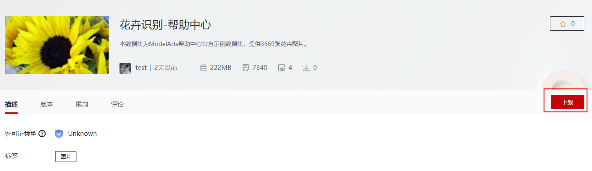

3.  在下载详情页，填写参数如[图1](#zh-cn_topic_0000001124469911_fig13613162519352)所示。
    -   下载方式：选择“ModelArts数据集“
    -   目标区域：选择“北京四“
    -   目标位置：请选择一个空的OBS目录，本示例为“/test-modelartsz/dataset-flower/“
    -   名称：填入该数据集的名称，本示例为“dataset-flower“

        **图 1**  下载至数据集  
        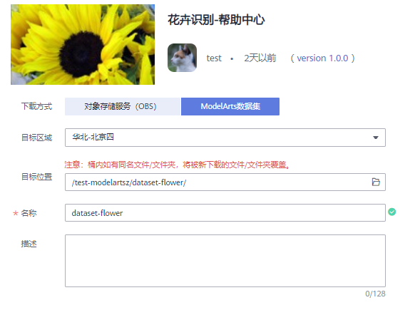

4.  确认无误后，单击确定。页面自动跳转到“个人中心\>我的数据\>我的下载“页面，请耐心等待10分钟左右。
5.  下载完成后，您可以单击目标数据集dataset-flower跳转至数据集。

    **图 2**  目标数据集  
    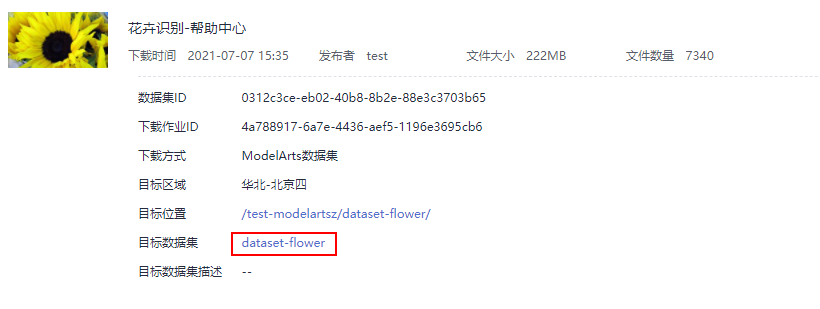

6.  在数据集详情页，单击右上角“发布“。

    **图 3**  发布数据集  
    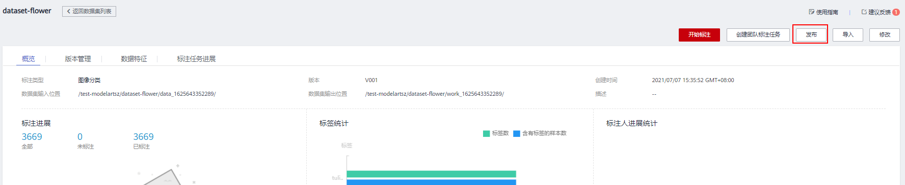

7.  在弹出的对话框中，填写版本名称，可使用默认值。打开“数据切分“按钮，“训练验证比例“建议设置为“0.8“。然后单击“确定“完成发布。

    验证集不参与训练。针对此示例，推荐使用0.8比例进行切分。

    **图 4**  发布数据集版本  
    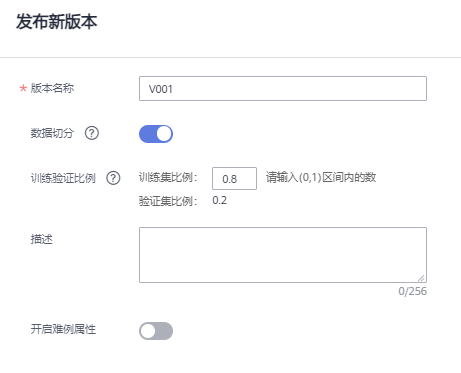

8.  在数据集列表页面，等待数据集发布完成。发布过程中的数据集，其名称前面有个运行标记。当数据集发布结束后，其操作列的发布按钮将呈现为蓝色可点击状态。

    请耐心等待，必须等数据集发布成功后，才可以执行下一步训练模型的操作。

## 订阅算法

目前“ResNet\_v1\_50“算法发布在AI Gallery中。您可以前往AI Gallery，订阅此模型，然后同步至ModelArts中。

1.  在ModelArts管理控制台中，在左侧菜单栏中选择“AI Gallery“，进入AI Gallery。
2.  在AI Gallery中，选择“资产集市\>算法“页签，在搜索框中输入“ResNet\_v1\_50“，查找对应的算法。请选择支持CPU、GPU训练的算法。
3.  单击[算法链接](https://marketplace.huaweicloud.com/markets/aihub/modelhub/detail/?id=40b66195-5bbe-463d-b8a2-03e57073538d)进入算法详情页，单击右侧的“订阅“，根据界面提示完成算法订阅。

    此算法由ModelArts官方提供，目前免费开放。订阅算法完成后，页面的“订阅“按钮显示为“已订阅“。

4.  单击详情页的“前往控制台“，此时弹出“选择云服务区域“对话框，选择ModelArts对应的区域，然后再单击“确定“，

    页面将自动跳转至ModelArts的“算法管理\>我的订阅“中同步对应的算法。

    **图 5**  前往控制台  
    

    **图 6**  选择云服务区域  
    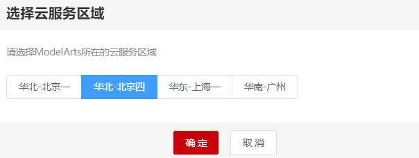

5.  在ModelArts管理控制台的算法管理页面，算法将自动同步至ModelArts中。

## 使用订阅算法创建训练作业

算法订阅成功后，算法将呈现在“算法管理\>我的订阅“中，您可以使用订阅的“ResNet\_v1\_50“算法创建训练作业，获得模型。

1.  进入“算法管理\>我的订阅“页面，选择订阅的“ResNet\_v1\_50“算法，单击左侧的小三角展开算法，在版本列表中，单击“创建训练作业“。

    **图 7**  创建训练作业  
    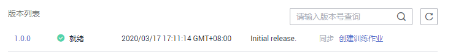

2.  在创建训练作业页面，参考如下说明填写关键参数。
    -   “算法来源“：系统默认选择订阅的算法，请勿随意修改。
    -   “训练输入“：选择数据集，然后从下拉框中选择[数据准备](#zh-cn_topic_0000001124469911_section1584314150552)中创建好的数据集dataset-flower。数据集一定要选择切分训练集比例的版本，否则将会导致训练失败。
    -   “训练输出“：选择一个OBS空目录存储训练输出的模型。
    -   “超参“：建议采用默认值。如需进行调优，可参考[运行参数说明](https://marketplace.huaweicloud.com/markets/aihub/modelhub/detail/?id=40b66195-5bbe-463d-b8a2-03e57073538d)。
    -   “资源池“：建议选择GPU规格的资源池，训练效率会更高一些。

        **图 8**  训练作业参数-算法  
        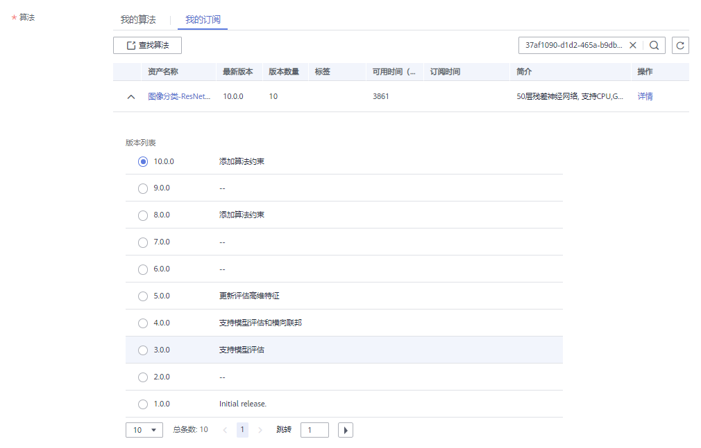

        **图 9**  训练作业参数-训练输入/输出  
        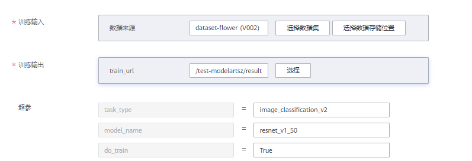

        **图 10**  资源池设置  
        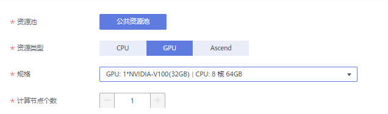

3.  参数填写完成后，单击“下一步“，根据界面提示完成训练作业创建。
4.  进入“训练管理\>训练作业（New）“页面，等待训练作业完成。

    训练作业运行需要几分钟时间，请耐心等待。根据经验，选择样例数据集，使用GPU资源运行，预计5分钟左右可完成。

    当训练作业的状态变更为“运行成功“时，表示已运行结束。您可以单击训练作业名称，进入详情页面，了解训练作业的“配置信息”、“日志”、“资源占用情况”和“评估结果”等信息。您也可以在配置的“训练输出位置“对应的OBS目录下获得训练生成的模型。

## 导入模型

1.  在ModelArts管理控制台，选择“模型管理 \> 模型“。
2.  在模型列表页面，单击“导入“。进入导入模型页面，参考如下说明填写关键参数。

    “元模型来源“：选择“从训练中选择\>训练作业（New）“。然后在“选择训练作业“右侧下拉框中选择上一步创建的训练作业。

    **图 11**  从训练中选择模型  
    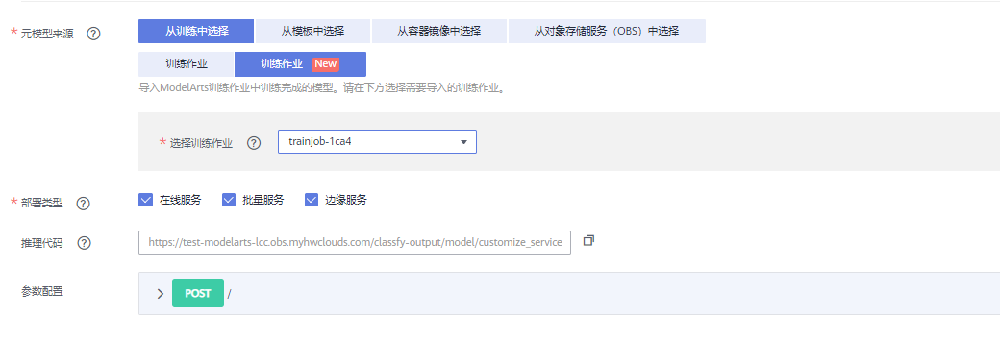

3.  模型导入参数填写完成后，单击“立即创建“。页面自动跳转至模型列表页面，等待模型导入结果。

    当模型的状态变为“正常“时，表示模型导入成功。

    **图 12**  模型导入成功  
    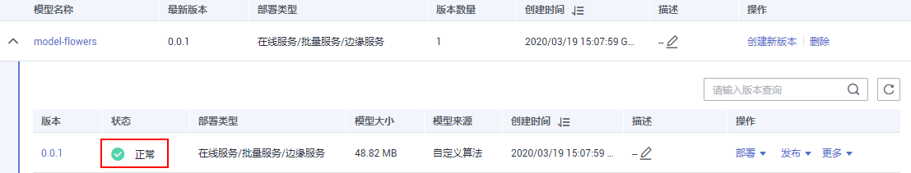

## 部署为在线服务（CPU）

模型导入成功后，可将此模型部署为在线服务，在部署时可使用CPU资源。

> **说明：** 
>本文仅描述了部署为在线服务的操作指导，针对批量服务的部署，其操作步骤类似，不再赘述。详细批量服务的部署指导，可参见[ModelArts用户指南](https://support.huaweicloud.com/engineers-modelarts/modelarts_23_0066.html)。

1.  在模型列表中，单击操作列的“部署 \> 在线服务“。

    **图 13**  部署模型  
    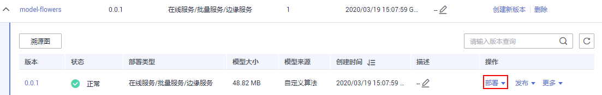

2.  在部署页面，参考如下说明填写关键参数。

    “资源池“：选择“公共资源池“。

    “选择模型及配置“：“模型“及“版本“会自动选择前面导入的模型。“计算节点规格“，在下拉框中选择CPU或GPU，本示例选择CPU资源进行部署。计算节点个数，需设置为“1“，目前仅支持单机部署，只能设置为“1“，不可修改。

    其他参数可使用默认值。

    > **说明：** 
    >如果需要使用GPU资源部署上线，需要进入模型所在位置，即[使用订阅算法创建训练作业](#zh-cn_topic_0000001124469911_section139551128135716)步骤生成的“训练输出“路径，进入“model“目录，打开并编辑“config.json“文件，将“runtime“的配置修改为ModelArts支持的GPU规格，例如"runtime": "tf1.13-python3.6-gpu"。修改完成后，重新执行[导入模型](#zh-cn_topic_0000001124469911_section33213372557)和[部署为在线服务](#zh-cn_topic_0000001124469911_section11505173761411)的操作。

    **图 14**  部署模型  
    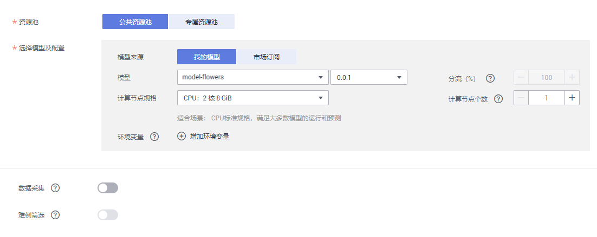

3.  参数设置完成后，单击“下一步“，根据界面提示，完成在线服务的部署。

    您可以进入“在线服务列表“页面，等待服务部署结束，当服务状态变为运行中时，表示服务部署成功。

    **图 15**  运行中的服务  
    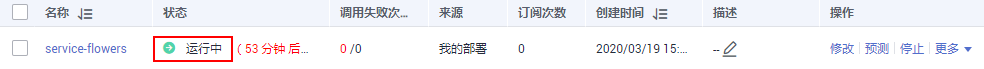

4.  在线服务部署完成后，您可以单击服务名称进入服务详情页。

    -   **访问服务**：了解调用指南，获取API接口地址，可通过postman或使用curl命令发送请求，[访问在线服务](https://support.huaweicloud.com/engineers-modelarts/modelarts_23_0063.html)。
    -   **预测**：单击“预测“页签，上传一个测试图片，进行预测。

    更多操作，可参见[ModelArts用户指南](https://support.huaweicloud.com/engineers-modelarts/modelarts_23_0060.html)。

    **图 16**  调用指南  
    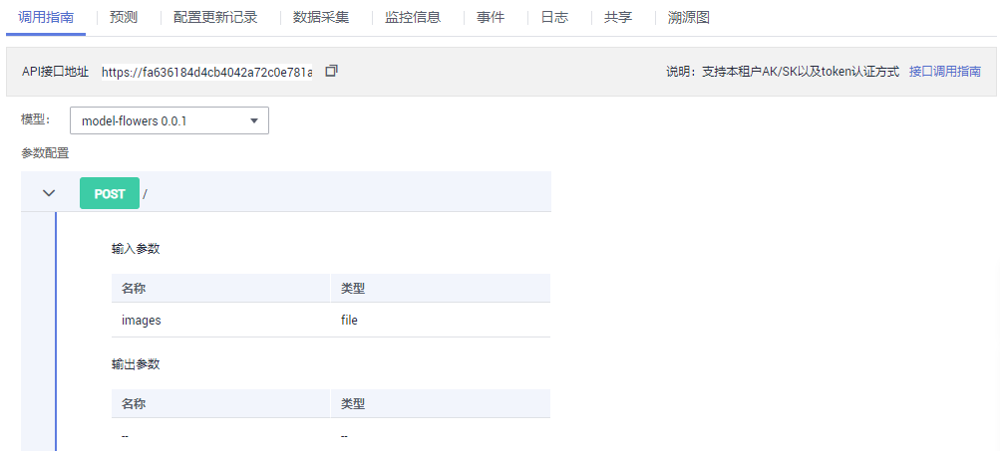

    **图 17**  预测  
    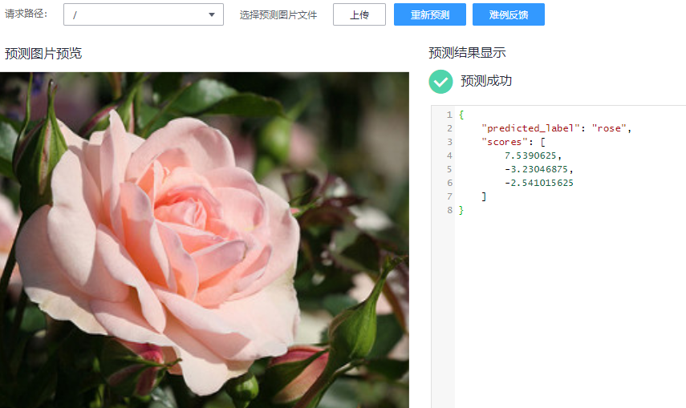

