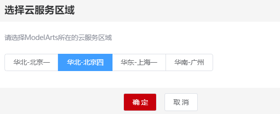
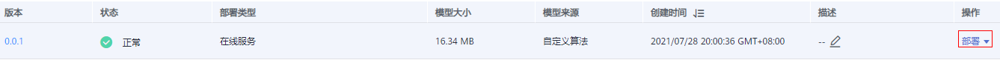

# 使用强化学习内置环境<a name="modelarts_10_0033"></a>

本章节介绍使用AI Gallery中预置的[强化学习算法](https://marketplace.huaweicloud.com/markets/aihub/modelhub/detail/?id=c01c57ee-bbcd-44d4-8181-e9630f79740c)训练内置环境CartPole示例。

## 环境介绍<a name="section16178450174816"></a>

CartPole，车杆游戏，游戏画面如[图1](#fig2161151911315)所示。游戏中，黑色的方块是一个小车，小车在一维无阻力轨道上运动。小车上连接一根活动杆，杆会左右摇摆。为保证游戏持续进行，小车需要左右移动保持杆子竖直。当小车的移动位置超出游戏界面所示范围或者杆子倾斜角度大于15°，游戏结束。游戏全过程可以理解为AI智能体与环境之间的互动，可以将复杂的因素抽象成以下三个变量。

1.  可采取的动作：左移、右移。
2.  获得奖励规则：左移或右移小车之后游戏没有结束，reward值会+1。
3.  目的：使用强化学习训练一个智能体，玩CartPole游戏，尽可能多获得奖励。

**图 1**  CartPole游戏画面<a name="fig2161151911315"></a>  


## 进入AI Gallery订阅强化学习算法<a name="section1391024520"></a>

ModelArts预置的强化学习算法（名为“强化学习GameAI“）发布在AI Gallery中。您可以前往AI Gallery，订阅算法至ModelArts中。

1.  在AI Gallery中，选择“算法“页签，单击[强化学习预置算法](https://marketplace.huaweicloud.com/markets/aihub/modelhub/detail/?id=c01c57ee-bbcd-44d4-8181-e9630f79740c)，进入算法详情页。
2.  单击右侧的“订阅“，根据界面提示完成算法订阅。

    此算法由ModelArts官方提供，目前免费开放。订阅算法完成后，页面的“订阅“按钮显示为“已订阅“。

3.  单击详情页的“前往控制台“，此时弹出“选择云服务区域“对话框，选择对应的区域，然后再单击“确定“，

    页面将自动跳转至ModelArts的“算法管理\>我的订阅“中同步对应的算法。

    **图 2**  选择云服务区域<a name="fig106801321135412"></a>  
    

4.  在ModelArts管理控制台的算法管理页面，算法将自动同步至ModelArts中。

    **图 3**  同步算法<a name="fig14458173582817"></a>  
    


## 使用订阅算法创建训练作业<a name="section1770314218580"></a>

算法订阅成功后，算法将呈现在“算法管理\>我的订阅“中，您可以使用订阅的“强化学习预置算法“算法创建训练作业，获得模型。

1.  <a name="li15495195512168"></a>进入“算法管理\>我的订阅“页面，选择订阅的“强化学习预置算法“算法，单击左侧的小三角展开算法，在版本列表中，单击“创建训练作业“。

    **图 4**  创建训练作业<a name="fig109479428917"></a>  
    

2.  在创建训练作业页面，参考如下说明填写关键参数。
    -   “算法来源“：系统默认选择步骤[1](#li15495195512168)订阅的算法，请勿随意修改。
    -   “训练输入“：由于本场景选择内置环境，无需数据输入。此处请选择一个OBS空目录。
    -   “训练输出“：选择一个OBS空目录存储训练输出的模型。
    -   “超参“：系统默认的环境ID为“CartPole-v0“，即我们想要训练的环境，无需修改。由于本示例使用的是内置环境，“use\_preset\_env“参数需设置为“True“。其他参数请参考[图6](#fig13926553123710)。
    -   “资源池“：建议选择CPU规格的资源池，例如“CPU:8核 32GB“规格。

        **图 5**  训练作业参数<a name="fig17492069913"></a>  
        

        **图 6**  调优参数配置<a name="fig13926553123710"></a>  
        

3.  参数填写完成后，单击“提交“，根据界面提示完成训练作业创建。
4.  进入“训练管理\>训练作业（New）“页面，等待训练作业完成。

    训练作业运行需要几分钟时间，请耐心等待。根据经验，此样例在5分钟左右完成训练。

    当训练作业的状态变更为“运行成功“时，表示已运行结束。您可以单击训练作业名称，进入详情页面，了解训练作业的“配置信息”、“日志”、“资源占用情况”等信息。您也可以在配置的“训练输出位置“对应的OBS目录下获得训练生成的模型。


## 导入模型<a name="section153342710916"></a>

1.  在ModelArts管理控制台，选择“模型管理 \> 模型“。
2.  在模型列表页面，单击“导入“。进入导入模型页面，参考如下说明填写关键参数。

    “元模型来源“：选择“训练作业（New）“。然后在“选择训练作业“右侧下拉框中选择上一步创建的训练作业。

    **图 7**  从训练中选择模型<a name="fig139607331476"></a>  
    

3.  模型导入参数填写完成后，单击“立即创建“。页面自动跳转至模型列表页面，等待模型导入结果。

    当模型的状态变为“正常“时，表示模型导入成功。

    **图 8**  模型导入成功<a name="fig14194366612"></a>  
    


## 部署为在线服务<a name="section18212153112117"></a>

模型导入成功后，可将此模型部署为在线服务，部署完成后即可在ModelArts管理控制台进行预测。

1.  在模型列表中，单击操作列的“部署 \> 在线服务“。

    **图 9**  部署模型<a name="fig9836164618112"></a>  
    

2.  在部署页面，参考如下说明填写关键参数。

    “资源池“：选择“公共资源池“。

    “选择模型及配置“：“模型“及“版本“会自动选择前面导入的模型。“计算节点规格“，在下拉框中选择CPU或GPU，本示例选择CPU资源进行部署。计算节点个数，需设置为“1“，目前仅支持单机部署，只能设置为“1“，不可修改。

    其他参数可使用默认值。

    **图 10**  部署模型参数<a name="fig6257568445"></a>  
    

3.  参数设置完成后，单击“下一步“，根据界面提示，完成在线服务的部署。

    您可以进入“在线服务“列表页面，等待服务部署结束，当服务状态变为“运行中“时，表示服务部署成功。

4.  在线服务部署完成后，您可以单击服务名称进入服务详情页。
    -   **访问服务**：了解“调用指南“，获取“API接口地址“，了解“输入参数“和“输出参数“。

        **图 11**  调用指南<a name="fig0557162420144"></a>  
        

    -   **预测**：单击“预测“页签，输入相应的参数或代码，单击“预测“即可看到运行结果，具体格式及要求参考算法说明文档。给出一组可用于推理预测的标准示例数据及格式，如下所示：

        ```
        {
        	"is_training": "False",
        	"observations": [
        		[0.02160617659181513, 0.022702596137138, -0.026817784180154104, 0.04523499832683836]
        	],
        	"prev_action": [0],
        	"prev_reward": [0.0],
        	"seq_lens": [0]
        }
        ```

        > **说明：** 
        >在线部署推理仅为单步预测，如果想实现完整的游戏推理，需要使用训练保存的模型或调用在线服务API的方式，编写相应的推理程序。

        **图 12**  预测结果<a name="fig17861113941518"></a>  
        


