# 使用强化学习预置算法应用于自定义环境<a name="modelarts_10_0042"></a>

本章节介绍使用AI Gallery强化学习算法训练自定义环境“贪吃蛇”示例。

> **说明：** 
>本示例展示强化学习预置算法自定义环境用法，建议您准备好用于强化学习的自定义环境。

## 环境介绍与实现<a name="section9254693203"></a>

如下所示仅提供本示例的自定义环境描述，帮助理解后续步骤。当您使用此功能时，需替换为您的自定义环境，同时将您的自定义环境相关文件按文件结构要求上传至OBS桶中。

本示例自定义环境相关代码，可从[ModelArts-Lab](https://gitee.com/ModelArts/ModelArts-Lab)工程中获得。下载工程，然后在“\\ModelArts-Lab-master\\official\_examples\\Reinforcement\_Learning\_Custom\_Env\_Example\_Code“获取训练代码“custom\_env“和用于预测的“Single\_Step\_Data\_For\_Inference.txt“文件。将训练代码“custom\_env“上传至OBS桶中。

-   **环境介绍**

    贪吃蛇游戏是一款休闲益智类游戏，该游戏通过控制蛇头方向吃果实，从而使得蛇的长度变得越来越长，随着蛇本身长度的增加，游戏难度也随之增加。

-   **问题描述**
    -   目标：利用强化学习训练智能体控制蛇移动并不断吃果实，以期获得尽可能多的分数或者尽可能长的长度。
    -   环境：贪吃蛇游戏环境，每吃到一个果实，积分增加1并且蛇的长度增加1；若蛇的头部碰到边界或者自己的身体，则蛇死亡，游戏失败。
    -   状态：游戏画面信息
    -   动作：上、下、左、右

-   **环境实现**

    本示例中，代码及文件结构如下所示。

    ```
    |- custom_env
      |- snake_env.py
      |- alg_config.json
    ```

    其中，环境的实现文件和算法参数配置文件一起放在命名为“custom\_env”的文件夹内（说明：该文件夹名字无约束），本示例中，snake\_env文件夹内的snake\_env.py是环境的具体实现代码。

    其中，在snake\_env.py中除了环境的实现代码（满足gym标准），还必须包含一个方法，主要用来实例化环境类并返回这个实例。snake\_env.py相应内容结构如下所示。

    ```
    class Snake_env(gym.Env):
        def __init__()
        ... ...
    
    def create_custom_env(env_config):
        custom_env = Snake_env()
        return custom_env
    ```

    alg\_config.json的配置如下：

    ```
    {
      #当前文件夹下环境所在.py文件的名字
      "env_url": "snake_env",
      "config": {
        # 环境名字
        "env": "snake_env",
      }
    }
    
    ```


## 进入AI Gallery订阅强化学习算法<a name="section1391024520"></a>

ModelArts预置的强化学习算法（名为“强化学习GameAI“）发布在AI Gallery中。您可以前往AI Gallery，订阅[强化学习GameAI](https://marketplace.huaweicloud.com/markets/aihub/modelhub/detail/?id=c01c57ee-bbcd-44d4-8181-e9630f79740c)，然后同步至ModelArts中。

1.  在ModelArts管理控制台中，在左侧菜单栏中选择“AI Gallery“，进入AI Gallery。
2.  在AI Gallery中，选择“资产集市\>算法“页签，在搜索框中输入“强化学习Game AI“，查找强化学习预置算法。
3.  单击算法名称进入算法详情页，单击右侧的“订阅“，根据界面提示完成算法订阅。

    此算法由ModelArts官方提供，目前免费开放。订阅算法完成后，页面的“订阅“按钮显示为“已订阅“。

4.  单击详情页的“前往控制台“，此时弹出“选择云服务区域“对话框，选择对应的区域，然后再单击“确定“，页面将自动跳转至ModelArts的“算法管理\>我的订阅“中同步对应的算法。

    > **说明：** 
    >此处选择的区域，务必与代码存储的OBS桶所在区域、ModelArts的使用区域一致。

    **图 1**  前往控制台<a name="fig12970625016"></a>  
    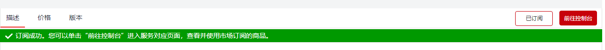

    **图 2**  选择云服务区域<a name="fig106801321135412"></a>  
    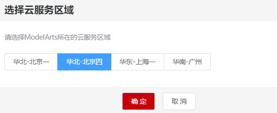

5.  在ModelArts管理控制台的算法管理页面，算法将自动同步至ModelArts中。

    **图 3**  同步算法<a name="fig73131312261"></a>  
    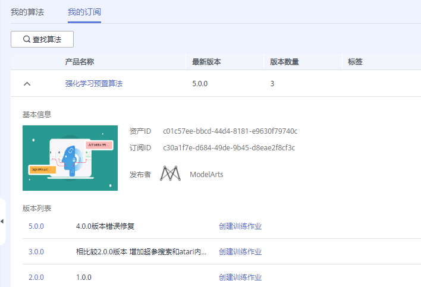


## 使用订阅算法创建训练作业<a name="section1770314218580"></a>

算法订阅成功后，算法将呈现在“算法管理\>我的订阅“中，您可以使用订阅的“强化学习预置算法“算法创建训练作业，获得模型。

1.  进入“算法管理\>我的订阅“页面，选择订阅的“强化学习预置算法“，在版本列表中，单击“创建训练作业“。

    **图 4**  创建训练作业<a name="fig193550332185"></a>  
    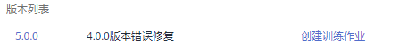

2.  在创建训练作业页面，参考如下说明填写关键参数。
    -   “算法来源“：系统默认选择上一步骤订阅的算法，请勿随意修改。
    -   “训练输入“：本示例使用自定义环境，所以“训练输入\>数据来源“需要选择自定义环境所在的文件夹，也就是选择到“custom\_env“这个层级即可（具体自定义环境文件结构请参见[环境介绍与实现](#section9254693203)）。
    -   “训练输出“：选择一个OBS空目录存储训练输出的模型。
    -   “调优参数“：由于不需要使用内置环境，需将参数“use\_preset\_env“设置为“False“。其他参数在本示例中建议采用默认值。
    -   “资源池“：建议选择CPU规格的资源池，例如“modelarts.vm.cpu.8u“规格。

        **图 5**  训练作业参数<a name="fig7764162010193"></a>  
        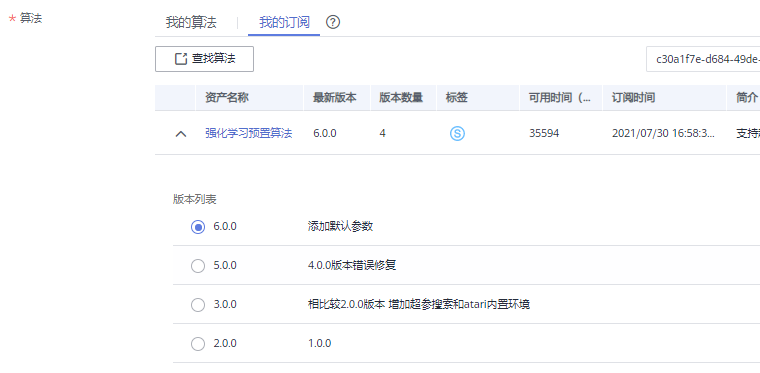

        **图 6**  调优参数配置<a name="fig1413612191416"></a>  
        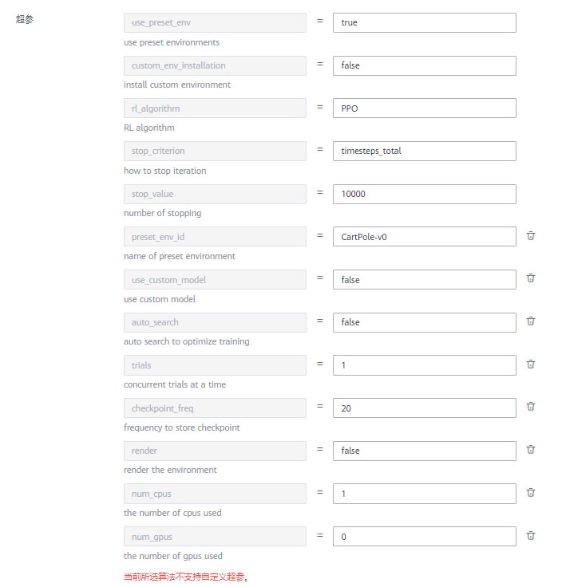

3.  参数填写完成后，单击“提交“，根据界面提示完成训练作业创建。
4.  进入“训练管理\>训练作业（New）“页面，等待训练作业完成。

    训练作业运行需要几分钟时间，请耐心等待。根据经验，此样例不会超过10分钟。

    当训练作业的状态变更为“运行成功“时，表示已运行结束。您可以单击训练作业名称，进入详情页面，了解训练作业的“配置信息”、“日志”、“资源占用情况”等信息。您也可以在配置的“训练输出位置“对应的OBS目录下获得训练生成的模型。


## 导入模型<a name="section153342710916"></a>

1.  在ModelArts管理控制台，选择“模型管理 \> 模型“。
2.  在模型列表页面，单击“导入“。进入导入模型页面，参考如下说明填写关键参数。

    “元模型来源“：选择“训练作业（New）“。然后在“选择训练作业“右侧下拉框中选择上一步创建的训练作业。

    **图 7**  从训练中选择模型<a name="fig787818437205"></a>  
    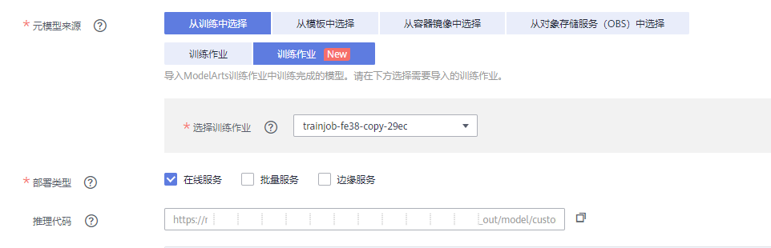

3.  模型导入参数填写完成后，单击“立即创建“。页面自动跳转至模型列表页面，等待模型导入结果。

    当模型的状态变为“正常“时，表示模型导入成功。

    **图 8**  模型导入成功<a name="fig19497338112117"></a>  
    


## 部署为在线服务<a name="section18212153112117"></a>

模型导入成功后，可将此模型部署为在线服务，部署完成后即可在ModelArts管理控制台进行预测。

1.  在模型列表中，单击操作列的“部署 \> 在线服务“。

    **图 9**  部署模型<a name="fig191173018227"></a>  
    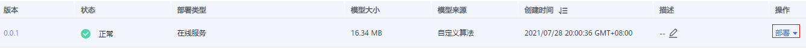

2.  在部署页面，参考如下说明填写关键参数。

    “资源池“：选择“公共资源池“。

    “选择模型及配置“：“模型“及“版本“会自动选择前面导入的模型。“计算节点规格“，在下拉框中选择CPU或GPU，本示例选择CPU资源进行部署。计算节点个数，需设置为“1“，目前仅支持单机部署，只能设置为“1“，不可修改。

    其他参数可使用默认值。

    **图 10**  部署模型参数<a name="fig14268132332314"></a>  
    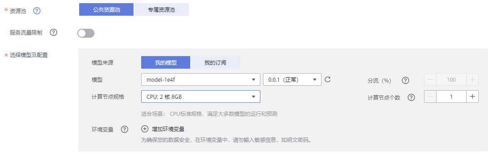

3.  参数设置完成后，单击“下一步“，根据界面提示，完成在线服务的部署。

    您可以进入“在线服务列表“页面，等待服务部署结束，当服务状态变为“运行中“时，表示服务部署成功。

4.  在线服务部署完成后，您可以单击服务名称进入服务详情页。
    -   **访问服务**：了解“调用指南“，获取“API接口地址“，了解“输入参数“和“输出参数“，可通过postman或使用curl命令发送请求，调用方法请参见[访问在线服务](https://support.huaweicloud.com/engineers-modelarts/modelarts_23_0063.html)。

        **图 11**  调用指南<a name="fig3638832202410"></a>  
        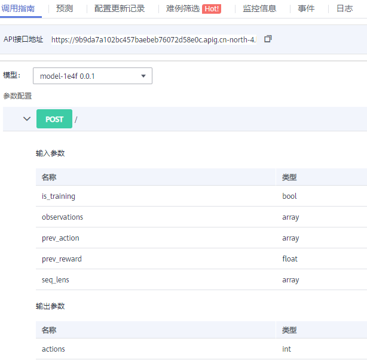

    -   **预测**：单击“预测“页签，输入相应的参数或代码，单击“预测“即可看到运行结果，具体格式及要求参考算法说明文档。

        本示例提供了可用于推理预测的数据，从ModelArts-Lab工程下载时，可获得训练代码和用于预测的数据文件。在本地打开“Single\_Step\_Data\_For\_Inference.txt“文件，拷贝文件中的所有内容，然后将内容黏贴至预测界面的“预测代码“输入框中。

        > **说明：** 
        >-   上述推理预测使用的数据，可以在ModelArts-Lab工程代码目录中下载，可从“\\ModelArts-Lab-master\\official\_examples\\Reinforcement\_Learning\_Custom\_Env\_Example\_Code“目录下获取。
        >-   对于不同的环境，其环境状态不同，对应的“observations”就不同，应用推理时需要明确。
        >-   在线部署推理仅为单步预测，如果想实现完整的业务推理，需要使用训练保存的模型，编写相应的推理程序。

        **图 12**  预测结果<a name="fig17973183818257"></a>  
        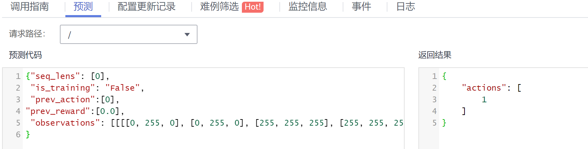


