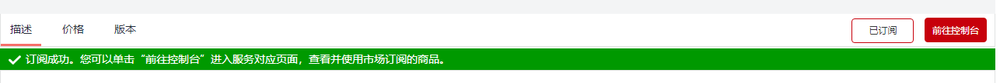
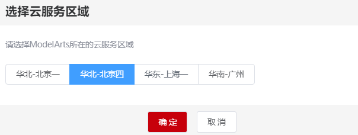

# 使用时序预测算法实现访问流量预测

本章节介绍使用AI Gallery中预置的时序预测算法实现访问流量预测。

## 准备工作

-   已注册华为云帐号，且在使用ModelArts前检查帐号状态，帐号不能处于欠费或冻结状态。
-   当前帐号已完成访问授权的配置。如未完成，请参考[使用委托授权](https://support.huaweicloud.com/prepare-modelarts/modelarts_08_0007.html)**。**针对之前使用访问密钥授权的用户，建议清空授权，然后使用委托进行授权。
-   已在OBS服务中创建桶和文件夹，用于存放样例数据集以及模型。

## 场景介绍

针对有一定AI基础的AI初学者，ModelArts基于业界的主流引擎提供了预置算法，无需关注模型开发过程，直接使用预置算法对已有数据进行训练，并快速部署为服务。时序预测可针对时间序列数据进行预测。

本章节提供了一个访问流量预测的样例，帮助您快速熟悉使用ModelArts AI Gallery算法训练的过程。此样例针对问流量数据cdn.csv，利用lstm预测得到接下来一个时间段内的结果。

## 步骤1：数据准备

1.  进入[数据集介绍](https://marketplace.huaweicloud.com/markets/aihub/datasets/detail/?content_id=b8291fa6-ff5a-415b-8171-e7c48dd96166)，单击“下载“，将“cdn.csv“数据集下载至目标位置OBS目录。
2.  设置“目标区域“和“目标位置“，然后单击“下一步“。
    -   “目标区域“：请设置为ModelArts的所在区域。ModelArts支持在“华北-北京一“、“华北-北京四“、“华东-上海一“使用，此处选择的区域与您想要使用的ModelArts所在区域填写一致。
    -   “目标位置“：将数据集从AI Gallery下载至您的OBS桶中。例如，将数据集存储至“test-modelarts/dataset“OBS路径下。

3.  数据开始下载后，可以单击右上角“个人中心\>数据集“，查看数据集下载进度。当此数据集的“状态“为“推送成功“时，此样例数据集已同步至你指定的目标位置下。

## 步骤2：进入AI Gallery订阅算法

ModelArts预置的时序预测算法发布在AI Gallery中。您可以前往AI Gallery，订阅此算法至ModelArts中。

1.  在ModelArts管理控制台中，在左侧菜单栏中选择“AI Gallery“，进入AI Gallery。
2.  在AI Gallery中，选择“资产集市\>算法“页签，在左侧导航栏“技术分支“中勾选“时序预测“，查找[时序预测-time\_series\_v2](https://marketplace.huaweicloud.com/markets/aihub/modelhub/detail/?id=dbf0420b-7a43-4dce-afca-d40d562dc4fd)算法。
3.  单击[算法链接](https://marketplace.huaweicloud.com/markets/aihub/modelhub/detail/?id=dbf0420b-7a43-4dce-afca-d40d562dc4fd)进入算法详情页，单击右侧的“订阅“，根据界面提示完成算法订阅。

    此算法由ModelArts官方提供，目前免费开放。订阅算法完成后，页面的“订阅“按钮显示为“已订阅“。

4.  单击详情页的“前往控制台“，此时弹出“选择云服务区域“对话框，选择ModelArts对应的区域，然后再单击“确定“，

    页面将自动跳转至ModelArts的“算法管理\>我的订阅“中同步对应的算法。

    **图 1**  前往控制台  
    

    **图 2**  选择云服务区域  
    

5.  在ModelArts管理控制台的算法管理页面，算法将自动同步至ModelArts中。

## 步骤3：使用订阅算法创建训练作业

算法订阅成功后，算法将呈现在“算法管理\>我的订阅“中，您可以使用订阅的“时序预测-time\_series\_v2“算法创建训练作业，获得模型。

1.  进入“算法管理\>我的订阅“页面，选择订阅的“时序预测-time\_series\_v2“算法，单击左侧的小三角展开算法，在版本列表中，单击“创建训练作业“。

    **图 3**  创建训练作业  
    

2.  在创建训练作业页面，参考如下说明填写关键参数。
    -   “算法来源“：系统默认选择步骤[1](#li15495195512168)订阅的算法，请勿随意修改。
    -   “训练输入“：数据来源单击“选择数据存储位置“，选择“cdn.csv“数据文件存储的OBS目录。注意此处选择目录，而不是此文件。
    -   “训练输出“：选择一个OBS空目录存储训练输出的模型。
    -   “超参“：此算法提供的参数均提供了默认值。如需修改，建议仔细阅读算法介绍，并根据参数解释进行修改。
    -   “规格“：建议选择GPU进行训练。如果需要选择CPU，建议将上述“超参“中，“gpu“的值设置为“0“。

        **图 4**  训练作业参数  
        

        **图 5**  调优参数配置  
        

        **图 6**  资源配置  
        

3.  参数填写完成后，单击“提交“，根据界面提示完成训练作业创建。
4.  进入“训练管理\>训练作业“页面，等待训练作业完成。

    训练作业运行需要几分钟时间，请耐心等待。根据经验，使用GPU资源时此样例在2分钟左右完成训练。

    当训练作业的状态变更为“运行成功“时，表示已运行结束。您可以单击训练作业名称，进入详情页面，了解训练作业的“配置信息”、“日志”、“资源占用情况”等信息。您也可以在配置的“训练输出位置“对应的OBS目录下获得训练生成的模型以及预测结果“forecast.csv“。

## 步骤4：导入模型

训练完成的模型存储在训练输出的OBS路径中，您可以将此模型导入到ModelArts中进行管理和部署。

1. 在ModelArts管理控制台中，单击左侧导航栏中的“模型管理\>模型”，进入“模型”页面。

2. 在“模型”页面，单击“导入”，进入导入模型页面。

3. 在“导入模型”页面，设置相关参数，然后单击“立即创建”。

设置模型的“名称”和“版本”，然后在“元模型来源”参数中，选择“从训练中选择\>训练作业（New）”，此时系统会自动选择您最近创建的训练作业，您可以从下拉框中可以选择系统中可用的训练作业。由于本示例数据较简单，其他参数采用默认值。

图10 导入模型

4. 模型导入完成后，系统将自动跳转至模型列表页面。您可以在模型列表页面查看已导入的模型及其版本。

图11 模型列表

## 步骤6：部署上线

1.  在“模型管理 \> 模型”页面，单击模型名称左侧的小三角，打开此模型下的所有版本。在对应版本所在行，单击操作列的“部署”，然后在下拉框中选择**“在线服务”**，进入“部署”页面。
2.  在“部署”页面中，设置相关参数，然后单击“下一步”。

    设置在线服务的**“名称”**，将**“是否自动停止”**功能启用。在**“选择模型及配置”**区域中，系统将自动选择[步骤5：导入模型\(v2.0新增\)](#section1529012189253)中的模型及其版本，在**“计算节点规格”**右侧下拉框中选择使用的资源，本示例选用“CPU：2核 8GiB”资源部署在线服务。其他参数使用默认值。

图12 部署为在线服务

1.  在“规格确认”页面，确认信息完毕后，单击“提交”。
2.  在“部署上线 \> 在线服务”页面，您可以查看在线服务的相关信息。由于模型部署上线需要花费一些时间，请耐心等待几分钟。当在线服务的状态为“运行中”时，表示在线服务已部署完成。

## 步骤7：在线预测

1.  在“在线服务”管理页面，单击在线服务名称，进入在线服务详情页面。
2.  在线服务详情页面中，单击 “上传“ 页签，从本地上传待预测数据，格式参考[算法说明](https://marketplace.huaweicloud.com/markets/aihub/modelhub/detail/?id=dbf0420b-7a43-4dce-afca-d40d562dc4fd)。
3.  在线服务详情页面中，单击“预测”页签，进入预测页面。

**图 7**  预测结果  

## 步骤8：清除资源

为避免产生不必要额费用，通过此示例学习时序预测算法的使用后，您可以清除相关资源，避免造成资源浪费。

-   删除训练作业：在“训练作业“页面，单击操作列的“删除“。
-   删除数据：前往OBS，删除上传的数据，然后删除文件夹及OBS桶。

