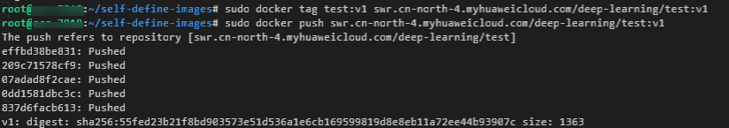
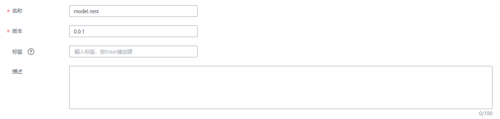

# 使用自定义镜像创建训练作业（GPU）<a name="modelarts_10_0071"></a>

本章节提供了在ModelArts平台使用自定义镜像创建训练作业的样例，帮助您快速熟悉平台的使用方法。

使用自定义镜像创建训练作业时，需要您熟悉该软件的使用，并具备一定的开发经验。详细步骤如下所示：

1.  [准备工作](#section757135512482)
2.  [制作自定义镜像](#section1172920310285)
3.  [上传镜像至SWR服务](#section7252037164915)
4.  [创建训练作业](#section62981752104919)

## 准备工作<a name="section757135512482"></a>

-   已注册华为云帐号，且在使用ModelArts前检查帐号状态，帐号不能处于欠费或冻结状态。
-   当前帐号已完成访问授权的配置。如未完成，请参考[使用委托授权](https://support.huaweicloud.com/prepare-modelarts/modelarts_08_0007.html)**。**针对之前使用访问密钥授权的用户，建议清空授权，然后使用委托进行授权。
-   已在OBS服务中创建桶和文件夹，用于存放样例数据集以及训练代码。如下示例中，请创建命名为“test-modelarts“的桶，并创建如[表1](#zh-cn_topic_0168474775_table2061005120337)所示的文件夹。

    创建OBS桶和文件夹的操作指导请参见[创建桶](https://support.huaweicloud.com/usermanual-obs/obs_03_0306.html)和[新建文件夹](https://support.huaweicloud.com/usermanual-obs/obs_03_0316.html)。请确保您使用的OBS与ModelArts在同一区域。

    **表 1**  文件夹列表

    <a name="zh-cn_topic_0168474775_table2061005120337"></a>
    <table><thead align="left"><tr id="zh-cn_topic_0168474775_row1860945116333"><th class="cellrowborder" valign="top" width="50.29%" id="mcps1.2.3.1.1"><p id="zh-cn_topic_0168474775_p10609195123319"><a name="zh-cn_topic_0168474775_p10609195123319"></a><a name="zh-cn_topic_0168474775_p10609195123319"></a>文件夹名称</p>
    </th>
    <th class="cellrowborder" valign="top" width="49.71%" id="mcps1.2.3.1.2"><p id="zh-cn_topic_0168474775_p206091751203312"><a name="zh-cn_topic_0168474775_p206091751203312"></a><a name="zh-cn_topic_0168474775_p206091751203312"></a>用途</p>
    </th>
    </tr>
    </thead>
    <tbody><tr id="zh-cn_topic_0168474775_row1660955118338"><td class="cellrowborder" valign="top" width="50.29%" headers="mcps1.2.3.1.1 "><p id="zh-cn_topic_0168474775_p3609175193317"><a name="zh-cn_topic_0168474775_p3609175193317"></a><a name="zh-cn_topic_0168474775_p3609175193317"></a><span class="filepath" id="zh-cn_topic_0168474775_filepath1660918516339"><a name="zh-cn_topic_0168474775_filepath1660918516339"></a><a name="zh-cn_topic_0168474775_filepath1660918516339"></a>“obs://test-modelarts/deep-learning/mnist/”</span></p>
    </td>
    <td class="cellrowborder" valign="top" width="49.71%" headers="mcps1.2.3.1.2 "><p id="zh-cn_topic_0168474775_p1360910519337"><a name="zh-cn_topic_0168474775_p1360910519337"></a><a name="zh-cn_topic_0168474775_p1360910519337"></a>用于存储训练脚本。</p>
    </td>
    </tr>
    <tr id="row15748037529"><td class="cellrowborder" valign="top" width="50.29%" headers="mcps1.2.3.1.1 "><p id="p195941849428"><a name="p195941849428"></a><a name="p195941849428"></a><span class="parmvalue" id="parmvalue5594349729"><a name="parmvalue5594349729"></a><a name="parmvalue5594349729"></a>“obs://test-modelarts/deep-learning/mnist/dataset-mnist”</span></p>
    </td>
    <td class="cellrowborder" valign="top" width="49.71%" headers="mcps1.2.3.1.2 "><p id="p10594154918214"><a name="p10594154918214"></a><a name="p10594154918214"></a>用于存储数据集。</p>
    </td>
    </tr>
    <tr id="zh-cn_topic_0168474775_row11609185115337"><td class="cellrowborder" valign="top" width="50.29%" headers="mcps1.2.3.1.1 "><p id="zh-cn_topic_0168474775_p460955193312"><a name="zh-cn_topic_0168474775_p460955193312"></a><a name="zh-cn_topic_0168474775_p460955193312"></a><span class="filepath" id="filepath571960721"><a name="filepath571960721"></a><a name="filepath571960721"></a>“obs://test-modelarts/deep-learning/mnist/output”</span></p>
    </td>
    <td class="cellrowborder" valign="top" width="49.71%" headers="mcps1.2.3.1.2 "><p id="zh-cn_topic_0168474775_p260919518338"><a name="zh-cn_topic_0168474775_p260919518338"></a><a name="zh-cn_topic_0168474775_p260919518338"></a>用于存储训练输出文件。</p>
    </td>
    </tr>
    <tr id="row109259214350"><td class="cellrowborder" valign="top" width="50.29%" headers="mcps1.2.3.1.1 "><p id="p09251233510"><a name="p09251233510"></a><a name="p09251233510"></a><span class="filepath" id="filepath45252810353"><a name="filepath45252810353"></a><a name="filepath45252810353"></a>“obs://test-modelarts/deep-learning/mnist/log”</span></p>
    </td>
    <td class="cellrowborder" valign="top" width="49.71%" headers="mcps1.2.3.1.2 "><p id="p492519263512"><a name="p492519263512"></a><a name="p492519263512"></a>用于存储日志文件。</p>
    </td>
    </tr>
    </tbody>
    </table>

-   本示例使用[MNIST数据集](https://modelarts-cnnorth1-market-dataset.obs.cn-north-1.myhuaweicloud.com/dataset-market/Mnist-Data-Set/archiver/Mnist-Data-Set.zip)，请上传至对应文件夹下。
-   训练代码请参考[Github仓库](https://github.com/huaweicloud/ModelArts-Lab/tree/master/docs/custom_image/mnist)中的“mnist\_softmax.py“文件，请上传至对应文件夹下。

## 制作自定义镜像<a name="section1172920310285"></a>

本示例使用Dockerfile文件定制自定义镜像。

以linux x86\_x64架构的主机为例，您可以购买相同规格的ECS或者应用本地已有的主机进行自定义镜像的制作。

1.  安装Docker，可参考[Docker官方文档](https://docs.docker.com/engine/install/binaries/#install-static-binaries)。

    以linux x86\_64架构的操作系统为例，获取Docker安装包。您可以使用以下指令安装Docker：

    ```
    curl -fsSL get.docker.com -o get-docker.sh
    sh get-docker.sh
    ```

    如果**docker images**命令可以执行成功，表示Docker已安装，该步骤可跳过。

2.  获取自定义镜像的基础镜像。

    为了方便用户实现代码下载、训练日志输出、上传日志文件至OBS等功能，ModelArts提供基础镜像包用于自定义镜像的制作。基础镜像列表参见[基础镜像包](https://support.huaweicloud.com/engineers-modelarts/modelarts_23_0217.html#section1)。本示例获取以下基础镜像：

    ```
    docker pull swr.cn-north-4.myhuaweicloud.com/modelarts-job-dev-image/custom-base-cuda10.0-cp36-ubuntu18.04-x86:1.1
    ```

    另外，您还可以使用**docker images**命令可查看本地的镜像列表。

3.  编写构建Tensorflow 1.13.2自定义镜像的Dockerfile文件。

    文件命名为“tf-1.13.2.dockerfile“。执行_vi tf-1.13.2.dockerfile_命令，进入文件中。

    Dockerfile文件编写的更多指导内容参见[官方指导说明](https://docs.docker.com/engine/reference/builder/)。

    ```
    FROM swr.cn-north-4.myhuaweicloud.com/modelarts-job-dev-image/custom-base-cuda10.0-cp36-ubuntu18.04-x86:1.1
    # 配置华为云的源，安装tensorflow
    RUN cp -a /etc/apt/sources.list /etc/apt/sources.list.bak && \
    sed -i "s@http://.*archive.ubuntu.com@http://repo.myhuaweicloud.com@g"  /etc/apt/sources.list && \
    sed -i "s@http://.*security.ubuntu.com@http://repo.myhuaweicloud.com@g"  /etc/apt/sources.list && \
    pip install  --trusted-host https://repo.huaweicloud.com -i https://repo.huaweicloud.com/repository/pypi/simple  tensorflow==1.13.2
    # 配置环境变量
    ENV PATH=/root/miniconda3/bin/:$PATH
    ```

4.  按Esc键退出编辑模式，执行_:wq_保存并退出_tf-1.13.2.dockerfile_文件。
5.  在“tf-1.13.2.dockerfile“文件所在的目录执行以下命令构建自定义镜像“tf-1.13.2:latest“。

    ```
    docker build -f tf-1.13.2.dockerfile . -t tf-1.13.2:latest 
    ```

    **图 1**  构建自定义镜像<a name="fig15745249143613"></a>  
    


## 上传镜像至SWR服务<a name="section7252037164915"></a>

1.  登录容器镜像服务控制台，选择区域为“华北-北京四“。

    **图 2**  容器镜像服务控制台<a name="fig783853020542"></a>  
    

2.  单击右上角“创建组织“，输入组织名称完成组织创建。您可以自定义组织名称，本示例使用“deep-learning“。

    **图 3**  创建组织<a name="fig720811199535"></a>  
    

3.  单击右上角“登录指令“，获取登录访问指令。

    **图 4**  登录指令<a name="fig93322058205316"></a>  
    

4.  以root用户登录本地环境，输入登录访问指令。
5.  上传镜像至容器镜像服务镜像仓库。
    1.  使用docker tag命令给上传镜像打标签。

        ```
        sudo docker tag tf-1.13.2:latest swr.cn-north-4.myhuaweicloud.com/deep-learning/tf-1.13.2:latest
        ```

    2.  使用docker push命令上传镜像。

        ```
        sudo docker push swr.cn-north-4.myhuaweicloud.com/deep-learning/tf-1.13.2:latest
        ```

        **图 5**  上传镜像<a name="fig10880134116532"></a>  
        

6.  完成镜像上传后，在“容器镜像服务控制台\>我的镜像“页面可查看已上传的自定义镜像。

    **图 6**  已上传的自定义镜像<a name="fig151281115165515"></a>  
    

    “swr.cn-north-4.myhuaweicloud.com/deep-learning/tf-1.13.2:latest“即为此自定义镜像的“SWR\_URL“。


## 创建训练作业<a name="section62981752104919"></a>

1.  登录ModelArts管理控制台，在左侧导航栏中选择“训练管理 \> 训练作业“，默认进入“训练作业“列表。
2.  在“创建训练作业“页面，参考填写相关信息，然后单击“下一步“。

    **图 7**  名称与描述<a name="fig85571547181817"></a>  
    

    **图 8**  作业参数配置<a name="fig898175618192"></a>  
    

    -   镜像地址：“swr.cn-north-4.myhuaweicloud.com/deep-learning/tf-1.13.2:latest“
    -   代码目录：“obs://test-modelarts/deep-learning/mnist/“
    -   运行命令：“bash /home/work/run\_train.sh python /home/work/user-job-dir/mnist/mnist\_softmax.py --data\_url /home/work/user-job-dir/mnist/dataset-mnist“

    **图 9**  设置资源<a name="fig958504352015"></a>  
    

3.  在“规格确认“页面，确认训练作业的参数信息，确认无误后单击“提交“。
4.  训练作业创建完成后，后台完成代码目录下载、自定义镜像审核以及自定义镜像的训练作业。训练作业一般需要运行一段时间，根据您选择的数据量和资源不同，训练时间将耗时几分钟到几十分钟不等。程序执行成功后，日志信息如下所示。

    **图 10**  运行日志信息<a name="fig4698112215347"></a>  
    


