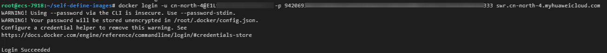

# 使用自定义镜像导入模型<a name="modelarts_10_0072"></a>

本章节提供了在ModelArts平台使用自定义镜像导入模型的样例，帮助您快速熟悉平台的使用方法。

使用自定义镜像导入模型时，需要您熟悉该软件的使用，并具备一定的开发经验。详细步骤如下所示：

1.  [准备工作](#section757135512482)
2.  [制作自定义镜像](#section49069474168)
3.  [本地验证镜像](#section16111213142117)
4.  [上传镜像至SWR服务](#section116065291228)
5.  [选择从容器镜像中导入模型](#section14416101517254)
6.  [将模型部署为在线服务](#section11593124119461)

## 准备工作<a name="section757135512482"></a>

-   已注册华为云帐号，且在使用ModelArts前检查帐号状态，帐号不能处于欠费或冻结状态。
-   当前帐号已完成访问授权的配置。如未完成，请参考[使用委托授权](https://support.huaweicloud.com/prepare-modelarts/modelarts_08_0007.html)**。**针对之前使用访问密钥授权的用户，建议清空授权，然后使用委托进行授权。

## 制作自定义镜像<a name="section49069474168"></a>

以linux x86\_x64架构的主机为例，您可以购买相同规格的ECS或者应用本地已有的主机进行自定义镜像的制作。

1.  安装Docker，可参考[Docker官方文档](https://docs.docker.com/engine/install/binaries/#install-static-binaries)。可参考以下方式安装docker。

    ```
    curl -fsSL get.docker.com -o get-docker.sh
    sh get-docker.sh
    ```

2.  获取基础镜像。本示例以Ubuntu18.04为例。

    ```
    docker pull ubuntu:18.04
    ```

    

3.  新建文件夹“self-define-images“，在该文件夹下编写自定义镜像的“Dockerfile“文件和应用服务代码“test\_app.py“。本样例代码中，应用服务代码采用了flask框架。

    文件结构如下所示

    ```
    self-define-images/
        --Dockerfile
        --test_app.py
    ```

    -   “Dockerfile“

        ```
        From ubuntu:18.04
        # 配置华为云的源，安装 python、python3-pip 和 Flask
        RUN cp -a /etc/apt/sources.list /etc/apt/sources.list.bak && \
          sed -i "s@http://.*security.ubuntu.com@http://repo.huaweicloud.com@g" /etc/apt/sources.list && \
          sed -i "s@http://.*archive.ubuntu.com@http://repo.huaweicloud.com@g" /etc/apt/sources.list && \
          apt-get update && \
          apt-get install -y python3 python3-pip && \
          pip3 install  --trusted-host https://repo.huaweicloud.com -i https://repo.huaweicloud.com/repository/pypi/simple  Flask
        
        # 拷贝应用服务代码进镜像里面
        COPY test_app.py /opt/test_app.py
        
        # 指定镜像的启动命令
        CMD python3  /opt/test_app.py
        ```

    -   “test\_app.py“

        ```
        from flask import Flask, request
        import json 
        app = Flask(__name__)
        
        @app.route('/greet', methods=['POST'])
        def say_hello_func():
            print("----------- in hello func ----------")
            data = json.loads(request.get_data(as_text=True))
            print(data)
            username = data['name']
            rsp_msg = 'Hello, {}!'.format(username)
            return json.dumps({"response":rsp_msg}, indent=4)
        
        @app.route('/goodbye', methods=['GET'])
        def say_goodbye_func():
            print("----------- in goodbye func ----------")
            return '\nGoodbye!\n'
        
        
        @app.route('/', methods=['POST'])
        def default_func():
            print("----------- in default func ----------")
            data = json.loads(request.get_data(as_text=True))
            return '\n called default func !\n {} \n'.format(str(data))
        
        # host must be "0.0.0.0", port must be 8080
        if __name__ == '__main__':
            app.run(host="0.0.0.0", port=8080)
        ```

        > **说明：** 
        >modelarts 平台会将请求转发至自定义镜像起的服务的8080端口，故容器内的服务监听的端口必须是8080，如 test\_app.py文件所示。


4.  进入“self-define-images“文件夹，执行以下命令构建自定义镜像“test:v1”。

    ```
    docker build -t test:v1 .
    ```

5.  您可以使用“docker images“查看您构建的自定义镜像。

    


## 本地验证镜像<a name="section16111213142117"></a>

1.  在本地环境执行以下命令启动自定义镜像

    ```
    docker run -it -p 8080:8080 test:v1
    ```

    **图 1**  启动自定义镜像<a name="fig1060013135570"></a>  
    

2.  另开一个终端，执行以下命令验证自定义镜像的三个API接口功能。

    ```
    curl -X POST -H "Content-Type: application/json" --data '{"name":"Tom"}'  127.0.0.1:8080/
    curl -X POST -H "Content-Type: application/json" --data '{"name":"Tom"}' 127.0.0.1:8080/greet
    curl -X GET 127.0.0.1:8080/goodbye
    ```

    如果验证自定义镜像功能成功，结果如下图所示。

    **图 2**  校验接口<a name="fig1160014132577"></a>  
    


## 上传镜像至SWR服务<a name="section116065291228"></a>

1.  登录容器镜像服务控制台，选择区域为“华北-北京四“。

    **图 3**  容器镜像服务控制台<a name="fig783853020542"></a>  
    

2.  单击右上角“创建组织“，输入组织名称完成组织创建。您可以自定义组织名称，本示例使用“deep-learning“。

    **图 4**  创建组织<a name="fig720811199535"></a>  
    

3.  单击右上角“登录指令“，获取登录访问指令。

    **图 5**  登录指令<a name="fig93322058205316"></a>  
    

4.  以root用户登录本地环境，输入登录访问指令。

    

5.  上传镜像至容器镜像服务镜像仓库。
    1.  使用docker tag命令给上传镜像打标签。

        ```
        sudo docker tag test:v1 swr.cn-north-4.myhuaweicloud.com/deep-learning/test:v1
        ```

    2.  使用docker push命令上传镜像。

        ```
        sudo docker push swr.cn-north-4.myhuaweicloud.com/deep-learning/test:v1
        ```

        **图 6**  上传镜像<a name="fig10880134116532"></a>  
        

6.  完成镜像上传后，在“容器镜像服务控制台\>我的镜像“页面可查看已上传的自定义镜像。

    **图 7**  已上传的自定义镜像<a name="fig151281115165515"></a>  
    


## 选择从容器镜像中导入模型<a name="section14416101517254"></a>

1.  登录ModelArts管理控制台，在左侧导航栏中选择“模型管理 \> 模型“，默认进入“我的模型“列表。
2.  单击导入进入“导入模型“页面，参考填写相关信息。

    -   基本信息设置：模型名称设置为“model-test“。

        **图 8**  名称与描述<a name="fig29781413132814"></a>  
        

    -   元模型来源：选择“从容器镜像中选择“。

        **图 9**  模型来源配置<a name="fig17243193611287"></a>  
        

    -   容器镜像所在的路径：选择已制作好的自有镜像。

        **图 10**  选择已制作好的自有镜像<a name="fig724423672814"></a>  
        

    -   部署类型勾选在线服务。

        **图 11**  部署类型设置<a name="fig1124423615280"></a>  
        

    -   配置文件：选择“在线编辑“。编辑完成后单击“保存“。

        本样例的配置文件如下所示

        ```
        {
            "model_algorithm": "test_001",
            "model_type": "Image",
            "apis": [{
                "protocol": "http",
                "url": "/",
                "method": "post",
                "request": {
                    "Content-type": "application/json"
                },
                "response": {
                    "Content-type": "application/json"
                }
            },
        {
                "protocol": "http",
                "url": "/greet",
                "method": "post",
                "request": {
                    "Content-type": "application/json"
                },
                "response": {
                    "Content-type": "application/json"
                }
            },
        {
                "protocol": "http",
                "url": "/goodbye",
                "method": "get",
                "request": {
                    "Content-type": "application/json"
                },
                "response": {
                    "Content-type": "application/json"
                }
            }
        ]
        }
        
        ```

        **图 12**  配置文件设置<a name="fig82447364284"></a>  
        

3.  确认信息填写无误，单击“立即创建”，完成模型导入。

    在模型列表中，您可以查看刚导入的模型及其对应的版本。当模型状态变更为“正常”时，表示模型导入成功。


## 将模型部署为在线服务<a name="section11593124119461"></a>

1.  登录ModelArts管理控制台，在左侧导航栏中选择“部署上线 \> 在线服务“。
2.  单击部署，进入“部署“页面，参考填写相关信息。确认信息无误后，单击下一步。
    -   基本信息设置。

        **图 13**  名称与描述<a name="fig320345333119"></a>  
        

    -   选择模型来源为“我的模型“，模型选择上一步骤创建的“model-test“。

        **图 14**  作业参数配置<a name="fig060113583517"></a>  
        

3.  确认填写信息无误后，根据界面提示完成在线服务的部署。部署服务一般需要运行一段时间，根据您选择的数据量和资源不同，部署时间将耗时几分钟到几十分钟不等。
4.  在线服务创建成功后，您可以在服务详情页查看服务详情。

    **图 15**  调用指南<a name="fig2407195510136"></a>  
    

5.  单击“预测“页签，您可以输入以下示例访问在线服务。

    ```
    {"hello":"my name is modelarts"}
    ```

    **图 16**  访问在线服务<a name="fig9291053104416"></a>  
    


