# 团队标注使用教程

当需要标注的数据较多，且无法使用智能标注完成时，可联合多人一起标注。本教程指导您使用ModelArts团队标注功能，将多人组成一个标注团队，针对同一数据集进行标注。

数据集的管理者在ModelArts管理控制台发起并分发任务，必须完成如下所示[准备工作](#section1046523124913)，而被分发了标注任务的标注人员，无需华为云帐号，其仅需进入“ModelArts数据标注平台“（任务邮件将提供详细访问地址），完成数据标注即可。团队标注的完整操作流程如下所示，其中蓝色部分为数据集管理者所需执行的任务，黄色部分为标注成员需执行的任务。

**图 1**  团队标注流程  
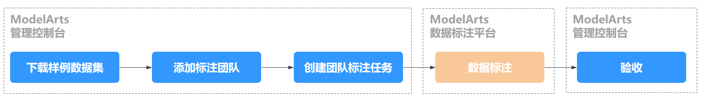

## 准备工作

在使用 ModelArts进行开发前，需先完成如下准备工作。**如果已完成，跳过此步骤。**

1.  [注册华为云帐号](https://support.huaweicloud.com/usermanual-account/account_id_001.html)。
2.  完成[实名认证](https://support.huaweicloud.com/usermanual-account/account_auth_00001.html)。
3.  登录ModelArts管理控制台，左上角选择使用区域（例如，华北-北京四），[使用委托完成访问授权](https://support.huaweicloud.com/prepare-modelarts/modelarts_08_0007.html)。
4.  在左上角服务列表中，选择对象存储服务，进入OBS管理控制台。[创建1个OBS桶](https://support.huaweicloud.com/usermanual-obs/zh-cn_topic_0045829088.html)用于存储数据。

    创建桶时，“区域“选择需与上一步骤相同，“数据冗余存储策略“选择“单AZ存储“，其他参数使用默认值。

## 下载样例数据集

本教程的样例数据集存储在AI Gallery中。如果您熟悉AI Gallery操作，可直接前往AI Gallery搜索并下载[car-and-person-without-labels](https://marketplace.huaweicloud.com/markets/aihub/datasets/detail/?content_id=998a131a-e295-4a50-9b37-93801182e778)数据集（如下图所示）。如果不熟悉下载操作，请参见[下载数据集](https://support.huaweicloud.com/aimarket-modelarts/modelarts_18_0005.html)。

**图 2**  下载示例数据集  
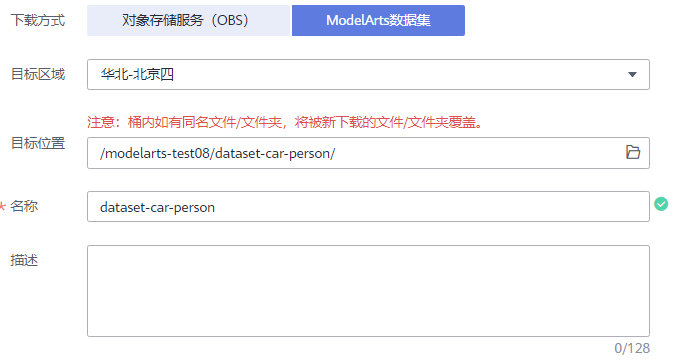

> **说明：** 
>此处下载的目标区域，一定要与ModelArts的使用区域相同。

数据集下载需要几分钟到十几分钟时间，请耐心等待。下载完成后，进入ModelArts的“数据管理\>数据集”查看下载的数据集，数据集名称为上述步骤中填写的名称。

## 添加标注团队

1.  在ModelArts管理控制台，选择“数据管理 \> 标注团队“，进入“标注团队“管理页面。
2.  单击**“添加团队”**，在弹出的“添加团队”对话框中，填写团队**“名称”**和**“描述”**，然后单击**“确定”**，完成标注团队的添加。

    **图 3**  添加团队  
    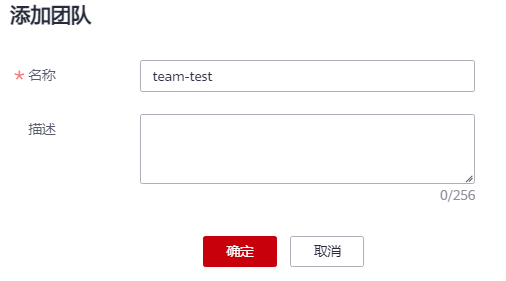

3.  选择新添加的团队，在“团队详情“中单击“添加成员“。
4.  在弹出的“添加成员“对话框中，填写成员**“邮箱“**和**“角色“**，然后单击“确定“。

    **图 4**  添加成员  
    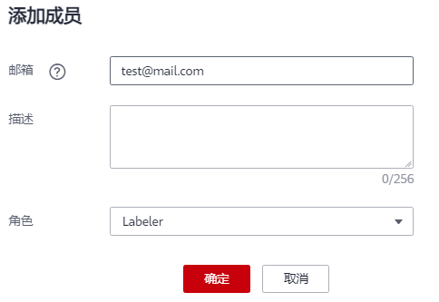

    为了您能更好的体验团队标注的全部功能，建议您准备至少两个可用的邮箱用于添加团队成员，其中一个可设置为Labeler角色，另一个为Team Manager角色；若您只有一个邮箱，请务必设置成员角色为Labeler。

    **成员角色及功能介绍**

    -   **Team manager**：支持添加、删除、更新团队成员；支持审核和标注功能。
    -   **Reviewer**：支持审核和标注功能功能。
    -   **Labeler**：支持标注功能。

    **图 5**  添加多个成员  
    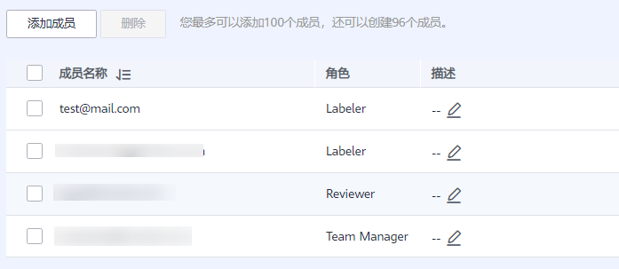

## 创建团队标注任务

1.  进入“数据管理 \> 数据集“页面，在数据集列表中，选择从AI Gallery下载的数据集。
2.  单击数据集名称进入概览页，单击右上角的“创建团队标注任务“。
3.  在弹出的“创建团队标注任务“对话框中，参考如下说明填写。

    -   **名称**：自定义
    -   **选择标注团队**：首先选择团队，然后勾选需要参与本团队标注任务的Labeler，至少选中一个Labeler。
    -   **标签集**：团队标注任务创建前数据集必须指定标签集，如果没有，请单击“创建标签集“链接快速创建。

    **图 6**  创建任务  
    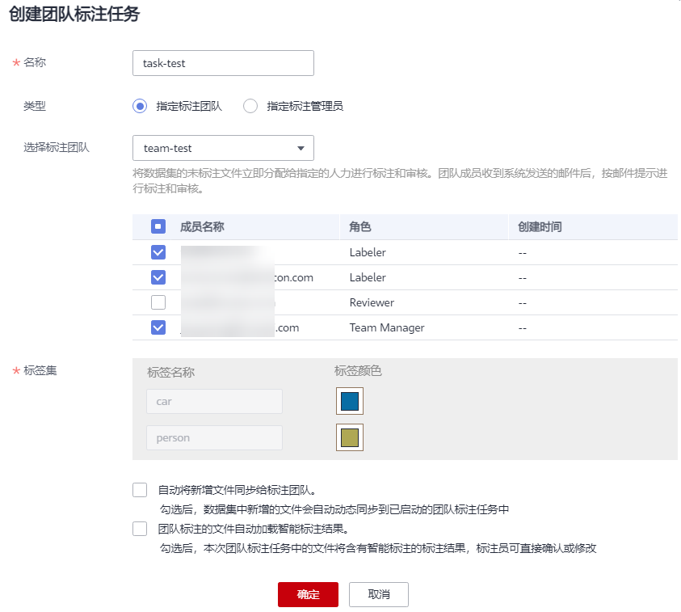

4.  单击**“确定”**按钮，完成团队标注任务的创建。

    任务创建成功后，可在概览页的标注任务进展页签下，查看任务详情。

    **图 7**  查看标注任务  
    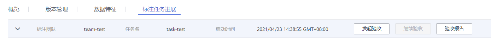

## 数据标注

针对上述任务中设置的成员（即上述步骤中勾选的Labeler），其邮箱将收到此标注任务的通知邮件，邮件标题为“您有新的标注任务待查收”。

标注成员收到的任务邮件中包含首次登录所需的“用户名”和“初始密码”，以及ModelArts数据标注平台地址，邮件内容如下所示。标注成员根据如下步骤登录并完成数据标注任务。

**图 8**  邮件示例  
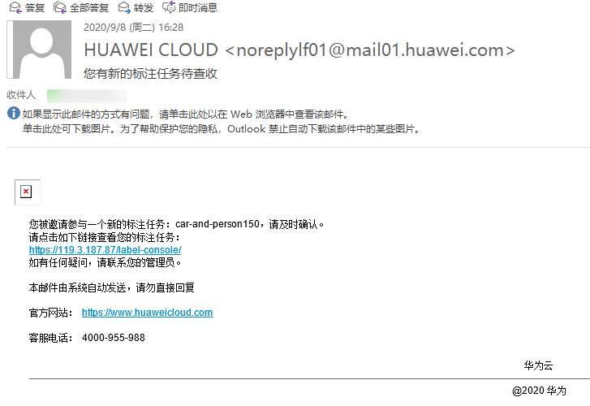

1.  在邮件详情中，使用“用户名”和“初始密码”登录ModelArts数据标注平台。

    ModelArts数据标注平台地址已在邮件中给出，直接单击链接即可前往。首次登录时，务必根据提示修改密码。

2.  单击左侧导航栏的“标注任务管理“，进入标注任务管理页，选择刚才创建的标注任务，单击右侧的“标注“操作，进入数据标注预览页。
3.  单击“未标注“页签，选中需标注的图片，单击图片，开始标注数据集。

    **图 9**  未标注页面  
    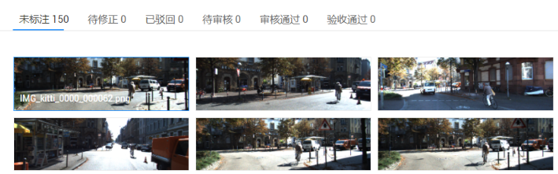

4.  在左侧工具栏中选择标注工具框选图片中的物体，并添加标签（画矩形框的方式是分别单击矩形框的左上角和右下角）。

    本教程以物体检测为例。不同类型的数据集，其标注方式不太一样，建议参考《AI工程师用户指南》\>数据标注章节，根据数据集类型了解具体标注方法。

    **图 10**  物体检测类型数据的标注  
    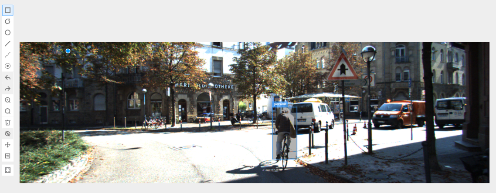

5.  单击上方的“下一张“按钮，以同样方式继续继续标注。

    当图片完成标注后，单击左上角的“返回数据标注预览“，返回数据标注预览页面。返回时界面将提示是否保存标注信息，请根据界面提示，单击“确定“完成保存。

## 验收

1.  团队标注任务的创建者，登录ModelArts管理控制台，选择“数据管理 \> 数据集“，进入数据集列表。
2.  单击对应数据集名称，进入概览页。在概览页中，选择“标注任务进展“页签，查看数据集的标注任务。
3.  单击“发起验收“，在弹出的对话框中，按如下提示设置抽样策略，单击“确定“，进入验收页面。

    **图 11**  发起验收  
    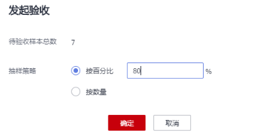

4.  在验收页面查看当前图片的标注结果，并参考如下示例，确认为通过或不通过。
    -   **通过示例**

        在右侧验收结果中单击“通过“并选择“验收评分“，然后单击“确认为通过“。

        **图 12**  通过示例  
        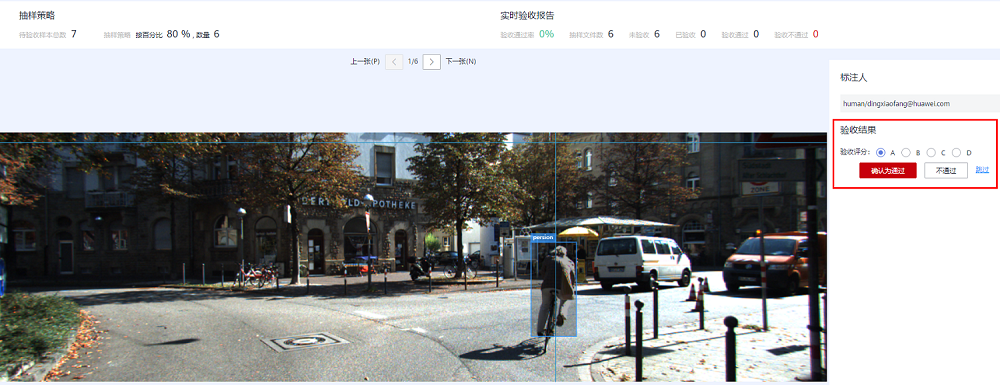

    -   **不通过示例**

        在右侧验收结果中单击“不通过“，并输入“验收建议“，然后单击“确认为不通过“。

        **图 13**  不通过示例  
        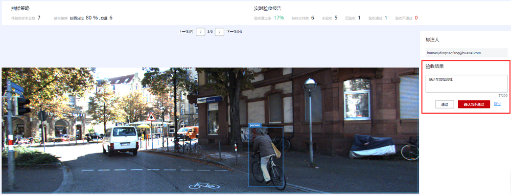

5.  单击“下一张“，继续验收。
6.  验收完成后，单击右上角“完成验收“，查看验收报告，并选择“验收通过“。

    **图 14**  完成验收  
    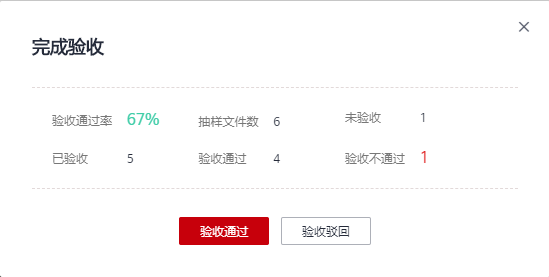

7.  在数据集概览页，单击右上角“开始标注“，进入数据集详情页。
8.  选择“已标注“页签，查看验收通过的标注结果。

    **图 15**  标注结果  
    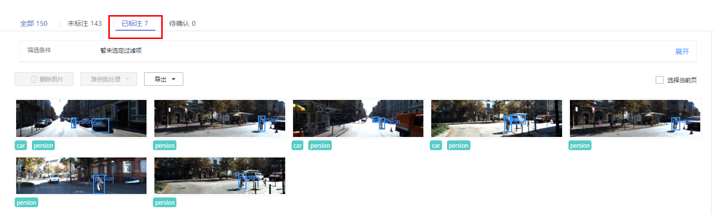

## 后续操作

当数据集的所有数据通过团队标注任务完成标注后，可将数据集发布，将发布后的数据集用于后续的模型训练任务。本教程不做详细说明，建议参考本文档中“常用框架”或“自定义镜像”等教程，了解模型训练的流程。

