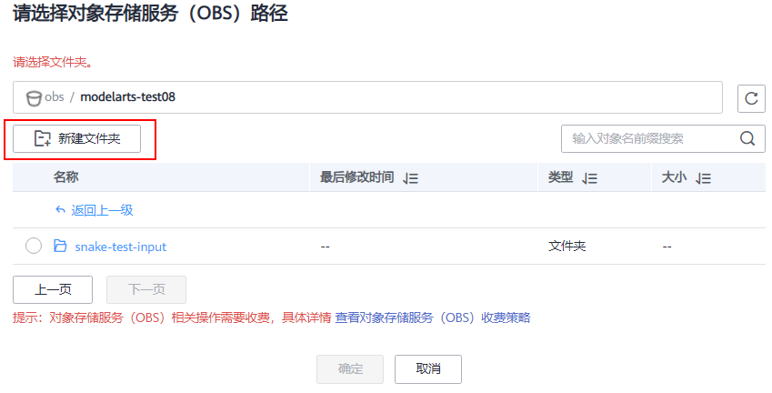
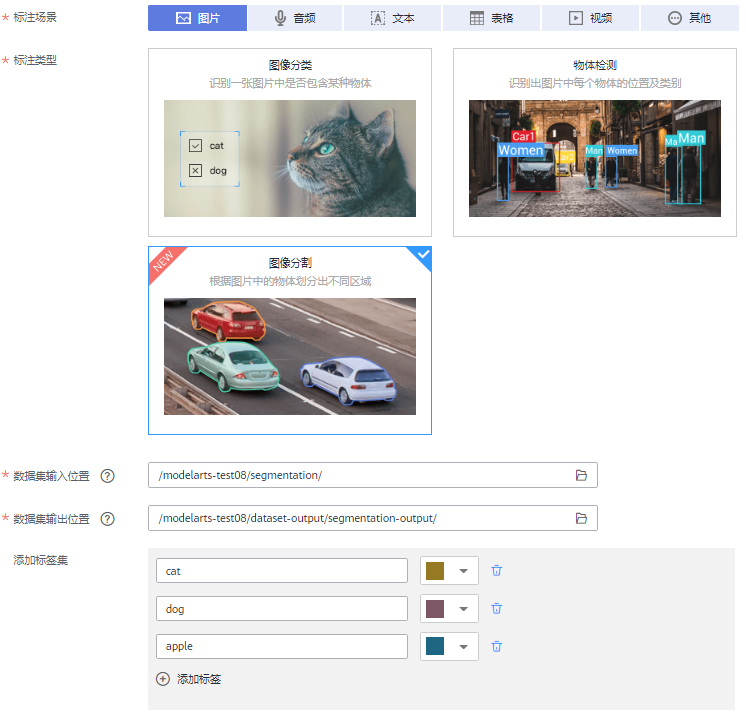
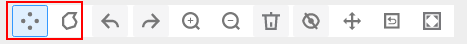
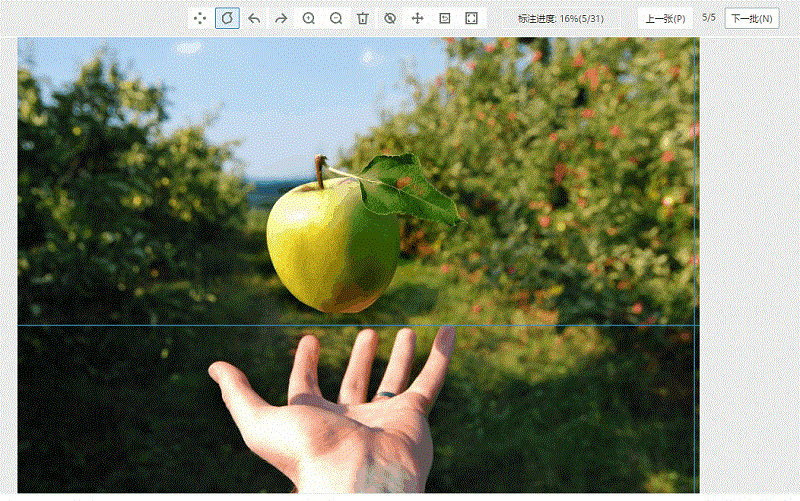
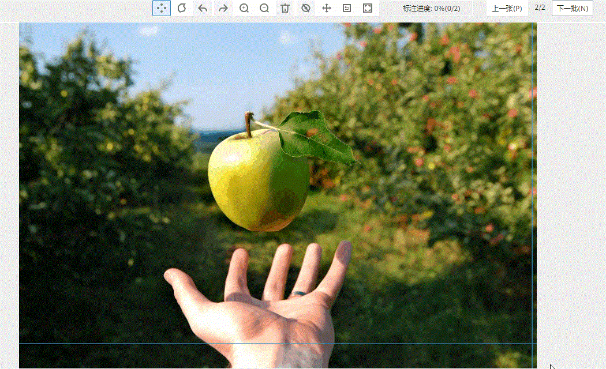
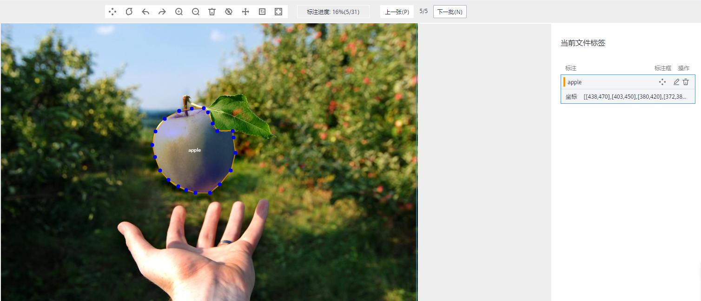
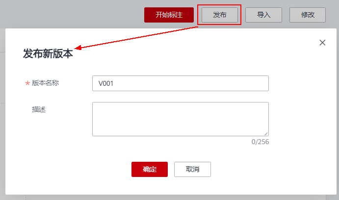
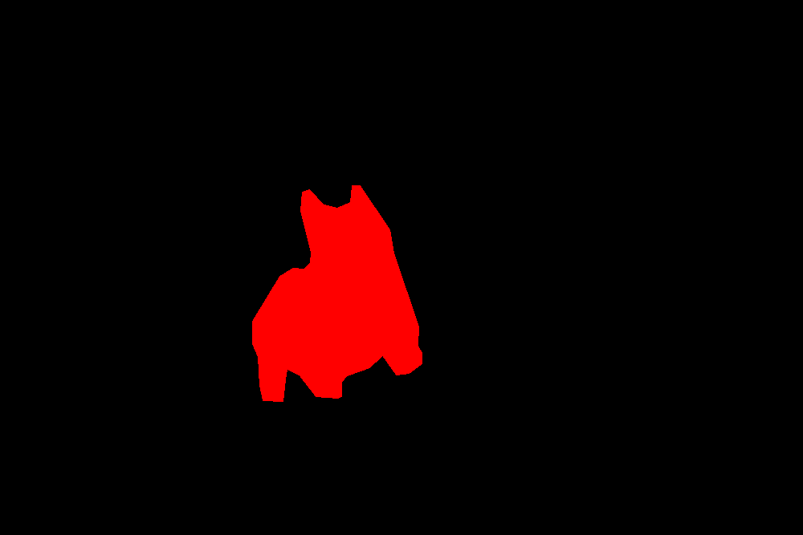

# 图像分割数据集使用教程<a name="modelarts_10_0019"></a>

ModelArts新发布支持了图像分割类型数据集，结合图像分割算法，可用于训练得到用于识别图片中每个物体轮廓的模型。

本教程指导您如何在ModelArts中创建图像分割类型的数据集，以及数据如何进行标注，为后续训练做准备。

## 准备工作<a name="section1046523124913"></a>

在使用 ModelArts进行开发前，需先完成如下准备工作。**如果已完成，跳过此步骤。**

1.  [注册华为云帐号](https://support.huaweicloud.com/usermanual-account/account_id_001.html)。
2.  完成[实名认证](https://support.huaweicloud.com/usermanual-account/account_auth_00001.html)。
3.  登录ModelArts管理控制台，左上角选择使用区域（例如，华北-北京四），[使用委托完成访问授权](https://support.huaweicloud.com/prepare-modelarts/modelarts_08_0007.html)。
4.  在左上角服务列表中，选择对象存储服务，进入OBS管理控制台。[创建1个OBS桶](https://support.huaweicloud.com/usermanual-obs/zh-cn_topic_0045829088.html)用于存储数据。

    创建桶时，“区域“选择需与上一步骤相同，“数据冗余存储策略“选择“单AZ存储“，其他参数使用默认值。


## 下载样例数据集<a name="section843983314345"></a>

本教程的样例数据集存储在AI Gallery中。如果您熟悉AI Gallery操作，可直接前往AI Gallery搜索并下载“dataset-segmentation-88“数据集。如果不熟悉操作，请参见如下详细步骤。

1.  进入ModelArts管理控制台，在左侧菜单栏中选择“AI Gallery“。
2.  进入AI Gallery后，选择“数据“页签，然后在搜索框中，输入“dataset-segmentation-88“，单击“搜索“。
3.  在搜索结果中，将呈现此样例数据集。单击数据集图片进入详情页面。
4.  单击“下载“。
5.  在弹出的下载页面中，设置“目标区域“和“目标位置“。

    “目标区域“需与ModelArts使用区域一致。例如“华北-北京四”。

    “目标位置“即指定数据集下载的目标路径，必须是OBS路径。在弹出的设置对话框中，选择准备工作中创建的OBS桶，可再此窗口中选择一个空文件夹，或者新建一个文件夹用于存储数据。

    **图 1**  设置目标位置<a name="fig1354443754213"></a>  
    

6.  单击“确定“，开始下载数据集至目标位置。

    系统页面将自动跳转至“我的数据“页面，在“我的下载“页签下，可查看对应数据集的下载进度。数据集下载需要几分钟到十几分钟时间，请耐心等待。


## 创建视频数据集<a name="section13382194153414"></a>

将下载的数据，在ModelArts中创建一个数据集，再启动标注和发布操作。如您熟悉数据集的创建操作，可选择上述数据存储目录作为“数据集输入位置“，“标注类型“选择“图像分割“。

如果您不熟悉创建数据集操作，可参考如下步骤完成任务。

1.  在ModelArts管理控制台，进入“数据管理\>数据集“页面，单击“创建数据集“。
2.  根据界面提示设置数据集相关参数，其中本示例的核心参数填写如下所示。

    -   “标注场景“：图片
    -   “标注类型“：图像分割
    -   “数据集输入位置“：设置为从AI Gallery中下载的目标位置。
    -   “数据集输出位置“：在已有的OBS桶中，创建一个空目录作为输出路径。
    -   “标签集“：添加cat、dog、apple标签，用于后续标注。也可先不设置，进入数据集详情页，了解清楚数据所需的类别后，再添加标签。

    **图 2**  创建数据集<a name="fig15568121132610"></a>  
    

3.  单击右下角“创建“，完成视频数据集的创建。

## 图像标注<a name="section1489320157"></a>

针对导入的数据集，需要对图片内的物体轮廓进行标注，可参考如下步骤。

1.  在“数据管理\>数据集“列表中，选择上述步骤中创建的数据集，单击数据集名称，进入数据集概览页。
2.  单击右上角“开始标注“，进入数据集详情页面。默认展示当前数据集中的所有数据，包含“已标注“和“未标注“图片。本示例中的图片数据均为标注，因此都是未标注图片。
3.  在数据列表中，选择一张图片，单击图片进入标注页面，在此页面，可进行标注操作。
    1.  **选择标注方式。**

        图像分割支持两种标注方式。

        -   多边形标注，根据目标物体的轮廓绘制多边形。
        -   极点标注，在目标物体轮廓的最上、最左、最下、最右的位置分别标注四个极点，极点要在物体的轮廓上。系统将根据标注的极点推理出物体的轮廓。对于背景比较复杂的图片，极点标注效果不佳，推荐使用多边形标注。

        

    2.  **多边形标注示例。**

        **图 3**  多边形标注<a name="fig01751943164418"></a>  
        

    3.  **极点标注示例。**

        **图 4**  极点标注<a name="fig7979850194419"></a>  
        

4.  针对已完成标注的数据，可在标注详情页面进行修改。

    右侧区域，可快速修改标签、删除标签。在图像展示区，鼠标选中轮廓并调整标注信息。

    **图 5**  修改标注<a name="fig63149598446"></a>  
    


参考上述操作，完成数据集中所有图片和标签类别的标注。本示例仅用于展示如何进行标注，其样本量较少，无法用于一个业务场景下的图像分割类模型训练。建议根据您的业务，每一类标签选择足够样本量进行标注和后续的模型训练。

## 发布数据集<a name="section2830185812341"></a>

标注完成后，其标注信息还未存储在OBS中，无法直接应用于模型训练。需要执行数据集发布操作，将当前数据集数据存档。

1.  在数据标注页面，完成标注后，单击左上角“返回数据标注预览“。界面将提示您保存标注数据，单击“确定“保存即可。
2.  在数据详情页面，单击左上角“返回数据集概览“，进入概览页。
3.  在概览页，单击右上角“发布“。
4.  在弹出的对话框中，默认预置了版本名称，从V001开始逐一递增。您也可以根据业务所需，设置“版本名称“。单击“确定“完成发布操作。

    **图 6**  发布数据集<a name="fig1955555614388"></a>  
    


## 发布后，相关文件目录和文件格式说明<a name="section7989164415122"></a>

版本发布后在数据集的输出目录下会生成对应的标注结果文件和mask图像。

-   目录结构

    ```
    |-- user-specified-output-path 
        |-- DatasetName-datasetId 
            |-- annotation 
                |-- VersionMame1 
                    |-- VersionMame1.manifest 
                    |-- annotations
                       |-- iamge1.xml    
                       |-- image2.xml
                    |-- segmentationClass
                       |-- image1.png
                       |-- image2.png
                |-- VersionMame2
                    ...
                |-- ...
    ```


-   示例数据：原图与mask图像

    **图 7**  原图<a name="fig4731029141511"></a>  
    

    **图 8**  mask图像<a name="fig6564144110156"></a>  
    

-   标注文件

    对比VOC，增加了mask\_source和mask\_color字段，表示mask图像存放路径和标签颜色。

    ```
    <?xml version="1.0" encoding="UTF-8" standalone="no"?>
    <annotation>
        <folder>NA</folder>
        <filename>img202101100524_N_1618456102898.JPG</filename>
        <source>
            <database>Unknown</database>
        </source>
        <size>
            <width>1000</width>
            <height>667</height>
            <depth>3</depth>
        </size>
        <segmented>1</segmented>
        <mask_source>obs://test/out/dataset-89e6-9y1T8TQRl9VoS5Te6A4/annotation/V008/segmentationClass/img202101100524_N_1618456102898.png</mask_source>
        <object>
            <name>dog</name>
            <pose>Unspecified</pose>
            <truncated>0</truncated>
            <difficult>0</difficult>
            <mask_color>255,0,0</mask_color>
            <occluded>0</occluded>
            <polygon>
                <x1>448</x1>
                <y1>231</y1>
                <x2>438</x2>
                <y2>231</y2>
                <x3>436</x3>
                <y3>252</y3>
                <x4>419</x4>
                <y4>259</y4>
                <x5>403</x5>
                <y5>255</y5>
                <x6>385</x6>
                <y6>236</y6>
                <x7>376</x7>
                <y7>239</y7>
                <x8>374</x8>
                <y8>263</y8>
                <x9>387</x9>
                <y9>314</y9>
                <x10>386</x10>
                <y10>327</y10>
                <x11>378</x11>
                <y11>335</y11>
                <x12>364</x12>
                <y12>334</y12>
                <x13>348</x13>
                <y13>344</y13>
                <x14>314</x14>
                <y14>400</y14>
                <x15>314</x15>
                <y15>428</y15>
                <x16>321</x16>
                <y16>445</y16>
                <x17>323</x17>
                <y17>480</y17>
                <x18>327</x18>
                <y18>499</y18>
                <x19>352</x19>
                <y19>500</y19>
                <x20>355</x20>
                <y20>473</y20>
                <x21>357</x21>
                <y21>460</y21>
                <x22>372</x22>
                <y22>467</y22>
                <x23>393</x23>
                <y23>494</y23>
                <x24>420</x24>
                <y24>496</y24>
                <x25>425</x25>
                <y25>494</y25>
                <x26>425</x26>
                <y26>476</y26>
                <x27>432</x27>
                <y27>468</y27>
                <x28>460</x28>
                <y28>458</y28>
                <x29>476</x29>
                <y29>443</y29>
                <x30>493</x30>
                <y30>467</y30>
                <x31>509</x31>
                <y31>465</y31>
                <x32>525</x32>
                <y32>453</y32>
                <x33>525</x33>
                <y33>439</y33>
                <x34>520</x34>
                <y34>431</y34>
                <x35>521</x35>
                <y35>407</y35>
                <x36>490</x36>
                <y36>315</y36>
                <x37>485</x37>
                <y37>286</y37>
                <x38>448</x38>
                <y38>231</y38>
            </polygon>
        </object>
    </annotation>
    ```


## 后续操作<a name="section5148676544"></a>

针对发布后的数据集，您可以订阅AI Gallery中的预置算法，也可自己开发算法，在ModelArts管理控制台中创建训练作业，得到模型。

本教程不详细介绍如何创建训练作业，建议您参考其他教程学习。下述教程一般以图像分类的数据作为示例，如需开发图像分割的模型，将数据和算法均替换为图像分割类型即可。

-   使用预置算法训练模型：[使用AI Gallery的订阅算法训练模型](modelarts_10_0025.md)
-   自定义开发算法（包含常用框架或自定义镜像），并训练模型：[使用TensorFlow实现手写数字识别](zh-cn_topic_0169506909.md)、[使用自定义镜像创建训练作业（GPU）](使用自定义镜像创建训练作业（GPU）.md)

