# 手势判断技能开发

ModelArts是面向AI开发者的一站式开发平台，您可以使用ModelArts开发一个用于华为HiLens平台的算法模型，然后基于您自定义的算法模型和逻辑代码新建技能。

本章节提供了一个手势判断技能的样例，介绍从模型训练到查看技能效果，新建一个全新技能的全流程，帮助您快速熟悉华为HiLens技能开发的使用过程。

开始使用样例前，请仔细阅读[准备工作](#zh-cn_topic_0210438981_section126181957182213)罗列的要求，提前完成准备工作。具体技能开发的步骤如下所示：

-   [步骤1：准备数据](#zh-cn_topic_0210438981_section441945153220)
-   [步骤2：创建数据集](#zh-cn_topic_0210438981_section1876312207574)
-   [步骤3：订阅算法](#zh-cn_topic_0210438981_section257731893314)
-   [步骤4：使用订阅算法创建训练作业](#zh-cn_topic_0210438981_section4733145311173)
-   [步骤5：转换模型](#zh-cn_topic_0210438981_section20261494186)
-   [步骤6：导入模型至华为HiLens](#zh-cn_topic_0210438981_section1581332195)
-   [步骤7：新建技能](#zh-cn_topic_0210438981_section17571200282)
-   [步骤8：（可选）发布技能](#zh-cn_topic_0210438981_section111901534397)
-   [步骤9：安装技能](#zh-cn_topic_0210438981_section11989692030)
-   [步骤10：启动技能](#zh-cn_topic_0210438981_section1331484918301)

## 准备工作

-   已注册华为云帐号，且在使用华为HiLens前检查帐号状态，帐号不能处于欠费或冻结状态。
-   已购买HiLens Kit设备，并准备好网线，电脑，路由器，HDMI线，显示屏。
-   成功注册设备HiLens Kit设备至华为HiLens控制台，详情请参见[注册HiLens Kit](https://support.huaweicloud.com/usermanual-hilens/hilens_02_0048.html)。
-   登录OBS服务，创建桶和文件夹，用于存放样例的训练数据。创建名称为“hilens-gesture“OBS桶，区域选择“华北-北京四“，创建如下文件夹：

    -   “gesture-data“：用于存放训练模型的数据。
    -   “gesture-data-output“：用于存放模型输出数据。
    -   “gesture-data-record“：用于存放日志。
    -   “gesture-convert-output“：用于存放转换模型后的输出文件。

    创建OBS桶和文件夹的操作指导请参见[创建桶](https://support.huaweicloud.com/usermanual-obs/obs_03_0306.html)和[新建文件夹](https://support.huaweicloud.com/usermanual-obs/obs_03_0316.html)。为保证模型数据能正常访问，请务必保证创建的OBS桶与华为HiLens在同一区域。

    占用OBS资源的操作均会收取一定费用，收费规则请参见[对象存储服务 OBS](https://www.huaweicloud.com/pricing.html?tab=detail#/obs)。

## 步骤1：准备数据

华为HiLens在公共OBS桶中提供了手势判断技能的用于模型训练的示例数据，命名为“gesture\_recognition\_data“，因此本文的操作示例使用此示例模型进行技能开发。您需要执行如下操作，将模型文件上传至您的OBS目录下，即准备工作中您创建的OBS目录“hilens-gesture/gesture-recognition“。

1.  单击[示例数据下载链接](https://hilens-guide-cn-north-4.obs.cn-north-4.myhuaweicloud.com/gesture_recognition_data.zip)，将手势判断案例示例数据“gesture\_recognition\_data“下载至本地。
2.  在本地，将“gesture\_recognition\_data“压缩包解压。例如解压至本地“gesture\_recognition\_data“文件夹下，包括1个子文件夹“gesture-data“和1个“.py“文件。
3.  参考[上传文件](https://support.huaweicloud.com/clientogw-obs/obs_03_0414.html)，利用OBS Browser+工具将“gesture\_recognition\_data/gesture-data“文件夹下的所有数据上传至“hilens-gesture/gesture-data“OBS路径下，OBS Browser+使用方法请参见[OBS Browser+工具指南](https://support.huaweicloud.com/browsertg-obs/obs_03_1000.html)。

## 步骤2：创建数据集

1.  登录[ModelArts管理控制台](https://console.huaweicloud.com/modelarts/)，根据要求完成[访问权限配置](https://support.huaweicloud.com/prepare-modelarts/modelarts_08_0002.html)。
2.  在左侧菜单栏中选择“数据管理\>数据集“。
3.  在数据集管理页面，单击“创建数据集“。在“创建数据集“页面，“数据集输入位置“选择[步骤1：准备数据](#zh-cn_topic_0210438981_section441945153220)中上传的数据存储目录（OBS路径），需选择到具体图片存储的父目录。“数据集输出位置“，请指定一个空目录，且此目录不能是数据来源目录下的子目录。“标注类型“选择“图像分类“。

    **图 1**  创建数据集  
    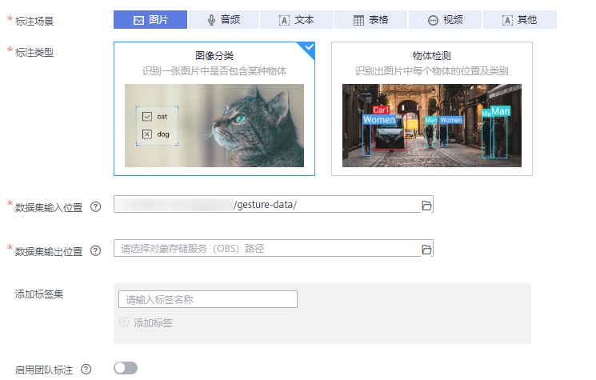

4.  参数填写完成后，单击“创建“，完成数据集创建。

    进入数据集管理页面，等待数据同步完毕，您可以单击数据集名称进入概览页面，了解进度。由于提供的样例数据集已完成数据标注，当数据集概览页面显示图片已标注，表示数据已同步完成。

    **图 2**  标注进展  
    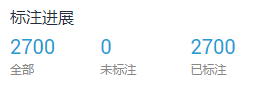

5.  发布数据集。

    在数据集管理页面，单击“发布“，在弹出窗口中，根据界面提示进行配置。由于本示例使用的算法，必须使用切分的数据集进行训练，因此训练验证比例的参数必须设置，建议设置为“0.8“或“0.9“，表示训练集和验证集的比例为“8：2“或“9：1“。

6.  单击“确定“完成发布数据集。

    **图 3**  发布数据集  
    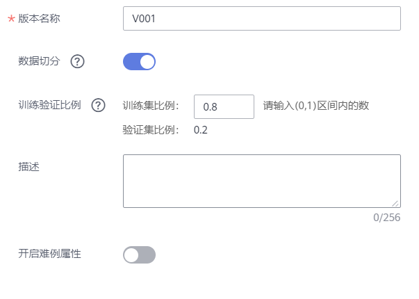

## 步骤3：订阅算法

ModelArts官方提供了一个“ResNet\_v1\_50“，算法用途为图像分类，您可以使用此算法训练，得到所需的模型。目前“resnet\_v1\_50“算法发布在AI Gallery中。您可以前往AI Gallery，订阅此算法，然后同步至ModelArts中。

1.  登录ModelArts管理控制台，在左侧菜单栏中选择“AI Gallery“。进入新版AI Gallery。
2.  在AI Gallery中，选择“算法“页签，在搜索框中输入“ResNet\_v1\_50“，查找对应的算法。

    ModelArts AI Gallery有三个“ResNet\_v1\_50“，请选择仅支持Ascend 310推理的算法进行应用。即图标中无“Ascend 910/Ascend 310”标识的算法。

    **图 4**  选择“ResNet\_v1\_50“算法  
    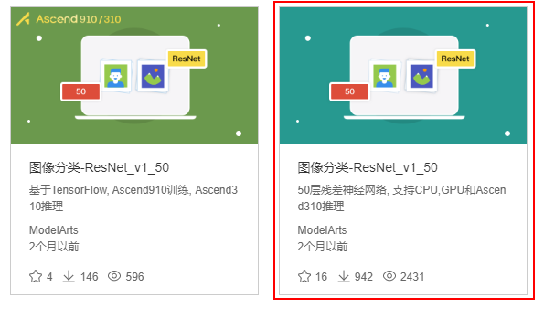

3.  单击算法名称进入算法详情页，单击右侧的“订阅“，根据界面提示完成算法订阅。

    此算法由ModelArts官方提供，目前免费开放。订阅算法完成后，页面的“订阅“按钮显示为“已订阅“。

4.  单击详情页的“前往控制台“，此时弹出“选择云服务区域“对话框，选择ModelArts对应的区域，然后再单击“确定“。

    页面将自动跳转至ModelArts的“算法管理\>我的订阅“中同步对应的算法。

    **图 5**  前往控制台  
    

    **图 6**  选择云服务区域  
    

5.  在ModelArts管理控制台的算法管理页面，算法将自动同步至ModelArts中。

    未同步的算法，无法直接用于创建训练作业，因此从AI Gallery订阅完成后，需在ModelArts管理控制台执行同步操作。同步成功后，下方界面中的“创建训练作业“按钮可用，且状态变更为“就绪“。

    **图 7**  同步算法  
    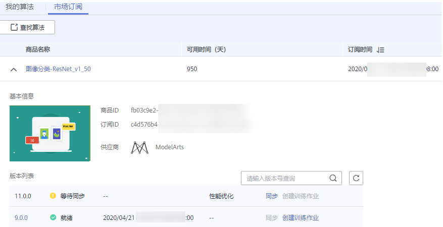

## 步骤4：使用订阅算法创建训练作业

1.  进入ModelArts管理控制台，单击左侧导航栏“训练管理\>训练作业“，进入“训练作业“页面。
2.  单击“创建“，进入“创建训练作业“页面。
3.  在“创建训练作业“页面，填写训练作业相关参数，然后单击“下一步“。
    1.  在基本信息区域，“计费模式“和“版本“为系统自动生成，不需修改。请根据界面提示填写“名称“和“描述“。

        **图 8**  训练作业基本信息  
        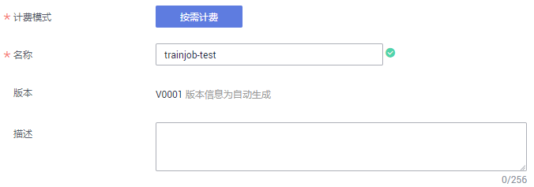

    2.  设置“算法来源“为订阅的“ResNet\_v1\_50“算法。在“算法来源“，选择“算法管理“，单击“算法名称“右侧的“选择“，在弹出框中，选择“我的订阅“的算法，如[图10](#zh-cn_topic_0210438981_fig164819386473)所示。

        **图 9**  算法来源设置为算法管理  
        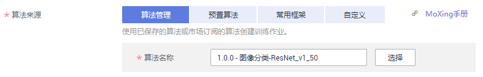

        **图 10**  选择AI Gallery的算法  
        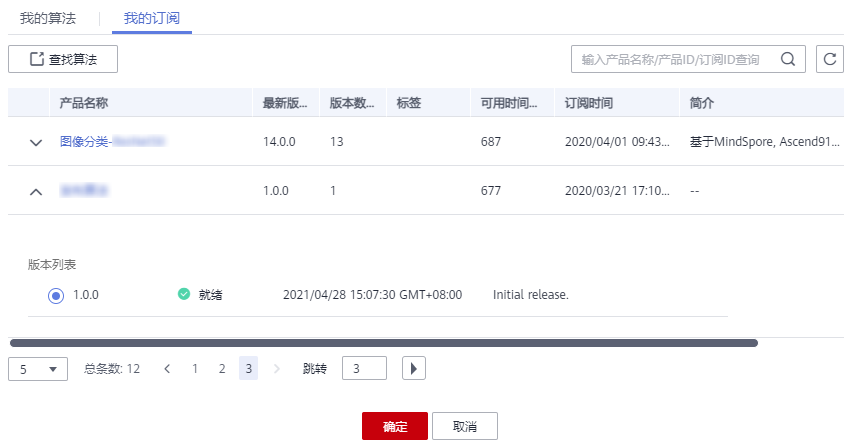

    1.  按[表1](#zh-cn_topic_0210438981_table19892559888)设置“训练输入“、“训练输出“、“调优参数“。

        **表 1**  训练作业参数

        
        <table><thead align="left"><tr id="zh-cn_topic_0210438981_row48924594815"><th class="cellrowborder" valign="top" width="30%" id="mcps1.2.3.1.1">
参数

        </th>
        <th class="cellrowborder" valign="top" width="70%" id="mcps1.2.3.1.2">
推荐填写

        </th>
        </tr>
        </thead>
        <tbody><tr id="zh-cn_topic_0210438981_row48923591187"><td class="cellrowborder" valign="top" width="30%" headers="mcps1.2.3.1.1 ">
“训练输入”

        </td>
        <td class="cellrowborder" valign="top" width="70%" headers="mcps1.2.3.1.2 ">
选择“数据集”，选择<a href="#zh-cn_topic_0210438981_section1876312207574">步骤2：创建数据集</a>中创建并发布的数据集及其版本。

        </td>
        </tr>
        <tr id="zh-cn_topic_0210438981_row128924598816"><td class="cellrowborder" valign="top" width="30%" headers="mcps1.2.3.1.1 ">
“训练输出”

        </td>
        <td class="cellrowborder" valign="top" width="70%" headers="mcps1.2.3.1.2 ">
选择<a href="#zh-cn_topic_0210438981_section126181957182213">准备工作</a>中新建的“hilens-gesture/gesture-data-output”文件夹。建议设置为一个OBS空目录，且此目录不能是数据来源目录下的子目录。

        </td>
        </tr>
        <tr id="zh-cn_topic_0210438981_row48923591088"><td class="cellrowborder" valign="top" width="30%" headers="mcps1.2.3.1.1 ">
“调优参数”

        </td>
        <td class="cellrowborder" valign="top" width="70%" headers="mcps1.2.3.1.2 ">
本示例可使用官方提供的默认参数值。如果您需要调整，建议参考<a href="https://marketplace.huaweicloud.com/markets/aihub/modelhub/detail/?id=40b66195-5bbe-463d-b8a2-03e57073538d" target="_blank" rel="noopener noreferrer">算法说明</a>进行调整。

        </td>
        </tr>
        <tr id="zh-cn_topic_0210438981_row789275920819"><td class="cellrowborder" valign="top" width="30%" headers="mcps1.2.3.1.1 ">
“作业日志路径”

        </td>
        <td class="cellrowborder" valign="top" width="70%" headers="mcps1.2.3.1.2 ">
选择<a href="#zh-cn_topic_0210438981_section126181957182213">准备工作</a>中新建的“gesture-data-record”文件夹用于存放日志。

        </td>
        </tr>
        </tbody>
        </table>

        **图 11**  训练作业详细参数  
        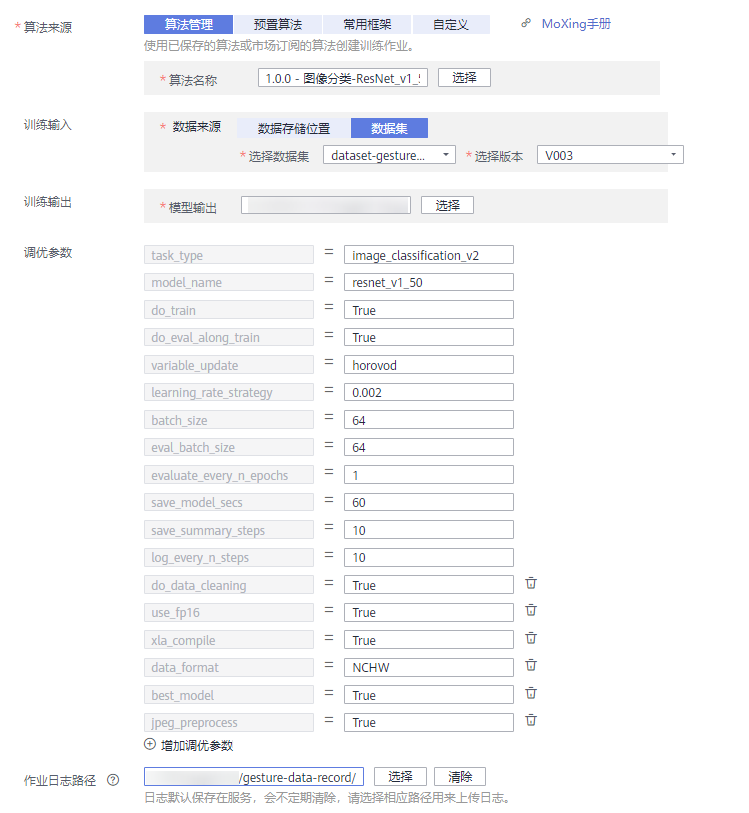

    2.  在资源设置区域，选择“公共资源池“，并选择一个“规格“，建议选择一个GPU规格，运行效果更佳，“计算节点个数“设置为“1“。

        **图 12**  选择资源  
        

    3.  完成信息填写，单击“下一步“。

4.  在“规格确认“页面，确认填写信息无误后，单击“提交“。
5.  在“训练作业“管理页面，可以查看新建训练作业的状态。训练作业的创建和运行需要一些时间，预计十几分钟，当状态变更为“运行成功“时，表示训练作业创建完成。

    您可以单击训练作业的名称，可进入此作业详情页面，了解训练作业的“配置信息“、“日志“、和“资源占用情况“等信息。在“训练输出位置“所在的OBS路径中，可以获取到生成的模型文件。

## 步骤5：转换模型

1.  在ModelArts管理控制台中，选择左侧导航栏的“模型管理\>压缩/转换“，进入模型转换列表页面。
2.  单击左上角的“创建任务“，进入任务创建任务页面。
3.  在“创建任务“页面，按[表2](#zh-cn_topic_0210438981_table146251321147)填写相关信息，如[图13](#zh-cn_topic_0210438981_fig84565455620)所示。

    **表 2**  创建任务参数

    
    <table><thead align="left"><tr id="zh-cn_topic_0210438981_row9626203218412"><th class="cellrowborder" valign="top" width="30%" id="mcps1.2.3.1.1">
参数

    </th>
    <th class="cellrowborder" valign="top" width="70%" id="mcps1.2.3.1.2">
推荐填写

    </th>
    </tr>
    </thead>
    <tbody><tr id="zh-cn_topic_0210438981_row1462618321411"><td class="cellrowborder" valign="top" width="30%" headers="mcps1.2.3.1.1 ">
“名称”

    </td>
    <td class="cellrowborder" valign="top" width="70%" headers="mcps1.2.3.1.2 ">
输入“gesture-recognition”。

    </td>
    </tr>
    <tr id="zh-cn_topic_0210438981_row66268321244"><td class="cellrowborder" valign="top" width="30%" headers="mcps1.2.3.1.1 ">
“描述”

    </td>
    <td class="cellrowborder" valign="top" width="70%" headers="mcps1.2.3.1.2 ">
输入判断手势技能的简短描述，如：将判断手势技能模型转换为“.om”格式。

    </td>
    </tr>
    <tr id="zh-cn_topic_0210438981_row13626532349"><td class="cellrowborder" valign="top" width="30%" headers="mcps1.2.3.1.1 ">
“输入框架”

    </td>
    <td class="cellrowborder" valign="top" width="70%" headers="mcps1.2.3.1.2 ">
选择“TensorFlow”。

    </td>
    </tr>
    <tr id="zh-cn_topic_0210438981_row26261832147"><td class="cellrowborder" valign="top" width="30%" headers="mcps1.2.3.1.1 ">
“转换输入目录”

    </td>
    <td class="cellrowborder" valign="top" width="70%" headers="mcps1.2.3.1.2 ">
选择转换输入目录为“hilens-gesture/gesture-data-output/frozen_graph”。

    </td>
    </tr>
    <tr id="zh-cn_topic_0210438981_row1162673213416"><td class="cellrowborder" valign="top" width="30%" headers="mcps1.2.3.1.1 ">
“输出框架”

    </td>
    <td class="cellrowborder" valign="top" width="70%" headers="mcps1.2.3.1.2 ">
选择“MindSpore”。

    </td>
    </tr>
    <tr id="zh-cn_topic_0210438981_row4626132244"><td class="cellrowborder" valign="top" width="30%" headers="mcps1.2.3.1.1 ">
“转换输出目录”

    </td>
    <td class="cellrowborder" valign="top" width="70%" headers="mcps1.2.3.1.2 ">
选择转换输出目录为“hilens-gesture/gesture-convert-output”。

    </td>
    </tr>
    <tr id="zh-cn_topic_0210438981_row96263328411"><td class="cellrowborder" valign="top" width="30%" headers="mcps1.2.3.1.1 ">
“转换模板”

    </td>
    <td class="cellrowborder" valign="top" width="70%" headers="mcps1.2.3.1.2 ">
选择“TF-FrozenGraph-To-Ascend-HiLens”。

    </td>
    </tr>
    <tr id="zh-cn_topic_0210438981_row05435431856"><td class="cellrowborder" valign="top" width="30%" headers="mcps1.2.3.1.1 ">
“高级选项”

    </td>
    <td class="cellrowborder" valign="top" width="70%" headers="mcps1.2.3.1.2 ">
“输入张量形状”设置为“images:1,224,224,3”，其他选项均为默认值。

    </td>
    </tr>
    </tbody>
    </table>

    **图 13**  创建模型压缩/转换任务  
    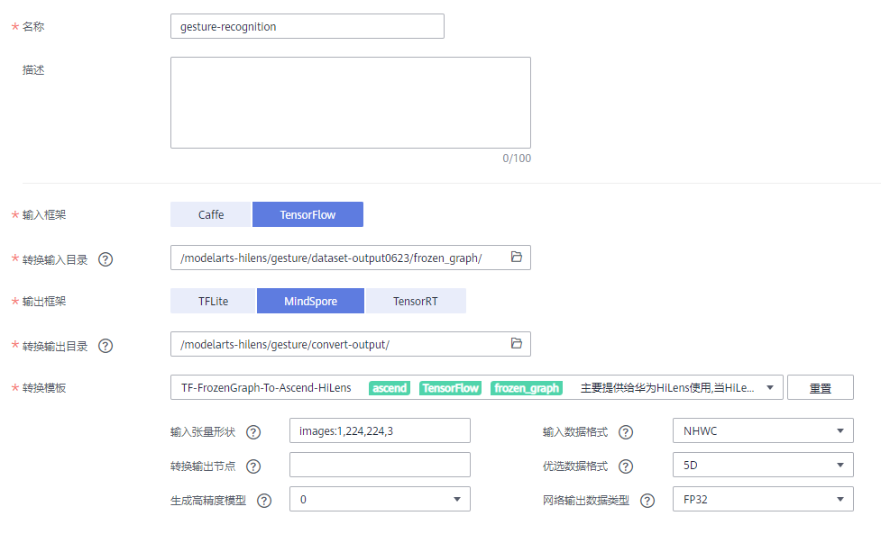

4.  任务信息填写完成后，单击右下角“立即创建“。

    创建完成后，系统自动跳转至“模型压缩/转换列表“中。刚创建的转换任务将呈现在界面中，其“任务状态“为“初始化“。任务执行过程预计需要几分钟到十几分钟不等，请耐心等待，当“任务状态“变为“成功“时，表示任务运行完成并且模型转换成功。

    如果“任务状态“变为“失败“，建议单击任务名称进入详情页面，查看日志信息，根据日志信息调整任务的相关参数并创建新的转换任务。

## 步骤6：导入模型至华为HiLens

1.  登录[华为HiLens管理控制台](https://console.huaweicloud.com/hilens/)，在左侧导航栏中选择“技能开发\>模型管理“，进入“模型管理“页面。

    > **说明：** 
    >华为HiLens控制台技能开发所在的区域应和在ModelArts AI Gallery订阅算法的区域[图5](#zh-cn_topic_0210438981_fig12970625016)一致。

2.  在“模型管理“页面，单击右上角的“导入（转换）模型“。
3.  在“导入模型“页面，然后参考[表3](#zh-cn_topic_0210438981_table1726611304617)填写参数，信息确认无误后单击“确定“完成导入，如[图14](#zh-cn_topic_0210438981_fig127494633615)所示。

    **表 3**  导入模型参数

    
    <table><thead align="left"><tr id="zh-cn_topic_0210438981_row1826713013617"><th class="cellrowborder" valign="top" width="23%" id="mcps1.2.3.1.1">
参数

    </th>
    <th class="cellrowborder" valign="top" width="77%" id="mcps1.2.3.1.2">
推荐填写

    </th>
    </tr>
    </thead>
    <tbody><tr id="zh-cn_topic_0210438981_row526713301613"><td class="cellrowborder" valign="top" width="23%" headers="mcps1.2.3.1.1 ">
“名称”

    </td>
    <td class="cellrowborder" valign="top" width="77%" headers="mcps1.2.3.1.2 ">
输入“gesture-recognition”。

    </td>
    </tr>
    <tr id="zh-cn_topic_0210438981_row926773014610"><td class="cellrowborder" valign="top" width="23%" headers="mcps1.2.3.1.1 ">
“版本”

    </td>
    <td class="cellrowborder" valign="top" width="77%" headers="mcps1.2.3.1.2 ">
输入“1.0.0”。

    </td>
    </tr>
    <tr id="zh-cn_topic_0210438981_row42678301768"><td class="cellrowborder" valign="top" width="23%" headers="mcps1.2.3.1.1 ">
“描述”

    </td>
    <td class="cellrowborder" valign="top" width="77%" headers="mcps1.2.3.1.2 ">
输入导入模型的描述。

    </td>
    </tr>
    <tr id="zh-cn_topic_0210438981_row926733015616"><td class="cellrowborder" valign="top" width="23%" headers="mcps1.2.3.1.1 ">
“模型来源”

    </td>
    <td class="cellrowborder" valign="top" width="77%" headers="mcps1.2.3.1.2 ">
单击“从ModelArts导入”，在右侧下拉框中选择“OM（从转换任务中获取）”，然后在下方转换任务列表中勾选之前在<a href="#zh-cn_topic_0210438981_section20261494186">步骤5：转换模型</a>转换的模型“gesture-recognition”。

    </td>
    </tr>
    </tbody>
    </table>

    **图 14**  导入模型  
    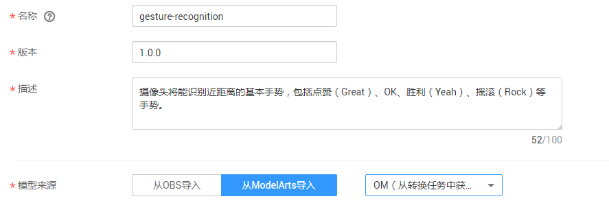

    模型导入后，将进入“模型管理“页面，您导入的模型可从列表中查看模型状态，导入成功后模型“状态“为“导入成功“。

## 步骤7：新建技能

1.  在华为HiLens管理控制台的左侧导航栏中选择“技能开发\>技能管理“，进入技能列表。
2.  在“技能管理“页面，单击右上角“新建技能“，进入“创建技能“页面。
3.  在“创建技能“页面，在“技能模板“中选择“使用空模板“后，填写基本信息和技能内容。

    **基本信息**

    按[表4](#zh-cn_topic_0210438981_table669314414818)填写技能的基本信息，如[图15](#zh-cn_topic_0210438981_fig147302179154)所示。

    **表 4**  技能基本信息参数

    
    <table><thead align="left"><tr id="zh-cn_topic_0210438981_row4693441584"><th class="cellrowborder" valign="top" width="30%" id="mcps1.2.3.1.1">
参数

    </th>
    <th class="cellrowborder" valign="top" width="70%" id="mcps1.2.3.1.2">
推荐填写

    </th>
    </tr>
    </thead>
    <tbody><tr id="zh-cn_topic_0210438981_row26937415812"><td class="cellrowborder" valign="top" width="30%" headers="mcps1.2.3.1.1 ">
“技能模板”

    </td>
    <td class="cellrowborder" valign="top" width="70%" headers="mcps1.2.3.1.2 ">
选择“使用空模板”。

    </td>
    </tr>
    <tr id="zh-cn_topic_0210438981_row1769318412819"><td class="cellrowborder" valign="top" width="30%" headers="mcps1.2.3.1.1 ">
“技能名称”

    </td>
    <td class="cellrowborder" valign="top" width="70%" headers="mcps1.2.3.1.2 ">
输入“Gesture_Recognition”。

    </td>
    </tr>
    <tr id="zh-cn_topic_0210438981_row166936412815"><td class="cellrowborder" valign="top" width="30%" headers="mcps1.2.3.1.1 ">
“技能版本”

    </td>
    <td class="cellrowborder" valign="top" width="70%" headers="mcps1.2.3.1.2 ">
输入“1.0.0”。

    </td>
    </tr>
    <tr id="zh-cn_topic_0210438981_row06937415815"><td class="cellrowborder" valign="top" width="30%" headers="mcps1.2.3.1.1 ">
“适用芯片”

    </td>
    <td class="cellrowborder" valign="top" width="70%" headers="mcps1.2.3.1.2 ">
默认为“Ascend310”。

    </td>
    </tr>
    <tr id="zh-cn_topic_0210438981_row1769354781"><td class="cellrowborder" valign="top" width="30%" headers="mcps1.2.3.1.1 ">
“检验值”

    </td>
    <td class="cellrowborder" valign="top" width="70%" headers="mcps1.2.3.1.2 ">
根据<a href="#zh-cn_topic_0210438981_section441945153220">步骤1：准备数据</a>所下载的“手势判断案例”文件夹中的“main.py”文件中init函数参数的值的代码，这里检验值应输入“gesture”。此处的检验值和init函数参数值应保持一致。

    </td>
    </tr>
    <tr id="zh-cn_topic_0210438981_row669412420814"><td class="cellrowborder" valign="top" width="30%" headers="mcps1.2.3.1.1 ">
“应用场景”

    </td>
    <td class="cellrowborder" valign="top" width="70%" headers="mcps1.2.3.1.2 ">
选择“其他”，文本框中输入“手势判断”。

    </td>
    </tr>
    <tr id="zh-cn_topic_0210438981_row186949413811"><td class="cellrowborder" valign="top" width="30%" headers="mcps1.2.3.1.1 ">
“技能图标”

    </td>
    <td class="cellrowborder" valign="top" width="70%" headers="mcps1.2.3.1.2 ">
上传技能图标。

    </td>
    </tr>
    <tr id="zh-cn_topic_0210438981_row165641053895"><td class="cellrowborder" valign="top" width="30%" headers="mcps1.2.3.1.1 ">
“技能图片”

    </td>
    <td class="cellrowborder" valign="top" width="70%" headers="mcps1.2.3.1.2 ">
用来向用户介绍技能的使用或技能的效果，可不上传。

    </td>
    </tr>
    <tr id="zh-cn_topic_0210438981_row13394795106"><td class="cellrowborder" valign="top" width="30%" headers="mcps1.2.3.1.1 ">
“OS平台”

    </td>
    <td class="cellrowborder" valign="top" width="70%" headers="mcps1.2.3.1.2 ">
选择“Linux”系统。

    </td>
    </tr>
    <tr id="zh-cn_topic_0210438981_row1839620131018"><td class="cellrowborder" valign="top" width="30%" headers="mcps1.2.3.1.1 ">
“描述”

    </td>
    <td class="cellrowborder" valign="top" width="70%" headers="mcps1.2.3.1.2 ">
输入技能的描述。

    </td>
    </tr>
    </tbody>
    </table>

    **图 15**  填写基本信息  
    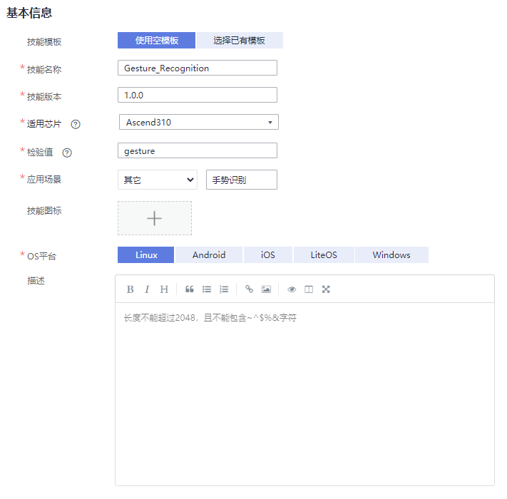

    **技能内容**

    根据您的模型和逻辑代码情况，按[表5](#zh-cn_topic_0210438981_table10674115251118)填写技能内容，详细参数说明请参见[技能内容](https://support.huaweicloud.com/usermanual-hilens/hilens_02_0022.html#section4)。

    **表 5**  技能内容参数

    
    <table><thead align="left"><tr id="zh-cn_topic_0210438981_row467425218112"><th class="cellrowborder" valign="top" width="25%" id="mcps1.2.3.1.1">
参数

    </th>
    <th class="cellrowborder" valign="top" width="75%" id="mcps1.2.3.1.2">
推荐填写

    </th>
    </tr>
    </thead>
    <tbody><tr id="zh-cn_topic_0210438981_row18674155261115"><td class="cellrowborder" valign="top" width="25%" headers="mcps1.2.3.1.1 ">
“技能格式”

    </td>
    <td class="cellrowborder" valign="top" width="75%" headers="mcps1.2.3.1.2 ">
选择“技能包”格式。

    </td>
    </tr>
    <tr id="zh-cn_topic_0210438981_row196741452141117"><td class="cellrowborder" valign="top" width="25%" headers="mcps1.2.3.1.1 ">
“运行时语言”

    </td>
    <td class="cellrowborder" valign="top" width="75%" headers="mcps1.2.3.1.2 ">
选择“Python3.7”。

    </td>
    </tr>
    <tr id="zh-cn_topic_0210438981_row196741152151110"><td class="cellrowborder" valign="top" width="25%" headers="mcps1.2.3.1.1 ">
“代码执行文件”

    </td>
    <td class="cellrowborder" valign="top" width="75%" headers="mcps1.2.3.1.2 ">
默认输入“index.py”。

    </td>
    </tr>
    <tr id="zh-cn_topic_0210438981_row1367445214118"><td class="cellrowborder" valign="top" width="25%" headers="mcps1.2.3.1.1 ">
“模型”

    </td>
    <td class="cellrowborder" valign="top" width="75%" headers="mcps1.2.3.1.2 ">
单击加号，您可以在弹出框中，选择导入的模型“gesture-recognition”。

    </td>
    </tr>
    <tr id="zh-cn_topic_0210438981_row1767485271115"><td class="cellrowborder" valign="top" width="25%" headers="mcps1.2.3.1.1 ">
“代码上传方式”

    </td>
    <td class="cellrowborder" valign="top" width="75%" headers="mcps1.2.3.1.2 ">
选择“在线编辑”，在代码编辑框中直接编辑代码，可直接复制<a href="#zh-cn_topic_0210438981_section441945153220">步骤1：准备数据</a>所下载的“手势判断案例”文件夹中的“.py”文件中的代码内容，请核对代码中模型名称，保持代码中的模型名称与<a href="#zh-cn_topic_0210438981_section20261494186">步骤5：转换模型</a>的模型名称一致。此样例中模型名称应是“gesture-recognition.om”，如下所示。<pre class="screen" id="zh-cn_topic_0210438981_screen57699273134">model   = hilens.Model(hilens.get_model_dir() + "gesture-recognition.om")</pre>
    

    </td>
    </tr>
    </tbody>
    </table>

    **图 16**  技能内容  
    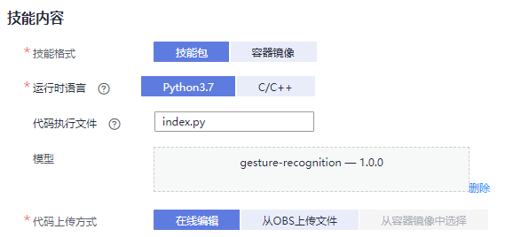

    基本信息和技能内容填写完成后，您可以在界面右侧查看其配置参数值，如果某个字段填写错误，在右侧会显示一个小红叉。

4.  确认信息无误后，单击“确定“完成技能创建。

    **图 17**  确认信息并完成新建技能  
    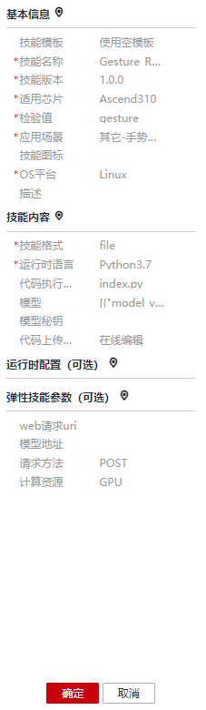

创建完成后，您的技能将进入“技能开发\>技能管理“页面，且状态为“未发布“，您可以执行发布操作，将技能发布至技能市场；您也可以安装技能至设备，并查看设备使用技能效果。

## 步骤8：（可选）发布技能

1.  在华为HiLens管理控制台，单击左侧导航栏“技能开发\>技能管理“，进入“技能管理“页面。
2.  选择需要发布的技能，单击右边的“发布“。
3.  在弹出的“发布技能到技能市场“对话框中，按[图18](#zh-cn_topic_0210438981_fig420215441177)设置相关信息，单击“确定“。

    **图 18**  发布技能  
    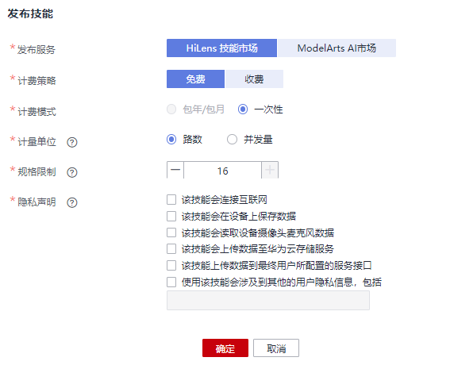

    **表 6**  发布技能参数说明

    
    <table><thead align="left"><tr id="zh-cn_topic_0210438981_row1793210277307"><th class="cellrowborder" valign="top" width="20%" id="mcps1.2.3.1.1">
参数字段

    </th>
    <th class="cellrowborder" valign="top" width="80%" id="mcps1.2.3.1.2">
说明

    </th>
    </tr>
    </thead>
    <tbody><tr id="zh-cn_topic_0210438981_row193318270306"><td class="cellrowborder" valign="top" width="20%" headers="mcps1.2.3.1.1 ">
发布服务

    </td>
    <td class="cellrowborder" valign="top" width="80%" headers="mcps1.2.3.1.2 ">
技能发布的服务位置。本样例选择“HiLens技能市场”。

    </td>
    </tr>
    <tr id="zh-cn_topic_0210438981_row109331927133012"><td class="cellrowborder" valign="top" width="20%" headers="mcps1.2.3.1.1 ">
计费策略

    </td>
    <td class="cellrowborder" valign="top" width="80%" headers="mcps1.2.3.1.2 ">
技能发布在技能市场的计费策略。可选择“免费”和“收费”。

    </td>
    </tr>
    <tr id="zh-cn_topic_0210438981_row129331927153014"><td class="cellrowborder" valign="top" width="20%" headers="mcps1.2.3.1.1 ">
计费模式

    </td>
    <td class="cellrowborder" valign="top" width="80%" headers="mcps1.2.3.1.2 ">
技能发布后的计费模式。

    <ul id="zh-cn_topic_0210438981_ul7609145110480"><li>若选择“免费”计费策略，仅可选择“一次性”计费模式。</li><li>若选择“收费”计费策略，可选择“包年/包月”和“一次性”两种计费模式。</li></ul>
    </td>
    </tr>
    <tr id="zh-cn_topic_0210438981_row8933142733019"><td class="cellrowborder" valign="top" width="20%" headers="mcps1.2.3.1.1 ">
计量单位

    </td>
    <td class="cellrowborder" valign="top" width="80%" headers="mcps1.2.3.1.2 ">
每份License可用在设备上的规格。有“路数”和“并发量”两种计量方式。若以“路数”规格，一份License可安装在设备上使用一路视频。

    </td>
    </tr>
    <tr id="zh-cn_topic_0210438981_row13933227143013"><td class="cellrowborder" valign="top" width="20%" headers="mcps1.2.3.1.1 ">
规格限制

    </td>
    <td class="cellrowborder" valign="top" width="80%" headers="mcps1.2.3.1.2 ">
技能在同一设备上最多可以处理视频的路数，或最大并发量。

    </td>
    </tr>
    <tr id="zh-cn_topic_0210438981_row993322753019"><td class="cellrowborder" valign="top" width="20%" headers="mcps1.2.3.1.1 ">
隐私声明

    </td>
    <td class="cellrowborder" valign="top" width="80%" headers="mcps1.2.3.1.2 ">
技能涉及到的用户隐私声明。

    </td>
    </tr>
    </tbody>
    </table>

    提交之后，将发送至华为HiLens后台，由工作人员进行审核，3个工作日之内完成审核，请您耐心等待。当审核通过后，状态将变更为“审核通过，已发布“。

## 步骤9：安装技能

1.  在“技能开发\>技能管理“页面，选择已开发的的技能，单击右侧操作列“安装“。
2.  勾选已注册且状态在线的设备，单击“安装“，安装成功后单击“确定“，完成安装技能操作，如[图19](#zh-cn_topic_0210438981_fig7755145712814)所示。

    安装过程中，华为HiLens管理控制台会将技能包下发到设备。下发技能包需要一段时间，可以从进度条中看到技能安装进度，下发完成后“进度“栏会提示“安装成功“。

    **图 19**  安装成功  
    

    安装成功后，您可以启动技能查看技能输出数据。

## 步骤10：启动技能

1.  使用HDMI视频线缆连接HiLens Kit视频输出端口和显示器。
2.  单击左侧导航栏“设备管理\>设备列表“，进入“设备列表“页面。
3.  单击已注册设备的“技能管理“，查看技能状态已安装的手势判断技能状态为“停止“，单击操作列的“启动“，并单击“确定“，确定启动技能运行在端侧设备上。

    等待一会，当状态变为“运行中“，则技能成功运行在端侧设备上。

    安装技能的状态说明如[图20](#zh-cn_topic_0210438981_fig166671143493)所示。

    **图 20**  查看技能状态  
    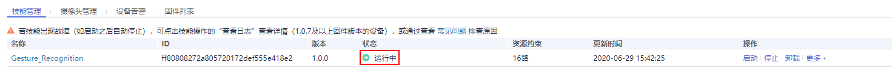

    **表 7**  安装技能状态

    
    <table><thead align="left"><tr id="zh-cn_topic_0210438981_row10392316236"><th class="cellrowborder" valign="top" width="15.45%" id="mcps1.2.3.1.1">
状态名

    </th>
    <th class="cellrowborder" valign="top" width="84.55%" id="mcps1.2.3.1.2">
状态说明

    </th>
    </tr>
    </thead>
    <tbody><tr id="zh-cn_topic_0210438981_row639193192312"><td class="cellrowborder" valign="top" width="15.45%" headers="mcps1.2.3.1.1 ">
停止

    </td>
    <td class="cellrowborder" valign="top" width="84.55%" headers="mcps1.2.3.1.2 ">
停止状态，技能停止运行在端侧设备上。

    </td>
    </tr>
    <tr id="zh-cn_topic_0210438981_row4395332316"><td class="cellrowborder" valign="top" width="15.45%" headers="mcps1.2.3.1.1 ">
运行中

    </td>
    <td class="cellrowborder" valign="top" width="84.55%" headers="mcps1.2.3.1.2 ">
运行状态，技能成功安装在端侧设备。

    </td>
    </tr>
    </tbody>
    </table>

    技能处于“运行中“状态时，您可以通过显示器查看技能输出的视频数据，此样例所开发的手势判断技能可识别一般的手势，技能输出的视频中会用方框标记出手势，并标记出手势含义。

