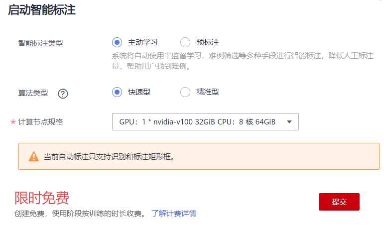

# 数据管理（物体检测类型）

在AI模型开发过程中，数据科学家需要花费较多时间在数据准备环境。包括数据预处理、数据标注等工作，当数据量庞大、种类较多时，数据准备工作繁琐，且耗时长。

ModelArts提供的数据管理功能，不仅提供了基础的数据标注、版本管理能力，同时还提供了数据处理（数据选择、数据清洗等）、自动分组、智能标注、特征分析等功能，帮助用户提升数据准备效率。

本案例介绍如何针对样例数据集，进行数据预处理、自动分组、智能标注、特征分析等操作，完成数据集准备。在实际业务开发过程中，可以根据业务需求选择数据管理的一种或多种功能完成数据准备。ModelArts数据管理的功能介绍请参见[数据管理简介](https://support.huaweicloud.com/engineers-modelarts/modelarts_23_0003.html)。

## 准备工作

在使用 ModelArts进行开发前，需先完成如下准备工作，如果已完成，跳过此步骤。

1.  [注册华为云帐号](https://support.huaweicloud.com/usermanual-account/account_id_001.html)。
2.  完成[实名认证](https://support.huaweicloud.com/usermanual-account/account_auth_00001.html)。
3.  登录ModelArts管理控制台，左上角选择使用区域（例如，华北-北京四），[使用委托完成访问授权](https://support.huaweicloud.com/prepare-modelarts/modelarts_08_0007.html)。
4.  在左上角服务列表中，选择对象存储服务，进入OBS管理控制台。[创建1个OBS桶](https://support.huaweicloud.com/usermanual-obs/zh-cn_topic_0045829088.html)用于存储数据。

    创建桶时，“区域“选择“华北-北京四“，“数据冗余存储策略“选择“单AZ存储“，其他参数使用默认值。

## 操作流程概览

完成了基础环境准备后，就可以前往ModelArts管理控制台，开始进行AI数据开发，此次操作主要分为以下几个流程：

1.  [从AI Gallery下载数据集](#section1439715257595)
2.  [数据处理](#section1539333512199)
3.  [自动分组](#section111271725164116)
4.  [智能标注](#section7769232194213)
5.  [特征分析](#section1738117464425)

## 从AI Gallery下载数据集

本示例使用AI市场已有的数据集进行操作，供学习具体功能操作使用，如下操作介绍如何从AI Gallery下载数据集，此操作将在ModelArts自动创建一个数据集。

> **说明：** 
>针对用户的真实业务数据，建议按如下操作方式完成数据集的创建。首先，创建1个OBS桶及文件夹，然后使用OBS Browser+工具，将业务数据上传至对应的文件夹。然后前往ModelArts管理控制台，[创建对应类型的数据集](https://support.huaweicloud.com/engineers-modelarts/modelarts_23_0004.html)，选择数据所在OBS目录作为此数据集的输入目录。

**AI Gallery提供的animal数据集介绍**

-   用于物体检测，包含830张未标注样本。
-   数据集一共包含4种类别：熊猫、马、鹿、猴子。

**参考如下操作，将AI Gallery的数据集下载至当前帐号的数据管理中。**

1.  单击[animal数据集](https://console.huaweicloud.com/modelarts/?region=cn-north-4#/aiMarket/datasetDetail/metadata?content_id=7a8042a5-ceff-4835-a270-8a1085063110)，打开AI Gallery的数据集详情页面。
2.  单击右上角“下载“。
3.  在弹出的对话框中，填写如下参数，将此数据集下载至数据管理中。

    “下载方式“：ModelArts数据集

    “目标区域“：华北-北京四

    “目标位置“：请选择前期准备工作中创建的OBS桶，可以在弹窗中通过“创建文件夹”，创建命名为animal的文件夹用于存储数据。

    “名称“：定义ModelArts中呈现的数据集名称。您可以自行定义，本示例使用dataset-animal名称。

    **图 1**  下载数据集  
    

4.  单击“确定“开始下载。页面自动进入下载列表，您可以通过进度列查看详细下载进度。

    此页面需要自己手动刷新页面查看最新下载进度，由于数据集较大，下载预计要花费3\~5分钟左右。

5.  前往ModelArts管理控制台，在左侧菜单栏中选择“数据管理\>数据集”，在数据集列表中查看数据集状态。

    从AI Gallery下载数据集后，将在ModelArts数据管理页面创建命名为“dataset-animal”的数据集。您可以进入数据集列表，查看到下载任务创建的数据集，单击名称左侧的小三角，展开数据集详情，可查看数据集的导入状态。当状态变为“导入完成“时，表示数据集已准备就绪。

    **图 2**  查看导入状态  
    

## 数据处理

在AI开发过程中，采集的数据可能存在大量重复数据，重复数据对模型精度提升并没有太大作用，反而需要花费很多时间对其进行标注。此时，可使用数据选择进行数据预处理，对采集到的数据去重，根据相似度删除一些重复度比较高的数据，从而减少数据的标注量 。

如果业务数据不存在重复数据或相似度高的数据，可跳过此步骤。面向图像分类和物体检测类型，ModelArts提供了数据清洗、数据增强等更多数据预处理的算法，请根据实际业务诉求进行选择详情请参见[数据处理简介](https://support.huaweicloud.com/engineers-modelarts/modelarts_23_0316.html)。

1.  **发布数据集版本。**

    在执行数据选择处理前，我们需要先发布一个数据集版本，作为数据校验算法的输入。

    1.  进入“数据管理\>数据集”页面，选择从AI Gallery下载的数据集，单击右侧操作列的“发布“。
    2.  在弹出的“发布新版本“对话框中，填写如下参数，然后单击“确定“发布数据集版本。

        “版本名称“：系统默认以V001开始，您也可以自行定义版本名称。

        其他参数建议使用默认值。

        **图 3**  发布数据集版本  
        

2.  **创建数据处理任务。**在此任务中，选择“数据选择“算法。
    1.  在左侧菜单栏中，选择“数据管理\>数据处理”，单击“创建“。
    2.  在“创建数据处理“页面，填写如下参数，然后单击创建，完成数据处理任务的创建。

        -   “名称“：自定义方便辨识的任务名称。
        -   “场景类别“：物体检测
        -   “数据处理类型“：数据选择
        -   “输入“：数据集，选择刚才创建的数据集及其数据集版本、
        -   “输出“：选择刚才创建的数据集作为目标数据集，并指定一个新的数据集版本名称，数据处理结果会保存为该数据集的一个新版本。

        **图 4**  创建数据处理任务  
        

        数据处理任务创建完成后，任务将自动启动，且界面自动跳转至数据处理任务列表页面。当数据处理任务状态变为“完成“时，表示任务执行完成。

3.  **查看数据选择结果。即删除相似图像后的结果。**

    数据选择任务完成后，单击任务名称进入详情页面。在详情页面中，选择“结果展示“页签，可查看全部数据、保留数据以及删除的数据。在“删除“页签下，即根据算法规则，删除的相似度较高的图像。

    **图 5**  查看数据选择结果  
    

4.  **将数据选择后的版本设置为数据集当前版本。**

    数据处理任务执行后，其处理结果对应的数据集版本不会作为当前版本。为方便后续数据标注、特征分析等操作，需要将数据选择后的数据集版本，设置为数据集的当前版本。

    1.  进入“数据管理\>数据集”页面，单击进行处理的数据集名称（dataset-animal），进入数据集概览页。
    2.  选择“版本管理“页签，选中数据处理后的版本（即步骤[2.b](#li19794101252)中输出参数对应的版本），然后单击“设置为当前版本“。

        **图 6**  设置为当前版本  
        

    等待数据集版本切换完成后，单击右上角的“开始标注“，进去数据集详情页，可以看到当前数据集中保留下来的数据，相似程度都比较低。

## 自动分组

自动分组可以理解为数据标注的预处理，先使用聚类算法对未标注图片进行聚类，再根据聚类结果进行处理，可以分组打标或者清洗图片。

1.  **启动自动分组任务，并等待任务完成。**
    1.  在数据集详情页面，选择“全部“页签，单击“自动分组\>启动任务“。

        **图 7**  启动自动分组任务  
        

    2.  在弹出的“自动分组“窗口中，设置如下参数，然后单击“确定“，启动任务。

        -   “分组数“：4。由于此数据集中的类别是4种，因此在分组任务中直接定义为4。针对用户的数据，可大致浏览下数据集，对数据集已有类别进行统计，分组数设置为数据集中的类别数。
        -   “结果处理方式“：更新属性到当前样本中。
        -   “属性名称“：自定义方便辨识的名称。

        **图 8**  自动分组任务设置  
        

        自动分组任务执行过程中，右上角将提示任务进展，您可以可以选择“自动分组\>任务历史“，查看任务进展。任务执行预计需要几分钟时间，请耐心等待。当任务状态变更为“成功“时，表示任务运行结束。

        **图 9**  任务进展  
        

2.  **数据筛选查看。**

    当自动分组任务完成后，您可以通过数据筛选功能，查看分组后，不同类别的详细数据。

    “全部“页签下，单击“筛选条件“右侧的“展开“，在“样本属性“右侧，选择自动分组定义的属性名称，然后选择不同的类别。自动分组任务定义的是4种分类，此时可通过0、1、2、3进行筛选查看4种不同类别下的数据。

    **图 10**  筛选数据  
    

    例如选择“0“，下方数据详情页展示同一类别的数据。自动将数据进行分组，可以在筛选结果中，即同一类别数据下，进入标注页面进行某一标签的标注，提升标注效率。针对图像分类任务，则可批量选中图像，进行批量标注，标注效率提升明显。

    **图 11**  展示同一类别数据  
    

## 智能标注

除了人工标注外，ModelArts还提供了智能标注功能，帮助您快速完成剩余的数据标注，为您节省70%以上的标注时间。

1.  **人工标注部分数据。**

    在启动智能标注前，需人工完成少量数据标注，每个标签至少15张图片。

    1.  定义标签。在“数据集概览“页面，单击右上角的“修改“，在弹出窗口中定义本数据集将使用的标签名称。例如Panda、Horse、Monkey、Deer。

        **图 12**  定义标签  
        

    2.  单击“开始标注“，进入详情页面进行标注。可通过[自动分组](#section111271725164116)先对数据进行分组，筛选出某一种类别的数据，单击图片进入并完成数据标注。每一种类别，建议至少完成15张图片的标注。

        **图 13**  标注部分数据  
        

2.  **启动智能标注。**
    1.  在数据集详情页面，单击右上角“启动智能标注“。
    2.  在“启动智能标注“窗口中，填写如下参数，然后单击“提交“。

        -   “智能标注类型“：主动学习
        -   “算法类型“：快速型

        其他参数值请采用默认值。

        **图 14**  启动智能标注  
        

        智能标注任务启动后，可以在“待确认“页签下查看智能标注任务进度。智能标注任务耗时较长，600多张图片，预计需等待二十几分钟，数据越多，任务运行时长越长，请耐心等待。

        当任务完成后，即可在“待确认“页签下查看自动标注好的数据。

        **图 15**  查看智能标注任务进度  
        

    3.  确认智能标注结果。

        在智能标注任务完成后，在“待确认“页签下，单击具体图片进入标注详情页面，可以查看或修改智能标注的结果。

        如果智能标注的数据无误，可单击右侧的“确认标注“，如果标注信息有误，可直接删除错误标注框，然后重新标注，以纠正标注信息。针对物体检测任务，需一张一张确认。确保所有图片已完成确认，然后执行下一步操作。

        **图 16**  确认结果  
        

## 特征分析

标注完成后，可以基于图片或目标框对图片的各项特征，如模糊度、亮度进行分析，帮助用户更好的分析数据集的数据质量和标注质量，判断数据集是否满足自己的算法和模型要求。

1.  **创建特征分析任务**。
    1.  在执行特征分析前，需先发布一个数据集版本。在智能标注并确认完的数据，单击右上角“返回数据集概览“，然后单击“发布“，发布一个新版本。
    2.  版本发布完成后，进入数据集概览页。选择“数据特征“页签，单击“特征分析“，在弹窗中选择刚才发布的数据集版本，并单击“确定“，启动特征分析任务。

        **图 17**  启动特征分析  
        

    3.  查看任务进度。

        任务执行过程中，可以单击“任务历史“，查看任务进度。当任务状态变为“成功“时，表示任务执行完成。

        **图 18**  查看任务进度  
        

2.  **查看特征分析结果。**

    特征分析任务执行完成后，可以在“数据特征“页签下，选择“数据集版本“、“类型“和“数据特征指标“，页面将自动呈现您选择对应版本及其指标数据，您可以根据呈现的图表了解数据分布情况，帮助您更好的理解您的数据。

    -   “版本选择“：根据实际情况选择已执行过特征任务的版本，可以选多个进行对比，也可以只选择一个。
    -   “类型“：根据需要分析的类型选择。支持“all“、“train“、“eval“和“inference“。分别表示所有、训练、评估和推理类型。
    -   “数据特征指标“：选择您需要展示的指标。详细指标解释，可参见[特征分析指标列表](https://support.huaweicloud.com/engineers-modelarts/modelarts_23_0185.html#section2)。

    **图 19**  查看特征分析结果  
    

    在特征分析结果中，例如图片亮度指标，数据分布中，分布不均匀，缺少某一种亮度的图片，而此指标对模型训练非常关键。此时可选择增加对应亮度的图片，让数据更均衡，为后续模型构建做准备。

## 总结

在完成特征分析后，如无需进行数据调整，则可直接使用此数据集及其版本用于后续的模型构建。即已完成AI开发过程中的数据准备。

