# 纳管Atlas 500，将模型部署为边缘服务

Atlas人工智能计算平台，是基于华为昇腾系列AI处理器，打造面向“端、边、云”的全场景AI基础设施方案。配合Atlas系列边缘设备，华为云智能边缘服务（IEF）和AI开发平台（ModelArts）结合，将构建的AI模型快速部署至Atlas设备中，满足在安防、交通、社区、园区、 商场、超市等复杂环境区域的应用需求。

1.  [模型准备](#section12464132419483)
2.  [在IEF中注册并纳管Atlas 500](#section313311354815)
3.  [将模型部署为边缘服务](#section28741119174815)

**图 1**  纳管Atlas 500并将模型部署至边缘服务  
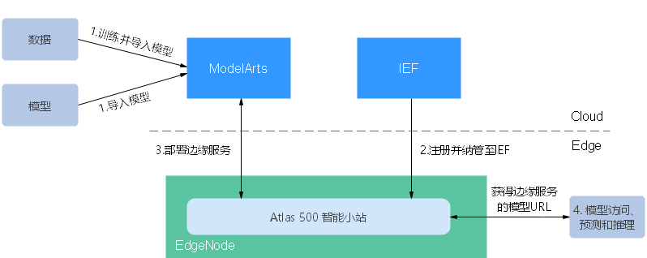

## 模型准备

在部署边缘服务前，您需要准备配套的模型。针对本示例，指导用户使用ModelArts预置算法训练模型。

1.  进入ModelArts的AI Gallery。
2.  下载数据集。

    在AI Gallery中，进入“数据集“页签，搜索[dataset\_mask\_detection\_500](https://marketplace.huaweicloud.com/markets/aihub/datasets/detail/?content_id=90259354-a047-49ec-8415-f033cc2f3e87)数据集。进入数据集详情页，单击“下载“，根据页面指导，将数据集下载至OBS路径下。其中，目标区域与ModelArts所在区域一致。

    数据集启动下载后，需要一段时间，请耐心等待，您也可以前往“个人中心\>数据集“，查看下载进度。

    **图 2**  下载数据集至OBS桶  
    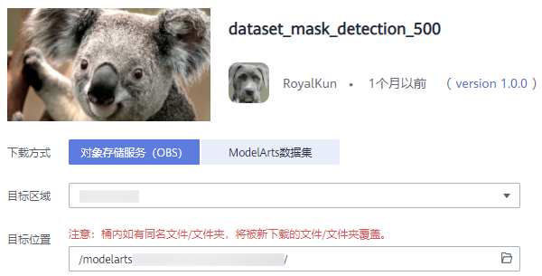

3.  创建并发布数据集。

    进入ModelArts管理控制台，选择“数据管理\>数据集“，单击“创建数据集“，类型选择“物体检测“，使用步骤[2](#li483313181277)的OBS路径作为“数据集输入位置“，“数据集输出位置“指定为一个空目录。

    **图 3**  创建数据集  
    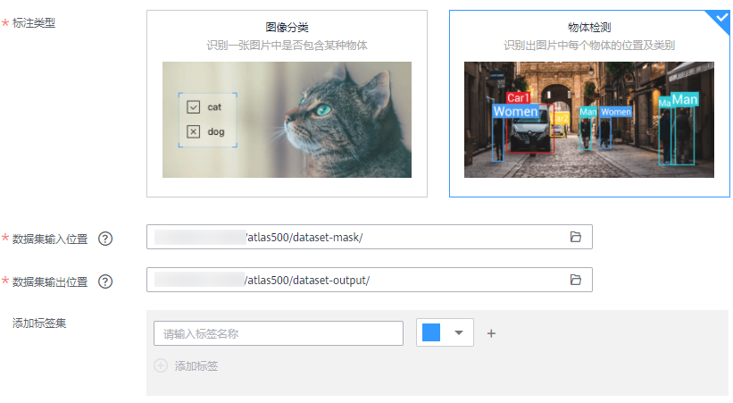

    数据集创建完成后，当数据集详情中显示500张图片已标注后，执行发布数据集的操作。注意一点，需开启数据切分功能，并将训练集比例设置为“0.8“。

    **图 4**  发布数据集  
    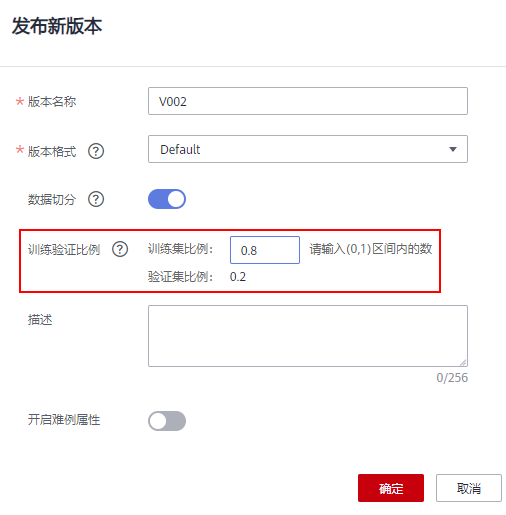

4.  订阅预置算法。

    在AI Gallery中，进入“算法“页签，查找[物体检测YOLOv3\_ResNet18](https://marketplace.huaweicloud.com/markets/aihub/modelhub/detail/?id=948196c8-3e7a-4729-850b-069101d6e95c)算法，根据界面提示订阅此算法，并在ModelArts的“算法管理\>我的订阅”中执行同步操作。

    可以参考[使用订阅算法实现图像分类（Ascend310推理）](使用订阅算法实现图像分类（Ascend310推理）.md)案例中的[订阅算法](使用订阅算法实现图像分类（Ascend310推理）.md#zh-cn_topic_0226311571_section87421022184315)。

5.  使用预置算法和数据集创建训练作业。

    使用步骤[3](#li21915597286)的数据集和步骤[4](#li17584132123)订阅的算法，创建训练作业。

    更多详细指导可参考[使用订阅算法实现图像分类（Ascend310推理）](使用订阅算法实现图像分类（Ascend310推理）.md)案例中的[使用订阅算法创建训练作业](使用订阅算法实现图像分类（Ascend310推理）.md#zh-cn_topic_0226311571_section139551128135716)。

6.  模型转换和模型导入。

    训练后得到的模型并不符合Atlas 500要求，需转换成om格式后再导入ModelArts。

    更多详细指导可参考[使用订阅算法实现图像分类（Ascend310推理）](使用订阅算法实现图像分类（Ascend310推理）.md)案例中的[模型转换](使用订阅算法实现图像分类（Ascend310推理）.md#zh-cn_topic_0226311571_section169361344121112)、[导入模型](使用订阅算法实现图像分类（Ascend310推理）.md#zh-cn_topic_0226311571_section33213372557)。

    > **说明：** 
    >执行模型转换和模型导入时，请参考[物体检测YOLOv3\_ResNet18](https://marketplace.huaweicloud.com/markets/aihub/modelhub/detail/?id=948196c8-3e7a-4729-850b-069101d6e95c)算法介绍的“Ascend310推理“章节，根据此算法要求选择模型和参数设置。

如果您需要导入您自己开发的模型，请参考如下要求，将满足要求的模型导入ModelArts。

-   需保证您的模型支持使用Ascend芯片推理。且您的模型使用的驱动版本与Atlas设备一致。
-   如果您的模型需要使用Ascend芯片推理，但是模型并不是.om格式（即不满足推理要求），可使用ModelArts模型转换功能，先将模型格式进行转换。转换操作可参见[模型转换](https://support.huaweicloud.com/engineers-modelarts/modelarts_23_0107.html)。
-   针对转换完成的模型，可使用模型模板将模型导入至ModelArts中。为了方便Ascend用户，ModelArts预置了模型模板，建议选择[从模板中选择元模型](https://support.huaweicloud.com/engineers-modelarts/modelarts_23_0205.html)的方式导入模型，减少了模型配置文件编写工作。选择模板时，请选择[ARM-Ascend模板](https://support.huaweicloud.com/engineers-modelarts/modelarts_23_0254.html)，只有按此模板导入的模型，才可直接部署至Atlas 500设备中。

## 在IEF中注册并纳管Atlas 500

将您的Atlas 500设备注册并纳管至华为云IEF服务中，纳管后，可直接在ModelArts中完成模型部署。

1.  **注册边缘节点**。
    1.  登录[IEF管理控制台](https://console.huaweicloud.com/ief2.0/#/app/resource/node/list)。
    2.  选择左侧导航栏的“边缘资源 \> 边缘节点“，单击页面右上角的“注册边缘节点“。
    3.  配置边缘节点基本信息。

        **图 5**  边缘节点基本信息  
        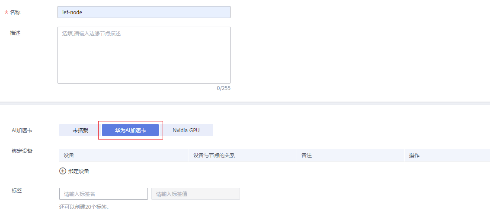

        -   **边缘节点名称**：边缘节点的名称。
        -   **AI加速卡**：选择“华为AI加速卡“。
        -   **绑定设备**：为边缘节点绑定边缘设备。设备在注册边缘节点后仍然可以绑定。
        -   **标签**

            标签可用于对资源进行标记，方便分类管理。

            如果您需要使用同一标签标识多种云资源，即所有服务均可在标签输入框下拉选择同一标签，建议在TMS服务中创建预定义标签。

    4.  单击“下一步“，为边缘节点进行高级配置。

        **图 6**  边缘节点配置  
        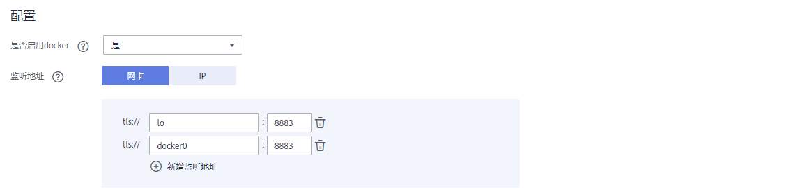

        -   **是否启用docker**：启用后可以支持部署容器应用。
        -   **监听地址**：

            配置边缘节点上MQTT Broker的监听地址，可以选择网卡或IP。

        当前支持配置边缘节点的系统日志和应用日志。

        -   **系统日志**：边缘节点上IEF软件（如edge-core、edge-logger和edge-monitor等）产生的日志。
        -   **应用日志**：边缘节点上部署的应用所产生的日志。

        **图 7**  日志  
        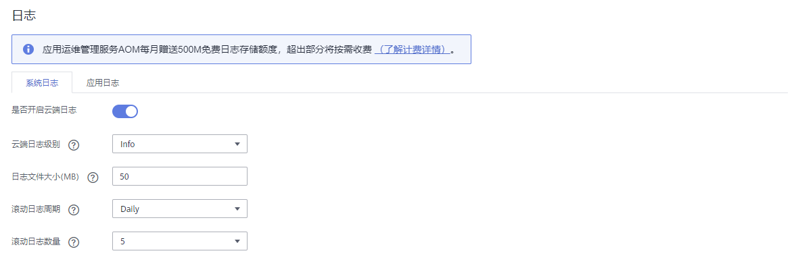

        系统日志和应用日志需要配置如下几个参数：

        -   **是否开启云端日志**：

            您可以通过开关控制是否上传日志到AOM服务，开启之后您可以在AOM中查看日志，具体请参见[在AOM查看日志](https://support.huaweicloud.com/usermanual-ief/ief_01_0021.html#ief_01_0021__section9464182617433)。

        -   **云端日志级别**：

            系统日志的可选项为：error，warning，info，debug。日志级别配置不同，上传的日志内容也不相同，error，warning，info，debug表示上传不同的日志级别。

        -   **日志文件大小**：日志文件大小限制，单位MB，默认50，取值范围10-1000。某个日志文件如果达到大小限制，则会转储。
            -   系统日志保存在边缘节点“/var/IEF/sys/log/“目录下，然后转储到AOM；
            -   应用日志会将容器的标准输出和挂载到边缘节点“/var/IEF/app/log“的日志转储到AOM。

        -   **滚动日志周期**：日志转储周期，可选项：daily，weekly，monthly，yearly。日志文件大小和滚动日志周期是同时生效的，满足任何一个条件都会进行日志转储。
        -   **滚动日志数量**：日志文件转储个数，默认5，取值范围1-10。边缘节点保存的转储日志数量如果达到限制，则会删除最老的那个转储文件。

    5.  单击页面右下角的“创建“，下载配置文件，在后续[2](#li18335182213545)时将用到这些。

        **图 8**  下载配置文件  
        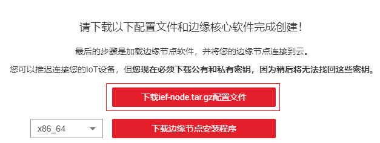

    6.  单击“完成“。

        您可以看到边缘节点的状态为“未纳管“，这是因为还未纳管边缘节点，请参见[2](#li18335182213545)纳管节点。

        **图 9**  未纳管的边缘节点  
        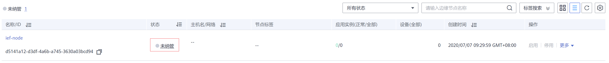

2.  **纳管Atlas 500智能小站**。
    1.  以admin用户登录智能小站后台，检查DNS服务器域名解析是否正常。
        1.  切换至develop模式，输入root用户的密码。

            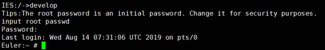

        2.  尝试ping华为云IEF的服务地址，观察域名是否能够解析。

            **ping ief-edgeaccess.cn-south-1.myhuaweicloud.com**

            -   如果显示如下，则说明无法解析。

                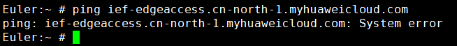

                执行如下命令，将公网的DNS服务器IP地址（例如114.114.114.114）加入resolv.conf。

                **vi /etc/resolv.conf**

            -   如果显示如下，则说明能解析，请执行下一步。

                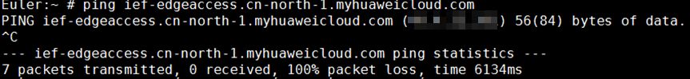

    2.  登录智能小站的WebUI，WebUI地址为https://\{hostIP\}。

        hostIP为智能小站的IP地址。

    3.  选择顶侧导航栏“维护“，单击页面左侧的“网管注册“。
    4.  选择网管模式为“华为云智能边缘平台IEF管理“，并上传[1.e](#li51691252124012)下载的配置文件。

        **图 10**  上传IEF节点证书  
        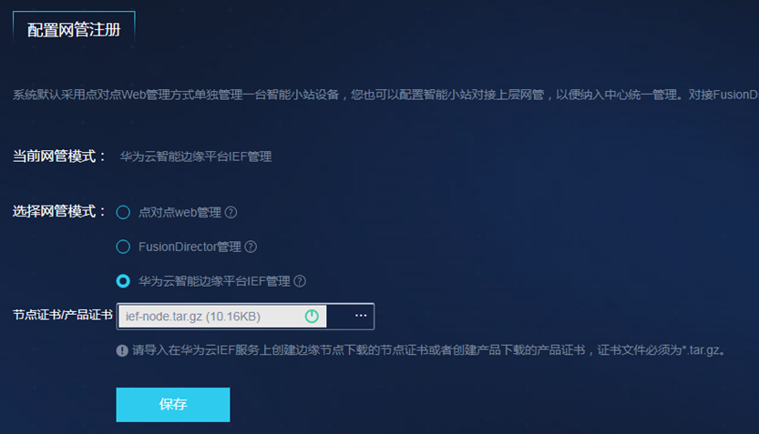

    5.  单击“保存”，等待智能小站被纳管到IEF平台。

        在IEF中查看节点的当前状态。当前状态为“运行中“表示纳管成功。

        **图 11**  查看节点状态  
        

## （可选）升级Atlas 500固件

在本案例中，使用的是ModelArts预置算法训练模型，其模型匹配的固件版本为C32，而Atlas 500设备默认固件为C30。如需要将此类模型部署至Atlas 500，则需要升级Atlas 500设置。如果您的模型与设备的固件版本匹配，则无需执行此操作。

1.  判断Atlas 500固件版本。

    参考[部署为边缘服务](https://support.huaweicloud.com/engineers-modelarts/modelarts_23_0069.html)，选择[模型准备](#section12464132419483)中导入的模型及版本，在选择Atlas 500节点后，如果出现如下图所示提示，表示您的设备与模型不匹配，需升级C32固件。

    **图 12**  部署为边缘服务（Atlas 500）  
    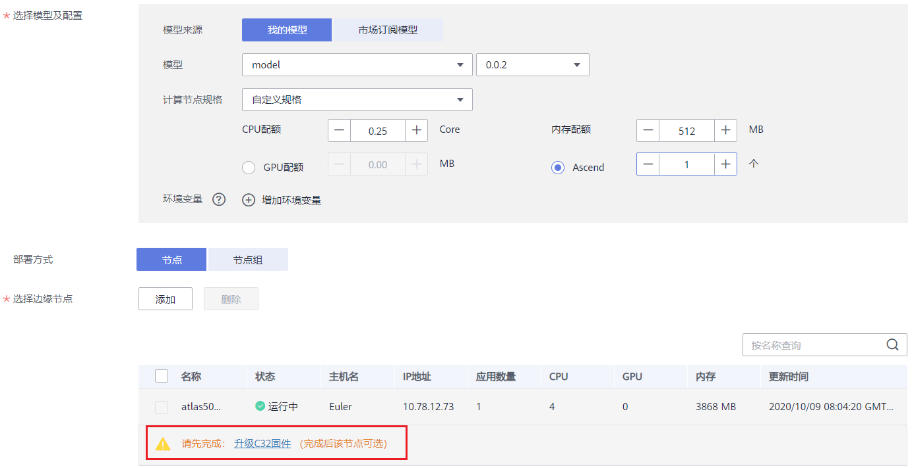

2.  升级Atlas 500固件。
    1.  在节点列表下方单击“升级C32固件“，在弹出的对话框中，仔细阅读升级说明，勾选“我已阅读并同意以上内容“，然后单击“下载“，将固件版本及升级指导下载至本地。文件名称为“atlas500\_C32\_Firmware.zip“。
    2.  解压“atlas500\_C32\_Firmware.zip“文件，打开Atlas500产品C32固件升级操作指导.doc文件，根据指导完成Atlas 500的固件升级操作。

## 将模型部署为边缘服务

1.  登录ModelArts管理控制台，在左侧菜单栏中选择“部署上线\>边缘服务“，在边缘服务列表中，单击“部署“进入“部署“页面。
2.  在“部署“页面中，选择对应的模型及其版本。选择“计算节点规格“和“边缘服务节点“。

    “计算节点规格“：选择“ARM：3 核 3 GiB Ascend: 1 \* Ascend 310“。

    “边缘服务节点“：单击选择边缘节点右侧的“添加“，在弹出的“添加节点“对话框中，选择在IEF中纳管的Atlas 500节点，然后单击“确定“。

    **图 13**  部署为边缘服务（Atlas 500）  
    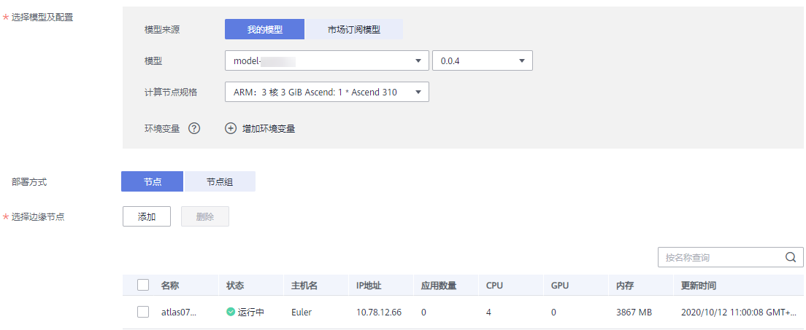

3.  单击“立即创建“，完成边缘服务的部署操作。

    系统自动进入“边缘服务“列表，新部署的边缘服务将展现的列表中。服务部署需要耗费一些时间，本示例选用的Atlas 500部署时需耗费十分钟左右，请耐心等待。当服务状态变为“运行中”时，表示边缘服务已部署完成，您可以单击服务名称进入服务详情页。

    如[图14](#fig67212713918)所示，“运行中“的服务，可以在“节点信息“中获得一个URL，该URL为模型访问、推理、预测接口。同时，此边缘服务出于“运行中“时，表示您的Atlas 500已具备此模型的AI能力。

    **图 14**  边缘服务详情  
    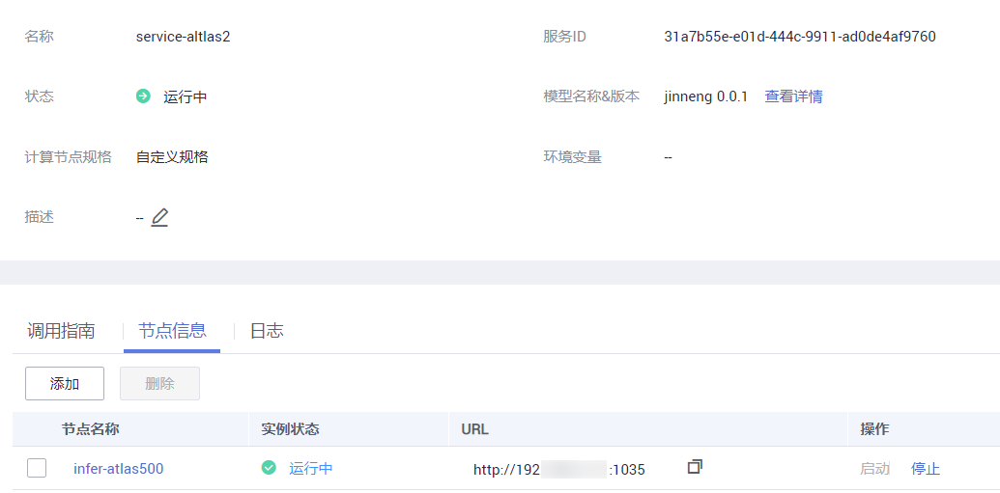

## 查看推理结果

通过postman发送http请求，查看推理结果。

1.  下载Postman软件并安装，您可以直接在Chrome浏览器添加Postman扩展程序（也可使用其它支持发送post请求的软件）。
2.  打开Postman。

    **图 15**  Postman软件界面  
    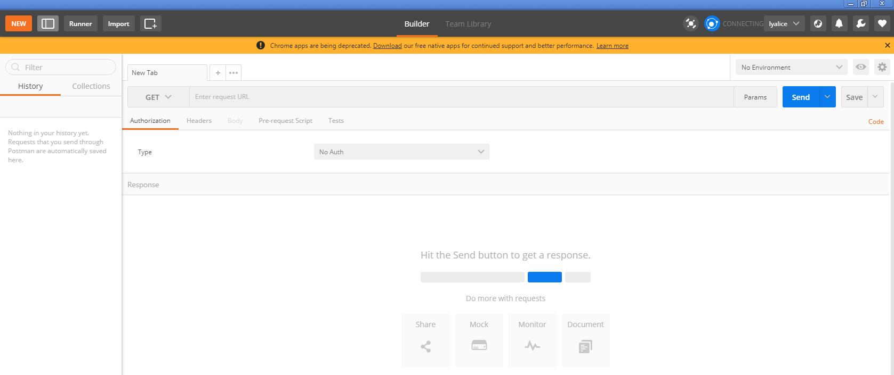

3.  在Postman界面填写参数，以图像分类举例说明。
    -   选择POST任务，将边缘节点的调用地址（即[将模型部署为边缘服务](#section28741119174815)步骤完成后获得的URL）复制到POST后面的方框。

        **图 16**  POST参数填写  
        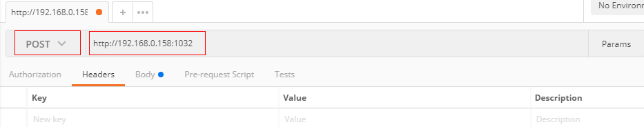

    -   在Body页签，根据模型的输入参数不同，可分为2种类型：文件输入、文本输入。本示例的图像分类模型为文件输入。

        选择“form-data“。在“KEY“值填写模型的入参，比如本例中预测图片的参数为“images“。然后在“VALUE“值，选择文件，上传一张待预测图片（当前仅支持单张图片预测）。

        **图 17**  填写Body配置  
        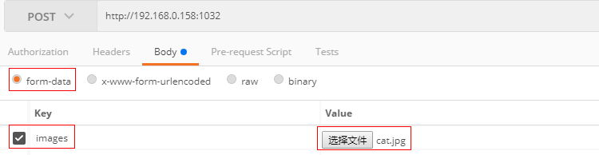

4.  参数填写完成，单击“Send”发送请求，结果会在Response下的对话框里显示。

    文件输入形式的预测结果如下图所示，返回结果的字段值根据不同模型可能有所不同。

    **图 18**  边缘服务文件输入预测结果  
    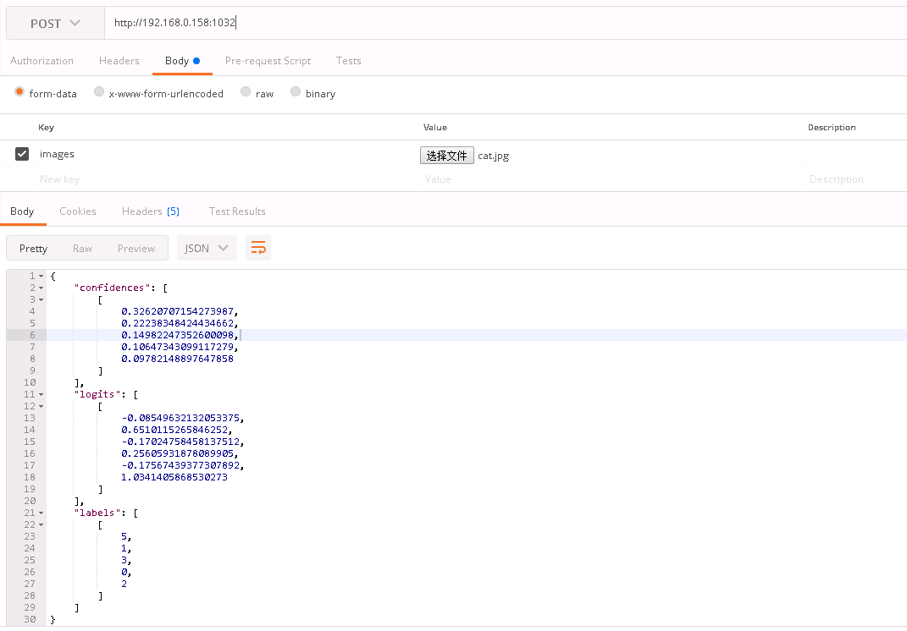

    > **说明：** 
    >为避免资源浪费，在试用完成后，建议停止边缘服务，同时可前往ModelArts和OBS清理不必要的数据。例如导入的模型、模型转换任务、训练作业、数据集、存储在OBS的数据集及模型文件等。

