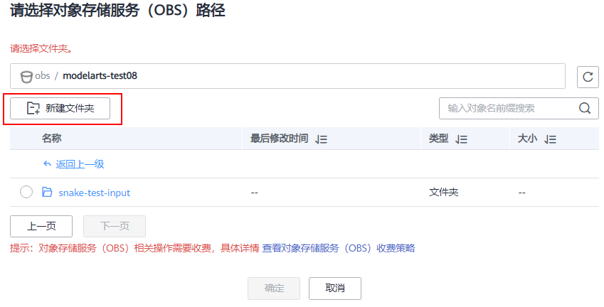
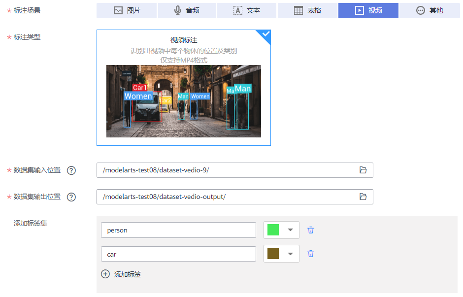
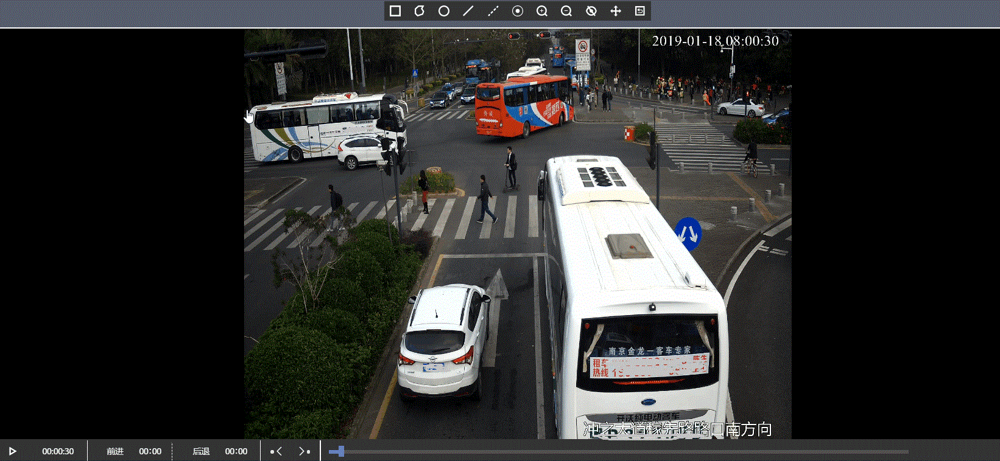
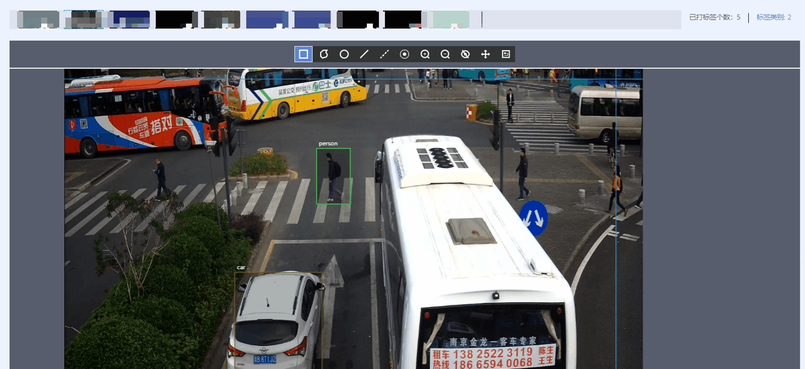
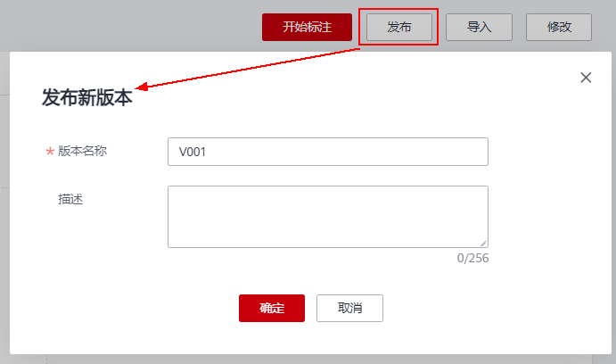
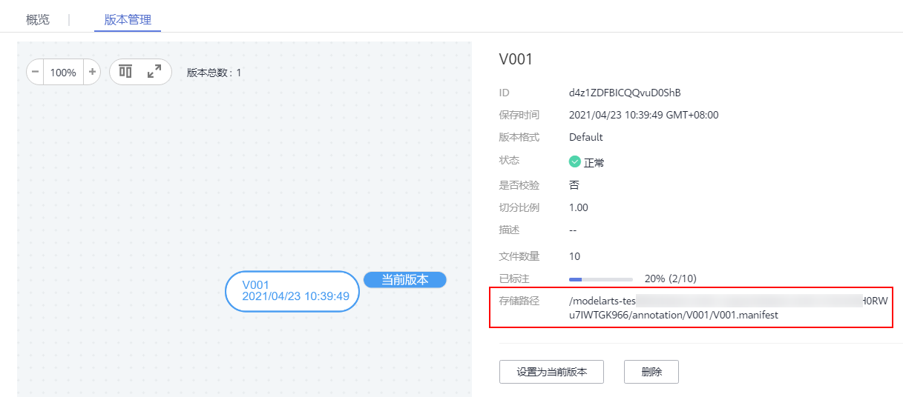

# 视频数据集使用教程<a name="modelarts_10_0018"></a>

本教程使用视频类型的数据集，指导您如何在ModelArts中对视频类数据进行标注，标注后的数据集，经过发布即可用于模型训练。

## 准备工作<a name="section11812234171513"></a>

在使用 ModelArts进行开发前，需先完成如下准备工作。**如果已完成，跳过此步骤。**

1.  [注册华为云帐号](https://support.huaweicloud.com/usermanual-account/account_id_001.html)。
2.  完成[实名认证](https://support.huaweicloud.com/usermanual-account/account_auth_00001.html)。
3.  登录ModelArts管理控制台，左上角选择使用区域（例如，华北-北京四），[使用委托完成访问授权](https://support.huaweicloud.com/prepare-modelarts/modelarts_08_0007.html)。
4.  在左上角服务列表中，选择对象存储服务，进入OBS管理控制台。[创建1个OBS桶](https://support.huaweicloud.com/usermanual-obs/zh-cn_topic_0045829088.html)用于存储数据。

    创建桶时，“区域“选择需与上一步骤相同，“数据冗余存储策略“选择“单AZ存储“，其他参数使用默认值。


## 下载样例数据集<a name="section843983314345"></a>

本教程的样例数据集存储在AI Gallery中，共9个短视频。如果您熟悉AI Gallery操作，可直接前往AI Gallery搜索并下载“traffic“数据集。如果不熟悉操作，请参见如下详细步骤。

1.  进入ModelArts管理控制台，在左侧菜单栏中选择“AI Gallery“。
2.  进入AI Gallery后，选择“数据“页签，然后在搜索框中，输入“traffic“，单击“搜索“。
3.  在搜索结果中，将呈现此样例数据集。单击数据集图片进入详情页面。
4.  单击“下载“。
5.  在弹出的下载页面中，设置“目标区域“和“目标位置“。

    “目标区域“需与ModelArts使用区域一致。例如“华北-北京四”。

    “目标位置“即指定数据集下载的目标路径，必须是OBS路径。在弹出的设置对话框中，选择准备工作中创建的OBS桶，可再此窗口中选择一个空文件夹，或者新建一个文件夹用于存储数据。

    **图 1**  设置目标位置<a name="fig1354443754213"></a>  
    

6.  单击“确定“，开始下载数据集至目标位置。

    系统页面将自动跳转至“我的数据“页面，在“我的下载“页签下，可查看对应数据集的下载进度。数据集下载需要几分钟到十几分钟时间，请耐心等待。


## 创建视频数据集<a name="section13382194153414"></a>

将下载的数据，在ModelArts中创建一个数据集，再启动标注和发布操作。如您熟悉数据集的创建操作，可选择上述数据存储目录作为“数据集输入位置“，“标注类型“选择“视频标注“。

如果您不熟悉创建数据集操作，可参考如下步骤完成任务。

1.  在ModelArts管理控制台，进入“数据管理\>数据集“页面，单击“创建数据集“。
2.  根据界面提示设置数据集相关参数，其中本示例的核心参数填写如下所示。

    -   “标注场景“：视频
    -   “标注类型“：视频标注
    -   “数据集输入位置“：设置为从AI Gallery中下载的目标位置。
    -   “数据集输出位置“：在已有的OBS桶中，创建一个空目录作为输出路径。
    -   “标签集“：添加person、car标签，用于后续标注。

    **图 2**  创建数据集<a name="fig15568121132610"></a>  
    

3.  单击右下角“创建“，完成视频数据集的创建。

## 视频标注<a name="section10447104913412"></a>

针对导入的数据集，需要对视频内的物体进行标注，可参考如下步骤。

1.  在“数据管理\>数据集“列表中，选择上述步骤中创建的数据集，单击数据集名称，进入数据集概览页。
2.  单击右上角“开始标注“，进入数据集详情页面。默认展示当前数据集中的所有数据，包含“已标注“和“未标注“视频。本示例中的视频数据均为标注，因此都是未标注视频。
3.  在数据列表中，选择一个数据，单击视频进入标注页面，在此页面，可进行标注操作。
    1.  **选择标注框。**

        视频上方为标注栏，提供了与物体检测类似的标注框。提供了矩形、多边形、圆形、实线、虚线、点的标注。同一个数据集，请务必选择一种标注框进行标注。

        

    2.  **标注视频中的物体。**

        在视频下方，提供了视频暂停、播放、前进、后退等按钮操作，可供标注过程中，准确找到需要标注的画面。

        播放需标注的视频，当视频播放至待标注时间时，单击进度条中的暂停按钮，将视频暂停至某一画面。使用鼠标在视频画面中框出目标，然后在弹出的添加标签文本框中，直接输入新的标签名，在文本框前面选中标签颜色，单击“添加”完成1个物体的标注。如果已存在标签，从下拉列表中选择已有的标签，然后单击“添加”完成标注。逐步此画面中所有物体所在位置，一张画面可添加多个标签。

        上一个暂停画面标注完成后，在进度条处单击播放按钮继续播放，在需要标注的画面中暂停，然后继续标注目标物体。界面右侧将呈现当前视频带标注的时间点。

        **图 3**  视频标注<a name="fig78451134133613"></a>  
        

    3.  **修改标注信息。**

        针对已标注的视频，进入标注页面后，右上角展示当前视频的标签个数和标签类别，单击标签类别，在右侧推出的展示框中，显示某一时间段标注信息。可以展开详细时间点，删除或修改标注信息。

        **图 4**  修改标注信息<a name="fig20337163410449"></a>  
        


参考上述操作，完成数据集中所有视频和标签类别的标注。本示例仅用于展示如何进行标注，其样本量较少，无法用于一个业务场景下的视频类模型训练。建议根据您的业务，每一类标签选择足够样本量进行标注和后续的模型训练。

## 发布数据集<a name="section2830185812341"></a>

标注完成后，其标注信息还未存储在OBS中，无法直接应用于模型训练。需要执行数据集发布操作，将当前数据集数据存档。

1.  在数据标注页面，完成标注后，单击左上角“返回数据标注预览“。界面将提示您保存标注数据，单击“确定“保存即可。
2.  在数据详情页面，单击左上角“返回数据集概览“，进入概览页。
3.  在概览页，单击右上角“发布“。
4.  在弹出的对话框中，默认预置了版本名称，从V001开始逐一递增。您也可以根据业务所需，设置“版本名称“。单击“确定“完成发布操作。

    **图 5**  发布数据集<a name="fig1955555614388"></a>  
    


## 发布后，相关文件目录和文件格式说明<a name="section62993511419"></a>

-   由于数据集是基于OBS目录管理的，发布为新版本后，对应的数据集输出位置，也将基于新版本生成目录。

    在数据集发布后，数据集将存储为manifest格式文件，manifest文件包含了数据及其标注信息，此文件的存放位置如下所示。

    **图 6**  Manifest文件存储<a name="fig103111751413"></a>  
    

-   标注结果文件\(XML\)为VOC格式，存放在数据集输出目录下：

    ```
    |-- user-specified-output-path 
        |-- DatasetName-datasetId 
            |-- annotation 
                |-- VersionMame1 
                    |-- VersionMame1.manifest 
                    |-- annotations
                       |-- images
                           |-- videoName1
                              |-- videoName1.timestamp.xml 
                           |-- videoName2
                              |-- videoName2.timestamp.xml
                |-- VersionMame2
                    ...
                |-- ...
    ```

-   视频标注的关键帧存在数据集的输入目录下：

    ```
    |-- user-specified-input-path 
        |-- images
            |-- videoName1 
                |-- videoName1.timestamp.jpg 
            |-- videoName2 
                |-- videoName2.timestamp.jpg 
    ```


## 后续操作<a name="section5148676544"></a>

针对发布后的数据集，您可以订阅AI Gallery中的预置算法，也可自己开发算法，在ModelArts管理控制台中创建训练作业，得到模型。

本教程不详细介绍如何创建训练作业，建议您参考其他教程学习。下述教程一般以图像类的数据作为示例，如需开发视频类的模型，将数据和算法均替换为视频类即可。

-   使用预置算法训练模型：[使用AI Gallery的订阅算法训练模型](modelarts_10_0025.md)
-   自定义开发算法（包含常用框架或自定义镜像），并训练模型：[使用TensorFlow实现手写数字识别](zh-cn_topic_0169506909.md)、[使用自定义镜像创建训练作业（GPU）](使用自定义镜像创建训练作业（GPU）.md)

